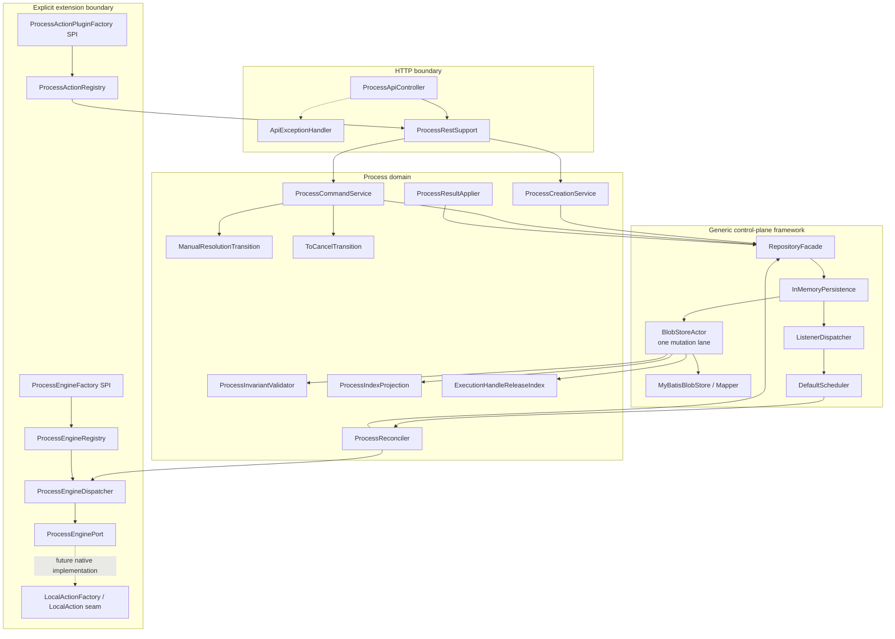
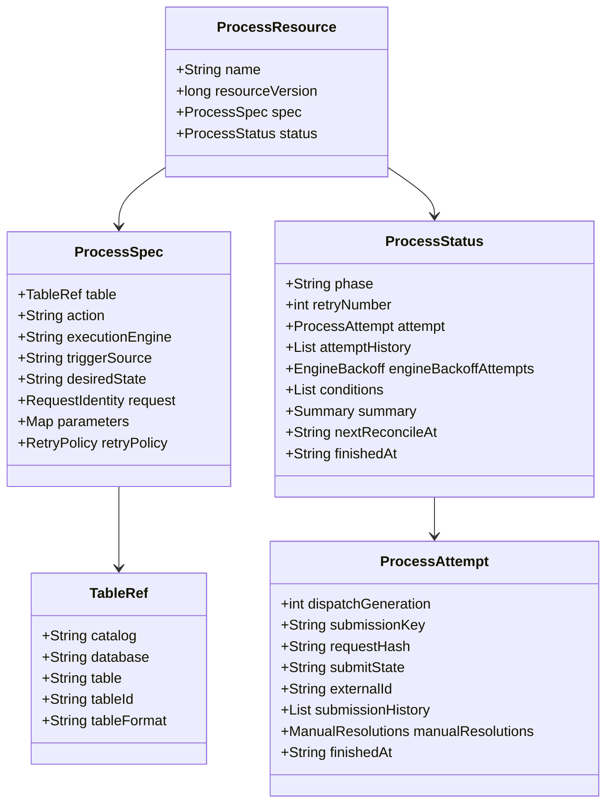
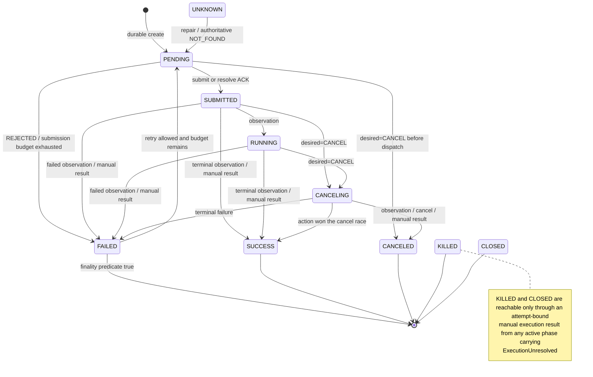
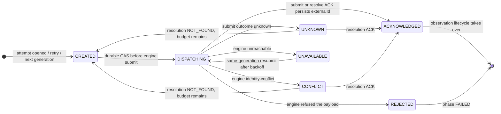
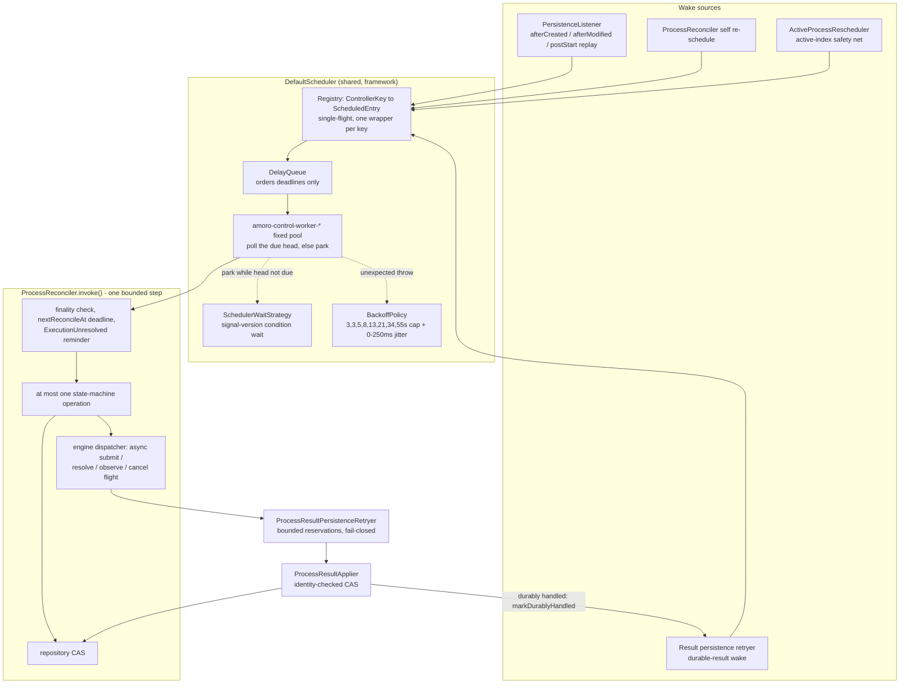
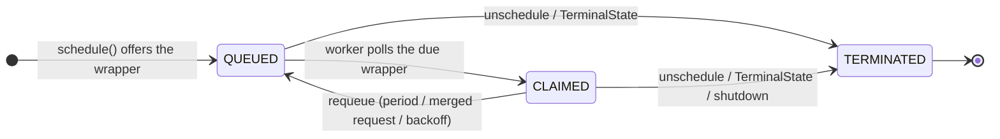
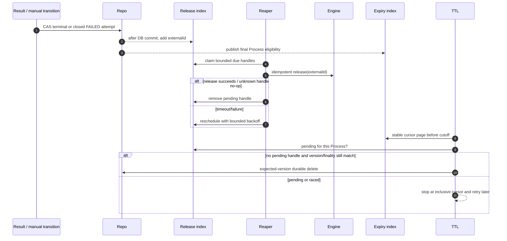
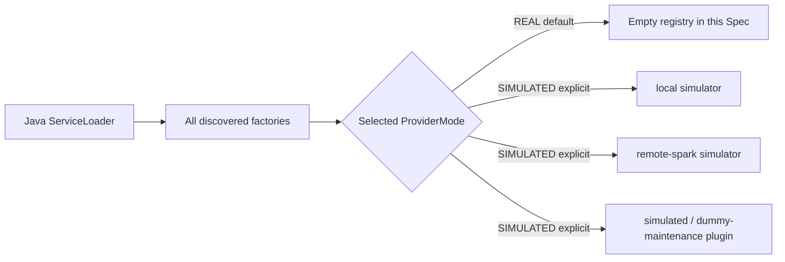

# Amoro AMS v2 Process Control Plane Architecture

A plain-language Chinese companion describing the same scheduling flow, architecture diagrams,
and state machines is [`ARCHITECTURE.zh-CN.md`](ARCHITECTURE.zh-CN.md).

## 1. Scope and delivery boundary

This module delivers a single-node, Spring Boot 3 / Java 17 Process control plane. It proves the
complete orchestration path with explicitly enabled simulators:

`create -> durable state -> schedule -> submit -> observe/cancel -> terminal -> release -> TTL`

It does **not** connect, migrate, or implement any Iceberg or Paimon Action. In particular, this
delivery contains no Iceberg `expire-snapshots` / `clean-orphans`, no Paimon `sync-table-meta`, no
real table loading, no metadata or file mutation, and no real Spark submission or remote Spark
protocol. Those capabilities require a separate Action specification and implementation.

The default runtime selects `ProviderMode.REAL`. Because this specification ships no real
providers, the default Engine registry and Action catalog are empty. Dummy Local and Remote
providers are selected only when `amoro.process.simulation.enabled=true`; every dummy terminal
summary contains `simulated=true`.

## 2. Architectural principles

- The database is the source of truth. Memory contains rebuildable projections only.
- Mutations are durable-first: projection publication and listener delivery happen after the DB
  write is confirmed.
- A Process is reconciled from desired and actual state. An event only wakes the reconciler; it is
  never the sole correctness path.
- Every state mutation uses `resourceVersion` compare-and-set semantics.
- The unique active scope is `(tableId, action)`. Manual and scheduled creation share one admission
  service and therefore one constraint.
- A create/list request resolves one atomic `TableIdentity(tableId, tableFormat)` snapshot. The
  persisted `tableFormat` is never re-read during dispatch, so a Process cannot mix identities from
  different catalog observations.
- Engine calls are asynchronous and bounded. Scheduler workers never wait on Action or remote I/O.
- An unknown submission side effect is never treated as “nothing happened” and is never blindly
  submitted again.
- A durable terminal result precedes execution-handle release; successful release precedes TTL
  deletion.
- Provider SPI types are format-neutral. Framework packages do not depend on Iceberg, Paimon,
  Spark, or v1 AMS server classes.

## 3. System context

```mermaid
flowchart LR
    Client["Operator / v2 Client"]
    API["/api/ams/v2 REST"]
    Scanner["Scheduled Dummy Scanner"]
    Create["ProcessCreationService"]
    Command["ProcessCommandService"]
    Repo["Process Repository"]
    DB[("amoro_process_v2")]
    Index["Immutable Aggregate Index"]
    Scheduler["Level-triggered Scheduler"]
    Reconciler["ProcessReconciler"]
    EngineSPI["ProcessEnginePort SPI"]
    LocalSim["Local Simulator"]
    RemoteSim["Remote Simulator\n(no HTTP / no Spark)"]
    Release["ExecutionHandleReaper"]
    TTL["ProcessTtlCleaner"]

    Client --> API
    API --> Create
    API --> Command
    Scanner --> Create
    Create --> Repo
    Command --> Repo
    Repo --> DB
    DB -. "postStart replay" .-> Index
    Repo --> Index
    Index --> Scheduler
    Scheduler --> Reconciler
    Reconciler --> EngineSPI
    EngineSPI --> LocalSim
    EngineSPI --> RemoteSim
    Index --> Release
    Release --> EngineSPI
    Index --> TTL
    TTL --> Repo
```



The existing `amoro-ams` service remains outside this diagram. There is no dual write, table join,
v1 Process proxy, or shared execution state in this delivery.

## 4. Component architecture



### Responsibilities

| Component | Responsibility | Explicit non-responsibility |
|---|---|---|
| `ProcessCreationService` | Idempotency, single-active admission, immutable spec construction | Does not call an Engine |
| `ProcessCommandService` | Bounded CAS for cancel and manual resolution | Does not duplicate transition logic |
| `ProcessReconciler` | One level-triggered state-machine step per invocation | Does not block for Engine futures |
| `ProcessResultApplier` | Identity-checked, late-result-safe durable callback application | Does not release handles |
| `ProcessIndexProjection` | One immutable snapshot for body, active, idempotency, read, expiry views | Is not a fact store |
| `ExecutionHandleReaper` | Sole caller of `ProcessEnginePort.release` | Does not change business outcome |
| `ProcessTtlCleaner` | Bounded deletion of expired, final, cleanup-complete Process rows | Does not repair terminal state |
| Action / Engine SPI | Selects behavior by canonical `(tableFormat, action, engine)` and provider mode | Does not imply a format Action exists |

## 5. Durable resource and indexes

`amoro_process_v2` stores one Base64-encoded YAML document per Process. The document contains an
immutable execution specification and a mutable status. `resourceVersion` starts at 1 after the
first durable insert and increases for each successful mutation.



The aggregate projection publishes all API/admission views with one atomic reference:

- `resourcesByName`: canonical Process body;
- `activeByTableAction`: unique non-final holder of `(tableId, action)`;
- `idempotencyByKey`: create replay identity;
- `activeOrder`: stable rescheduler cursor ordered by `(createdAt, name)`;
- `readViews`: persistent rank trees ordered by `(createdAt DESC, name DESC)`;
- `expiryOrder`: final resources ordered by `(finishedAt, name)`.

Persistent AVL maps/rank trees provide structural sharing. Point updates are `O(log n)`, rank pages
are `O(log n + pageSize)`, and an old snapshot remains internally consistent while a new snapshot
is prepared.

`ExecutionHandleReleaseIndex` is a separate reconstructable cleanup projection. It deduplicates by
`(executionEngine, externalId)`, orders retry deadlines, and tracks Process ownership for the TTL
gate. A restart deliberately rebuilds terminal handles and repeats idempotent release.

## 6. Mutation and publication sequence

```mermaid
sequenceDiagram
    autonumber
    participant Caller
    participant Repo as RepositoryFacade
    participant Lane as Process mutation lane
    participant Inv as Invariant + projection prepare
    participant DB as amoro_process_v2
    participant Cache as Canonical cache + indexes
    participant Events as ListenerDispatcher

    Caller->>Repo: create / expected-version modify / delete
    Repo->>Lane: enqueue bounded command
    Lane->>Lane: read latest and derive detached candidate
    Lane->>Inv: validate and prepare immutable deltas
    Inv-->>Lane: prepared updates
    Lane->>DB: durable INSERT / UPDATE / DELETE
    alt DB outcome confirmed
      DB-->>Lane: success
      Lane->>Cache: publish body and prepared projections
      Lane->>Events: hand off after-commit event
      Lane-->>Caller: complete result
    else outcome cannot be resolved
      Lane->>Lane: fence resource name/scope
      Lane-->>Caller: PERSISTENCE_OUTCOME_UNKNOWN
    else DB write refuted
      Lane-->>Caller: failure; memory remains unchanged
    end
```

Projection preparation happens before DB I/O, but publication happens only after durable success.
A projection prepare error therefore produces no DB or memory change.

## 7. Creation paths and single-active admission

### Manual creation

```mermaid
sequenceDiagram
    participant Client
    participant REST
    participant Table as TableCatalogPort
    participant Action as Selected dummy Action plugin
    participant Create as ProcessCreationService
    participant Index as Aggregate snapshot
    participant Repo

    Client->>REST: POST table/processes + Idempotency-Key
    REST->>Table: resolve simulated table identity
    REST->>Action: validate and freeze dummy parameters
    REST->>Create: canonical ProcessCreateIntent
    Create->>Create: acquire scope lease(tableId, action)
    Create->>Index: check idempotency and active holder
    alt identical idempotency record exists
      Create-->>REST: original resource, replay=true
    else another active Process exists
      Create-->>REST: 409 ACTIVE_PROCESS_EXISTS
    else admitted
      Create->>Repo: durable create(PENDING)
      Repo-->>Create: resourceVersion=1
      Create-->>REST: new resource
    end
```

### Scheduled creation

The scheduled dummy scanner reads `ManagedTablePort` with a stable cursor and asks the selected
dummy Action plugin whether a logical fire time is eligible. It then creates the same canonical
`ProcessCreateIntent` through the same singleton `ProcessCreationService`. It owns no second lock or
write path, so a concurrent REST request and scan cannot both create an active Process for the same
scope.

No real table condition is implemented. `SimulatedManagedTablePort` and dummy evaluation facts are
available only with simulation explicitly enabled; future real facts/probes plug into the neutral
ports.

## 8. Process state machine

Process state is a two-layer machine plus a condition set:

- the **phase** (`status.phase`) is the business-level state;
- the **attempt submit state** (`status.attempt.submitState`) tracks side-effect uncertainty for
  one submission generation — `DISPATCHING` is a submit state, not a phase: the phase stays
  `PENDING` while the attempt is staged durably;
- **conditions** freeze specific operations when an outcome cannot be resolved automatically.

Fixed terminal phases are `SUCCESS`, `CANCELED`, `KILLED`, and `CLOSED`. `FAILED` is final only
when the desired state is `CANCEL`, the action retry budget is exhausted, or retry disposition is
`FINAL`; otherwise it is an active retry decision point that the reconciler reopens as `PENDING`
with a fresh attempt. `UNKNOWN` is a repair-only phase accepted for imported rows and handled
exactly like `PENDING`.

### 8.1 Phase transitions



Every edge is a `resourceVersion` CAS on the durable row. Engine observations, engine cancellations,
and manual results are applied asynchronously by `ProcessResultApplier`; intent transitions
(`SUBMITTED`, `CANCELING`, retry reopen, direct cancel) are written by `ProcessReconciler`; manual
resolutions are derived purely by `ManualResolutionTransition` and committed by
`ProcessCommandService`.

### 8.2 Attempt submit states



`stageAndSubmit` persists `DISPATCHING` before the engine call. Any later round or restart observing
`DISPATCHING` never blindly submits again: it resolves the existing `(submissionKey, requestHash)`
through `resolveSubmission` or, when the engine cannot resolve (or reports
`ResolutionUnsupported`), through an attempt-bound manual submission resolution. `ACKNOWLEDGED`
carries the externalId; `NOT_FOUND` either opens the next bounded submission generation or fails
the attempt with `SUBMISSION_NOT_ACCEPTED` when the submission budget is exhausted.

### 8.3 Conditions

| Condition | Raised by | Effect while true | Cleared by |
|---|---|---|---|
| `SubmissionUnresolved` | submit outcome UNKNOWN/CONFLICT; engine reports `ResolutionUnsupported` | Generation rollover frozen; only submission resolution may advance the attempt | authoritative ACK / NOT_FOUND (engine or manual) |
| `ExecutionUnresolved` | engine reports the execution LOST | Submit/resolve/observe/cancel frozen for the identity; the reconciler only refreshes a reminder | attempt-bound manual execution result |
| `EngineUnreachable` | any engine command UNAVAILABLE | Only the persisted operation-specific backoff advances ({3,3,5,8,13,21,34,55}s + jitter); action retry budget is never consumed | first round with all backoff counters back to zero |
| `CancellationUnsupported` | engine capability lacks cancellation (per capabilityVersion) | Cancel degrades to observe-only | capability-version change or recovery round |
| `DataRepaired` | reconciler reconstructed missing finality markers | Audit marker only; no scheduling effect | never (audit) |

## 9. Scheduling architecture

Scheduling is level-triggered: an event is only a hint, the durable row is the truth, and every
wake-up asks the shared scheduler to run one bounded, non-blocking reconcile step for exactly one
Process. Four wake sources converge on the `DefaultScheduler`; overlap is harmless because
registrations deduplicate by `ControllerKey` and always keep the earliest deadline.



### 9.1 Single-flight registration semantics

- At most one wrapper per `ControllerKey` is in the queue or in flight; same-key invocations never
  overlap.
- Repeated `schedule` calls merge to the earliest deadline; a later request never postpones an
  earlier one. The wrapper is reinserted as the same object, so queue cardinality never grows with
  repeated schedules.
- While a key is in flight (`CLAIMED`), a new request only records the earliest desired deadline,
  which the worker applies after the invocation returns.
- `unschedule` terminates the entry generation. Registry entries carry generation identity, so a
  stale worker can never cancel or requeue an entry recreated under the same key; this is also what
  lets the durable deletion hook unschedule a controller from the mutation lane.
- Workers never take a real-time poll: the `DelayQueue` only orders deadlines, a worker drains it
  with a non-blocking poll once the injected `Clock` says the head is due, and otherwise parks on
  the signal-version wait. Time advancing alone never wakes a worker; only a signal does
  (new/shortened deadline, unschedule, shutdown).



### 9.2 Invocation protocol

`ScheduledController.invokeOnce()` maps one invocation to the next deadline:

| Invocation outcome | Next action |
|---|---|
| normal return | requeue at the natural period `amoro.control.scheduler.delay-ms` (default 3s) from completion, shortened by any merged earlier request; the reconciler usually registers its own earlier deadline during `invoke()` |
| `TerminalState` | entry removed; the controller is never rescheduled (final Process) |
| any other throwable | requeue with backoff {3,3,5,8,13,21,34,55}s capped at 55s plus [0,250)ms jitter; retries are unlimited |

### 9.3 Reconcile round cadence

One round performs at most one durable state-machine operation and never blocks on an engine
future. The next wake is:

| Round outcome | Next wake |
|---|---|
| `nextReconcileAt` in the future | remaining time |
| engine command already in flight for the identity | `command-in-flight-delay-ms` (default 250ms) |
| WAIT (observe poll cadence, REJECTED, retry opened, no engine for route) | `poll-interval-ms` (default 3s) |
| `ExecutionUnresolved` reminder refresh | execution-unresolved reminder interval (default 300s) |
| engine UNAVAILABLE | operation backoff persisted into `nextReconcileAt` by the result applier |
| DISPATCHED / DONE without self-schedule | natural scheduler period; the durable-result wake normally arrives first |

Before dispatching any engine side effect, the reconciler reserves bounded result-persistence
capacity (`max-pending`, default 1024). A saturated lane makes the round WAIT instead of calling the
engine, which avoids a completed side effect with no in-process owner capable of persisting its
result.

### 9.4 Maintenance loops

Single-threaded, bounded loops started after the scheduler and stopped before it
(`ControlPlaneLifecycle`); each is a repair convenience, never the sole correctness path.

| Loop | Thread | Bounded work |
|---|---|---|
| Scheduled dummy trigger | `amoro-process-trigger` | one scanner per registered Action plugin; batch pages of `ManagedTablePort` through the shared creation admission |
| Active rescheduler | `amoro-process-active-rescheduler` | cursor batch (default 256, 1s runtime cap) over `activeOrder`; re-registers non-final Processes every 30s |
| Execution handle reaper | `amoro-process-execution-handle-reaper` | bounded due batch of idempotent releases every 60s |
| TTL maintenance | `amoro-process-ttl` | bounded expiry page after the release gate |
| Result persistence retry | `amoro-process-result-persistence-retry` | fair bounded retry (default batch 64 every 250ms) of completed engine results |
| Engine adapter close | `amoro-process-engine-close` | bounded adapter shutdown |
| Local result retention | `amoro-process-local-retention` | simulated local terminal-result retention |

## 10. Reconciliation and Engine command sequence

```mermaid
sequenceDiagram
    autonumber
    participant Event as Listener / Rescheduler
    participant S as DefaultScheduler
    participant R as ProcessReconciler
    participant Repo
    participant D as Engine Dispatcher
    participant E as Selected Simulator
    participant Retry as Result persistence retry lane

    Event->>S: schedule ControllerKey(process, name)
    S->>R: invoke (same key never overlaps)
    R->>Repo: read latest Process
    R->>Repo: CAS CREATED -> DISPATCHING
    Note over R,Repo: durable before any engine side effect
    R->>D: async submit(key, requestHash, payload)
    D->>E: simulator submit
    E-->>D: ACK / UNKNOWN / REJECTED / UNAVAILABLE
    D-->>Retry: completed flight, identity remains claimed
    Retry->>Repo: identity-checked ProcessResultApplier CAS
    alt result durably handled or proved stale
      Retry->>D: markDurablyHandled
      Retry->>S: wake same controller
    else persistence temporarily unavailable
      Retry->>Retry: bounded fair retry; flight remains claimed
    end
    R->>D: later async observe/cancel/resolve
```

Before dispatching an Engine side effect, the reconciler reserves bounded callback-persistence
capacity. If the lane is full, it waits without calling the Engine. This avoids the unrecoverable
case where a completed side effect has no in-process owner capable of persisting its result.

### Crash and unknown-submission recovery

- `CREATED` or proven `UNAVAILABLE`: persist `DISPATCHING`, then submit the same generation.
- A later invocation or restart seeing `DISPATCHING` never blindly submits again; it resolves the
  existing `submissionKey/requestHash`.
- ACK persists `externalId` and proceeds to observation.
- Authoritative NOT_FOUND may open the next bounded submission generation.
- UNKNOWN/CONFLICT keeps the same generation and sets `SubmissionUnresolved`.
- LOST sets `ExecutionUnresolved`; only an exact manual command can finish the attempt.

## 11. Cancel and manual resolution

`PATCH desiredState=CANCEL` persists monotonic intent only. The API thread never calls an Engine.
The reconciler then resolves an uncertain submission, transitions an acknowledged execution to
`CANCELING`, and asynchronously cancels or observes it. An action that finishes before cancellation
may legitimately end in `SUCCESS`.

Manual submission/execution commands include `Idempotency-Key`, `submissionKey`, `requestHash`, and
reason. `ManualResolutionTransition` is the single pure derivation implementation. The command
service re-reads and retries bounded CAS conflicts; an identical winner becomes a replay. Current
and archived identities are checked, so a late command cannot mutate a newer attempt.

Engine callbacks use the same identity and audit guards. Once a manual result closes an attempt,
late submit, resolve, observe, or cancel results are treated as durably handled no-ops and cannot
overwrite the operator conclusion.

## 12. Release and TTL sequence



Delete cannot synthesize a release entry: all handles must be reconstructable while the Process row
still exists. The same mutation lane runs the durable deletion hook and unschedules the controller,
so a failed delete never unschedules an active Process and an old delete cannot kill a new same-name
controller.

## 13. Thread and queue ownership

| Thread / pool | Bound | Work allowed | Work forbidden |
|---|---:|---|---|
| HTTP request pool | Server-managed | DTO validation, snapshot reads, bounded repository calls | Engine calls, Action execution |
| `amoro-control-worker-*` | `amoro.control.scheduler.workers` | One short reconcile step | Blocking on futures or DB client I/O outside repository facade |
| `process-mutation-lane` | One thread, bounded mailbox | Ordered derive, DB write, projection publish | Engine/network calls |
| `control-plane-*` listener workers | Bounded workers/queue/retries | Post-commit event delivery | Defining correctness by event delivery alone |
| `amoro-process-local-action-*` | Simulation worker count + bounded queue | Dummy Local execution only | Iceberg/Paimon table or Action calls |
| Engine timeout executor | One per selected Engine | Future completion guards | Business state mutation |
| Result persistence retry lane (`amoro-process-result-persistence-retry`) | One thread, bounded reservations | Fair retry of completed Engine result CAS | New Engine commands |
| Active rescheduler (`amoro-process-active-rescheduler`) | One thread, bounded cursor/runtime | Repair missed listener wakeups | Full cache scan |
| Execution handle reaper (`amoro-process-execution-handle-reaper`) | One thread, bounded due batch | Idempotent release only | Business outcome changes |
| Scheduled dummy trigger (`amoro-process-trigger`) | One thread, bounded table pages | Dummy fact evaluation and shared creation service | Real table probing |
| TTL maintenance (`amoro-process-ttl`) | One thread, bounded expiry page | Expected-version delete after release gate | TRUNCATE or full-cache traversal |

## 14. Provider SPI and deployment modes

`ServiceLoader` discovers `ProcessEngineFactory`, `ProcessActionPluginFactory`, and the Local Action
seam with an explicit classloader. Factory identity includes canonical name and `ProviderMode`.
Duplicate identities fail application startup. Validated identities are frozen before provider
construction; partial construction failure closes every adapter already created. Registry,
dispatcher, and lifecycle-aware adapters share one bounded shutdown budget.



A future real provider implements the same ports in a separate delivery. Registering a wire name is
not sufficient: only the intersection of selected Action support and selected Engine names becomes
an admitted route.

## 15. REST surface

| Method | Path | Purpose |
|---|---|---|
| `POST` | `/api/ams/v2/tables/{catalog}/{db}/{table}/processes` | Manual idempotent create |
| `GET` | `/api/ams/v2/processes/{name}` | Point query |
| `GET` | `/api/ams/v2/tables/{catalog}/{db}/{table}/processes` | Stable rank-paged list |
| `PATCH` | `/api/ams/v2/processes/{name}` | Monotonic cancel intent |
| `POST` | `/api/ams/v2/processes/{name}/submission-resolutions` | Attempt-bound submission result |
| `POST` | `/api/ams/v2/processes/{name}/execution-resolutions` | Attempt-bound execution result |

Unknown request fields and malformed bodies return `400`. API errors use the stable
`{code,message,timestamp,traceId}` shape. Persistence outcome unknown is distinct from ordinary
unavailability and fences the identity instead of inviting a new side-effecting request.

## 16. Startup, restart, and shutdown

Startup order:

1. validate `amoro.control.*` and `amoro.process.*` values;
2. initialize the dialect-specific schema;
3. create the Process domain, invariant validator, aggregate index, and release index;
4. discover providers and select REAL (default) or SIMULATED (explicit);
5. register the Process scheduling listener;
6. run `postStart`: reload DB rows, rebuild projections, and replay live Process wakeups;
7. start scheduler and bounded maintenance loops;
8. accept normal API traffic.

Shutdown first stops new trigger/repair/release/TTL rounds and waits a bounded interval for an
already-running round. It then stops scheduler reconciliation, closes Engine adapters and the
result-persistence retry lane, drains listener delivery, and finally drains mutation lanes. A
timeout interrupts the corresponding executor; every close path is idempotent so Spring's inferred
destroy callbacks also cover partial startup failures. Any durable `DISPATCHING`, active,
terminal-release, or expiry state left at shutdown is reconstructed from the DB on the next
startup.

## 17. Verification boundary

The release gate requires:

- JDK 17 compilation and the complete offline JUnit 5 suite;
- embedded Derby durable-store and restart tests;
- local Docker Testcontainers MySQL 5.7 tests for SQL semantics and the Process lifecycle;
- Local and Remote simulator contract/lifecycle tests, including cancel, UNKNOWN/LOST, restart,
  manual resolution, release, and TTL;
- concurrent manual/scheduled admission tests proving at most one active Process;
- dependency and source scans proving no Iceberg/Paimon Action invocation, table loading, file or
  metadata mutation, Spark client, or remote submission endpoint.

Passing simulator tests demonstrates orchestration correctness only. It is not evidence that any
format maintenance behavior has been implemented.
