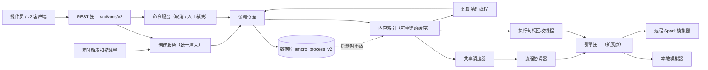
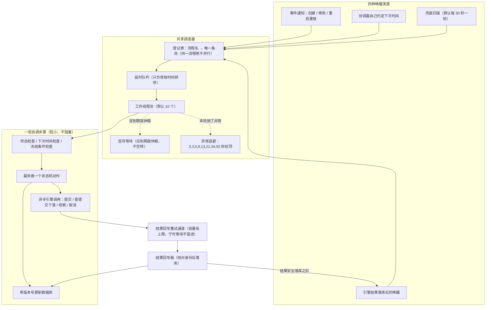
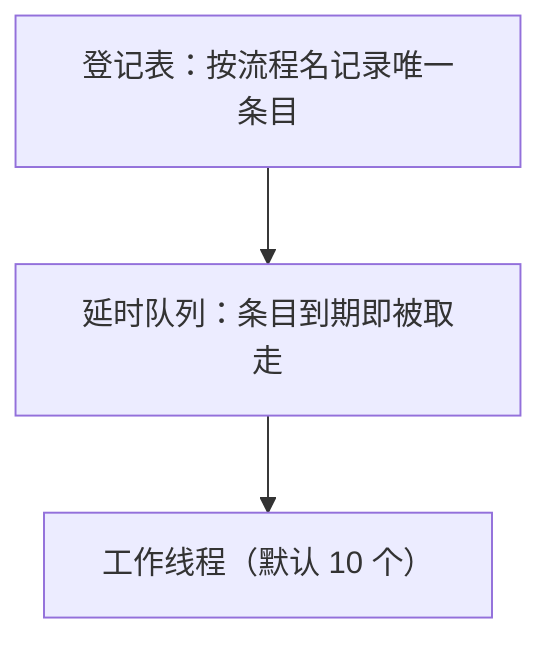
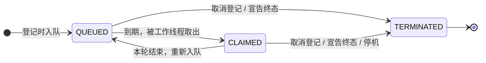
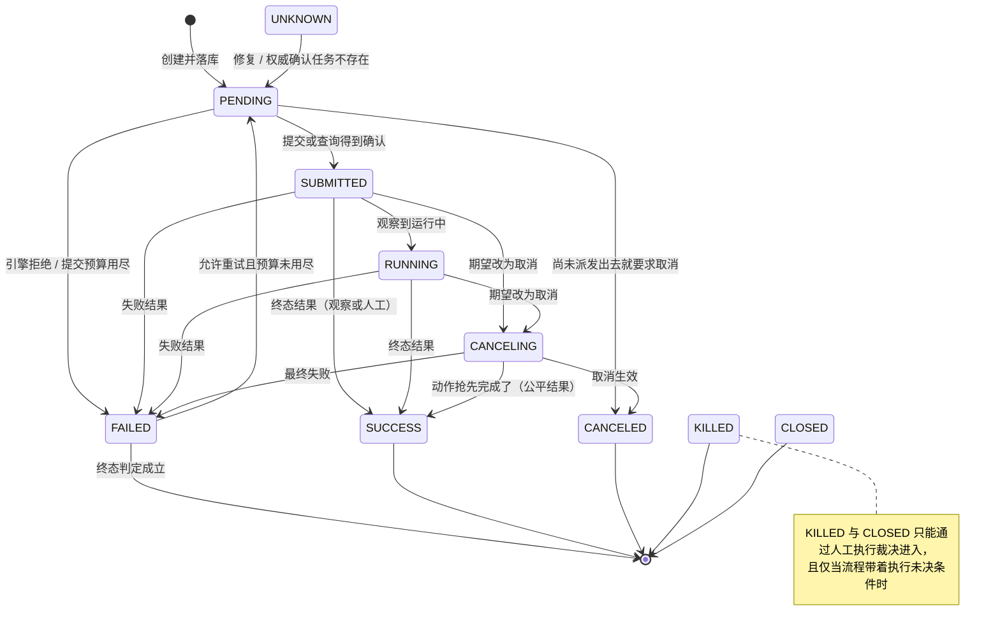
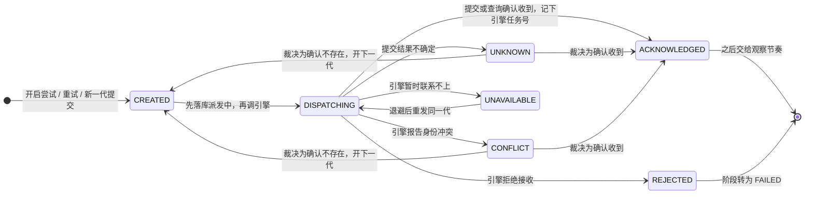

# Amoro AMS v2 Process 调度与状态机说明（中文版）

本文件是 [`ARCHITECTURE.md`](ARCHITECTURE.md) 的中文配套文档，用通俗语言讲清楚三件事：

1. v2 里一个 Process（流程）是怎么被一步步推进的（调度流程）；
2. 整个调度链路的架构图；
3. Process 的状态机（阶段怎么走、失败怎么重试、取消怎么生效）。

两份文档如有出入，以英文版为准。代码里的状态值（如 `PENDING`、`DISPATCHING`）是系统里
真实存在的字面值，因此图中保留英文原名，旁边配中文含义。

先约定几个词，后文直接使用：

- **流程（Process）**：一次要执行的维护动作，例如"给某张表做过期清理"。本模块目前只带
  模拟实现，不会真正执行 Iceberg/Paimon 的任何动作，默认情况下引擎列表和动作列表都是
  空的，只有显式打开 `amoro.process.simulation.enabled=true` 才会加载模拟器。
- **引擎（Engine）**：真正干活的一方，目前是本地模拟器和一个不联网的"远程 Spark"模拟器。
- **落库**：写入数据库。数据库是唯一的事实来源；内存里的数据只是缓存视图，随时可以删掉
  重建，不会丢信息。
- **带版本号的更新**：每条流程记录自带一个递增版本号。每次修改前先比对版本号，对不上
  说明别人已经先改了，本次修改作废，重新读最新值再来。这是防止并发改错的根本手段。
- **幂等**：同一个操作做一次和做多次，效果完全一样。
- **异步调用**：把请求发出去就返回，不在原地等结果；结果回来后再处理。
- **终态**：不会再变化的最终状态（成功、已取消、已杀掉、已关闭）。
- **退避**：失败后一次比一次等得稍久一点再重试，避免把对方打挂。

## 1. 这个模块是什么

一个单机的 Spring Boot 服务，用来证明完整的编排链路能跑通：

```
创建 → 落库 → 调度 → 提交给引擎 → 观察 / 取消 → 得到终态 → 归还引擎资源 → 到期清理
```

它不连接任何真实表，不做任何元数据或文件改动，也不提交真正的 Spark 任务。这些都要等
后续接入真实的动作实现。

## 2. 三条基本设计规则

1. **数据库是唯一事实来源。** 内存只是缓存，重启后从数据库重建。
2. **先落库，再做有副作用的动作。** 例如要向引擎提交任务时，先把"派发中"这个状态写进
   数据库，成功之后才真正调用引擎。这样任何时刻宕机，重启后都能从数据库看出当时进行到
   哪一步，绝不会"记不清自己发没发过请求"。
3. **每一轮只做一小步，做完记下"下次什么时候再看"。** 推进不靠记住发生过什么事件，而是
   每次都重新读数据库里的当前状态来决定下一步；事件通知只是"提醒去看一眼"，就算全丢了，
   还有周期性的兜底扫描，正确性不受影响。

## 3. 整体架构图



- 手工创建（REST 请求）和定时创建（扫描线程）走**同一个**创建服务，共用同一条准入规
  则：同一张表的同一个动作，同时最多只有一个在跑的流程。所以两条路并发也不会建出两
  个重复流程。
- 取消接口只负责把"期望改为取消"写进数据库，绝不在接口线程里调用引擎；后续交给调度器
  和协调器处理。

## 4. 一个流程在数据库里长什么样

整张表 `amoro_process_v2`，一行一个流程，内容是一份 YAML 文档（编码后存放），里面包含：

- **不变的执行规格**：哪张表、什么动作、用哪个引擎、谁发起的、带了什么参数、重试预算；
- **可变的状态**：当前阶段、重试次数、当前尝试的进展、历史记录、冻结条件、结果摘要、
  下次处理时间。

外加版本号：首次创建为 1，之后每成功修改一次加一。

## 5. 调度：谁来推进流程（重点）

### 5.1 调度总览图

一句话概括：任何"该干活了"的信号，最后都变成同一个动作——向共享的调度器登记"请尽快
跑一次某个流程的协调步骤"。调度器保证同一个流程同一时刻最多只有一步在执行；每一步本身
很短：读最新状态、决定下一步，要么带版本号改一次数据库，要么发一个异步引擎调用，然后
立刻结束。



### 5.2 四种唤醒来源

| 来源 | 什么时候出现 | 说明 |
|---|---|---|
| 事件通知 | 创建、修改、重启重放 | 数据库写入成功后，后台通知线程把变更告诉监听器，监听器向调度器登记这个流程 |
| 协调器自己 | 一轮结束时事情没做完 | 自己约定"多少毫秒后再来看我"，例如观察节奏默认 3 秒 |
| 兜底扫描 | 默认每 30 秒一轮 | 假设通知全丢了也能自愈：按固定顺序每次翻一批（默认 256 个，单轮最多跑 1 秒）活跃流程，逐个重新登记；调度器会自动去重，所以重复登记无害 |
| 结果落库后 | 引擎返回的结果写进数据库之后 | 写成功会立刻再登记一次该流程，让下一步马上被推进，不用等下个周期 |

### 5.3 调度器内部：同一个流程绝不并行



要点（均对应 `DefaultScheduler` 的实际行为）：

- **同一流程最多一个在执行**：队列里最多挂一个、手里最多执行一个，两者不会同时存在。
- **重复登记取最早的时间**：晚到的登记不会把已经约定的更早时间往后推。而且重复登记
  复用同一个条目对象，登记多少次队列里也只有一件东西，不会越堆越多。
- **正在执行时又来登记**：只记下"最早想要的时间"；等这轮执行完，工作线程会在"正常间隔"
  和"这个被记下的时间"里选更早的重新入队。
- **取消登记**（例如流程被删除）：条目立即标记终止并移出队列。每个条目带"代"的身份标记，
  老一代的线程绝不会误删或误排删掉后又重建的同名条目。
- **工作线程不空转**：队列头还没到时间就休眠；只有发生新登记、提前登记、取消、停机这类
  "信号"才会醒来。时间自己流逝不会唤醒任何人。
- **正常结束**：默认间隔 3 秒后再跑（配置项 `amoro.control.scheduler.delay-ms`）；流程
  自己登记的更早时间优先生效。
- **抛异常**：按固定序列退避 {3, 3, 5, 8, 13, 21, 34, 55} 秒（封顶 55 秒），外加 0–250
  毫秒的随机抖动，重试次数不限。
- **宣告终态**：条目移除，这个流程从此不再调度，直到它被删除或被重新创建。

登记条目自身的小状态机：



含义：QUEUED＝排队中；CLAIMED＝被领取、正在执行；TERMINATED＝已终止。

### 5.4 一轮协调步骤做什么

固定顺序，命中任何一步就返回，绝不贪多：

1. 读该流程的最新数据。
2. 如果终态数据缺了必要的标记（比如缺结束时间），先补齐（属于数据修复）。
3. 如果已经是终态：宣告结束，调度器移除条目。
4. 如果"下次处理时间"还没到：重新登记"到点再来看"，本轮结束。
5. 如果带着"执行结果不确定、只能人工裁决"的条件：只刷新一个提醒时间（默认每 5 分钟
   提醒一次），本轮结束。
6. 否则按期望状态走**一步**（具体走哪一步见第 6 章状态机）：期望是取消就走取消分支，
   否则走运行分支。一轮只做一件事——要么带版本号改一次数据库，要么发一个异步引擎调用
   （提交 / 查询提交下落 / 观察 / 取消）。

两个重要细节：

- **引擎调用永远是异步的**：发出去就返回，绝不在这一轮里等结果。同一个动作如果已经有
  一个在途的调用还没回来，本轮直接约定 250 毫秒后再试。
- **发调用之前先占名额**：向引擎发出任何调用之前，先在"结果回写通道"预定一个名额（默认
  上限 1024 个）。名额满了就先不调用引擎——宁可晚一点，也不允许出现"调用已经发出去了、
  回头却没有能力把结果写进数据库"的被动局面。

### 5.5 下次什么时候再看

| 本轮的情况 | 下次唤醒 |
|---|---|
| "下次处理时间"还没到 | 剩余的时间 |
| 同一动作已有在途调用未返回 | 250 毫秒后 |
| 本轮结论是"等一等"（观察节奏、引擎拒绝、刚开了新重试、该路由没有可用引擎） | 默认 3 秒后 |
| 带"执行未决"条件，只刷新了提醒 | 默认 5 分钟后 |
| 引擎暂时联系不上 | 由回写器把该操作自己的退避时间写进"下次处理时间" |
| 本轮发出了引擎调用或做完了一个动作，没另约时间 | 默认 3 秒的常规间隔；通常结果落库的唤醒会先到 |

### 5.6 后台维护线程一览

下面这些都是单线程、每次只处理一小批的后台循环。它们的定位是"修复便利"，不是正确性的
唯一依靠——就算它们全部停摆，流程推进依然由上面的调度链路保证。

| 线程 | 干什么 | 边界 |
|---|---|---|
| `amoro-process-trigger` | 定时触发：每个已注册的动作插件一个扫描器，每次翻一批表，逐个判断要不要发起流程，最后走同一个创建服务 | 只做判断和创建，不做别的 |
| `amoro-process-active-rescheduler` | 兜底扫描：默认每 30 秒、每批 256 个、单轮最多 1 秒 | 只负责重新登记，不做全量扫描 |
| `amoro-process-execution-handle-reaper` | 资源回收：默认每 60 秒取一批到期的引擎任务凭证，逐个幂等释放；失败就带着退避再排 | 只释放资源，不改业务结果 |
| `amoro-process-ttl` | 过期清理：终态流程保留默认 30 天后删除；删除前先确认资源已释放 | 只删到期且已释放的行 |
| `amoro-process-result-persistence-retry` | 结果回写重试：默认每 250 毫秒、每批 64 个，公平地重试那些"引擎已返回但还没写进数据库"的结果 | 只重试回写，不发新的引擎调用 |
| `amoro-process-engine-close` | 引擎适配器的收尾关闭 | 只在停机时工作 |
| `amoro-process-local-retention` | 本地模拟器终态结果的保留清理 | 仅模拟环境 |

启动与停机顺序：**启动**时先启动调度器，再启动这些维护线程；**停机**时反过来——先停维
护线程，再停调度器，然后关闭引擎和结果重试通道，再停事件通知线程，最后停数据库写入通
道。任何一步超时都会强制中断，所有关闭路径都可以重复执行；停机时没做完的事（比如还没
释放的资源），下次启动会从数据库里恢复出来继续做。

## 6. 状态机（重点）

### 6.1 两层状态，加一组条件

- **阶段（phase）**：业务意义上的大状态，外人看流程主要看这个。
- **提交状态（submitState）**：当前这次"把任务交给引擎"进行到哪一步，专门用来表达"副
  作用不确定"的问题。注意：派发中（`DISPATCHING`）是提交状态，不是阶段；处于派发中时，
  阶段仍然是 `PENDING`。
- **条件（conditions）**：五面"冻结旗"。每种条件冻结一类操作，等确定的事实到来才解冻。

阶段一览：

| 值 | 含义 | 是否终态 |
|---|---|---|
| `PENDING` | 待处理（起点） | 否 |
| `SUBMITTED` | 引擎已确认接收 | 否 |
| `RUNNING` | 运行中 | 否 |
| `CANCELING` | 取消中 | 否 |
| `FAILED` | 失败（是否终态看下述判定） | 视情况 |
| `SUCCESS` | 成功 | 是 |
| `CANCELED` | 已取消 | 是 |
| `KILLED` | 已杀掉 | 是 |
| `CLOSED` | 已关闭 | 是 |
| `UNKNOWN` | 仅用于修复导入的旧数据，按 `PENDING` 对待 | 否 |

`FAILED` 什么时候算终态：期望本来就是取消、或重试预算用完、或本次失败被判定"不允许重
试"。否则失败只是一个"要不要再来一次"的决策点：协调器会归档旧尝试、开一个新尝试，阶段
回到 `PENDING`。

### 6.2 阶段迁移图



图上每条边都是一次带版本号的数据库更新。其中：观察结果、引擎取消结果、人工裁决由"结果
回写器"异步写入；阶段意图类迁移（进入取消中、回到待处理、直接取消等）由协调器写入；人
工裁决的具体推导在一个纯函数里完成，命令服务负责重试写入。

### 6.3 提交状态图



读这张图的关键：

- **先落库"派发中"，再真正调引擎。** 这样即使写完就宕机，重启后看到"派发中"也绝不会盲目
  再提交一次，而是先去引擎那里查那次提交的下落。
- **查下落有两条路**：引擎支持查询就用引擎查；引擎不支持（或明确说查不了），只能由运维
  人工提交裁决——"确认收到"（必须带上引擎侧的任务号）或"确认不存在"。
- **确认不存在**：如果提交预算还没用完（同一尝试内允许提交的次数，配置项
  `max-submission-retries`），就开下一代提交重来；预算用完则本次尝试失败，原因记为
  `SUBMISSION_NOT_ACCEPTED`。
- **引擎暂时联系不上**：记"引擎不可达"条件，按该操作自己的退避节奏等下次重发同一代；
  这不算动作失败，不消耗动作重试预算。

### 6.4 五种条件

| 条件 | 什么情况下出现 | 冻结了什么 | 怎么解除 |
|---|---|---|---|
| 提交未决（`SubmissionUnresolved`） | 提交返回"不确定"或"身份冲突"；或引擎表示无法查询提交下落 | 不许换新一代提交，只能先把这一代的下落查清楚 | 权威结论"确认收到 / 确认不存在"（引擎查到或人工裁决） |
| 执行未决（`ExecutionUnresolved`） | 引擎报告这个执行"找不到了" | 提交、查下落、观察、取消全部冻结，只能等人工裁决结果 | 针对当前尝试的人工执行裁决 |
| 引擎不可达（`EngineUnreachable`） | 任何引擎调用返回"暂时联系不上" | 只按各操作自己的退避节奏等待；不消耗动作重试预算 | 某一轮所有退避计数都归零（引擎恢复正常） |
| 不支持取消（`CancellationUnsupported`） | 引擎能力声明里没有取消功能 | 取消退化为"只观察、不取消"，等它自己跑完 | 引擎能力版本变化后自动重试取消 |
| 数据已修复（`DataRepaired`） | 协调器补齐了缺失的终态标记 | 不冻结任何操作，纯审计标记 | 不解除，留作记录 |

## 7. 六个典型场景走读

1. **顺利成功**：创建（`PENDING`）→ 协调器开启尝试（`CREATED`）→ 落库"派发中" → 提交引
   擎 → 引擎确认（记下任务号，阶段变 `SUBMITTED`）→ 定期观察 → `RUNNING` → 观察到成功 →
   `SUCCESS`。之后资源回收线程去引擎释放任务凭证，保留期满后清理线程删除记录。
2. **失败重试**：观察到失败且允许重试 → `FAILED` → 下一轮把旧尝试归档、开新尝试、回到
   `PENDING`；重试预算耗尽则停在 `FAILED`（此时才是终态）。
3. **取消**：接口只把"期望=取消"落库。还没派发出去：直接 `CANCELED`；已派发且引擎确认
   过：进入 `CANCELING`，异步发取消命令并继续观察；如果动作赶在取消生效前完成，结果是
   `SUCCESS`（谁先完成算谁的，不会硬改结果）；引擎不支持取消就只观察不取消。
4. **引擎联系不上**：所有调用都返回"暂时联系不上" → 打"引擎不可达"条件，按退避等待重试；
   期间流程原地等待，不消耗重试预算；恢复后条件自动清除。
5. **提交结果不确定**：提交返回"不知道成没成功" → 打"提交未决"条件，冻结代数推进，先查
   下落；引擎查不出结论，就等人工裁决。
6. **服务重启**：启动时从数据库重读所有行、重建内存索引，然后给每个还活着的流程重新登记
   调度；处于"派发中"的流程重启后走查询而不是重发；已完成但没来得及释放或清理的，重启
   后由回收线程和清理线程接着处理。

## 8. 线程清单

| 线程 / 线程池 | 数量上限 | 允许做 | 不允许做 |
|---|---|---|---|
| HTTP 请求线程 | 由服务器管理 | 参数校验、读缓存、有界的仓库调用 | 调用引擎、执行动作 |
| `amoro-control-worker-*` 协调线程 | 默认 10 | 每次一小步协调 | 等待引擎结果、绕过仓库直接碰数据库 |
| `process-mutation-lane` 写入通道 | 单线程，队列有界 | 顺序执行所有数据库改动并更新缓存 | 任何引擎 / 网络调用 |
| `control-plane-*` 事件通知线程 | 有界（线程数、队列、重试都有限制） | 落库成功后的事件通知 | 把正确性寄托在通知送达上 |
| `amoro-process-local-action-*` | 模拟环境的线程数 + 有界队列 | 只跑模拟的本地动作 | 访问真实的表或动作 |
| 引擎超时计时线程 | 每个引擎一个 | 给异步调用兜底计时 | 修改业务状态 |
| 结果回写重试线程 | 单线程，名额有界 | 只重试"已返回但未落库"的结果回写 | 发起新的引擎调用 |
| 兜底扫描 / 资源回收 / 过期清理 / 定时触发 / 结果保留 | 各一条 | 见 5.6 节 | 见 5.6 节 |

## 9. 术语对照表

| 代码里的词 | 通俗含义 |
|---|---|
| `ProcessReconciler`（协调器） | 一个流程对应的"推进器"，一轮做一小步 |
| `ControllerKey`（登记键） | 调度登记用的键，流程域里就是流程名 |
| 同一流程不并行（single-flight） | 同一个流程同一时刻最多只有一步在执行，重复登记自动合并 |
| 按现状推进（level-triggered） | 每次按数据库里的真实状态决定下一步；通知只是提醒 |
| 带版本号更新（resourceVersion） | 更新前比对版本号，不一致即作废重读再来 |
| 缓存视图（projection） | 内存里的索引和缓存，随时可从数据库重建 |
| 写入通道（mutation lane） | 单线程排队执行所有数据库改动的通道 |
| `ListenerDispatcher`（事件通知线程池） | 落库成功后把变更告诉监听器的后台线程 |
| 尝试（attempt） | 一次完整的"提交 → 执行 → 出结果"；动作重试会开新尝试 |
| 提交代（dispatch generation） | 同一尝试内向引擎提交的第几轮 |
| `submissionKey` / `requestHash` | 提交身份和请求内容指纹，用来识别"是不是同一次提交" |
| `externalId` | 引擎侧返回的任务号 |
| `CommandFlight` | 一次异步引擎调用，外加"结果是否已安全落库"的标记 |
| 名额（lease / reservation） | 发引擎调用前在回写通道预定的位置；满了就不发 |
| 冻结（fencing） | 遇到结果未知时锁住身份，禁止再发同类请求，防止重复副作用 |
| 宁可等待不冒进（fail-closed） | 容量不足或结果未明时先停下等待，而不是继续往前冲 |
| 执行句柄（execution handle） | 引擎侧任务的凭证，流程结束后要还给引擎（调用释放） |
| 过期清理（TTL） | 终态流程保留若干天（默认 30 天）后删除 |
