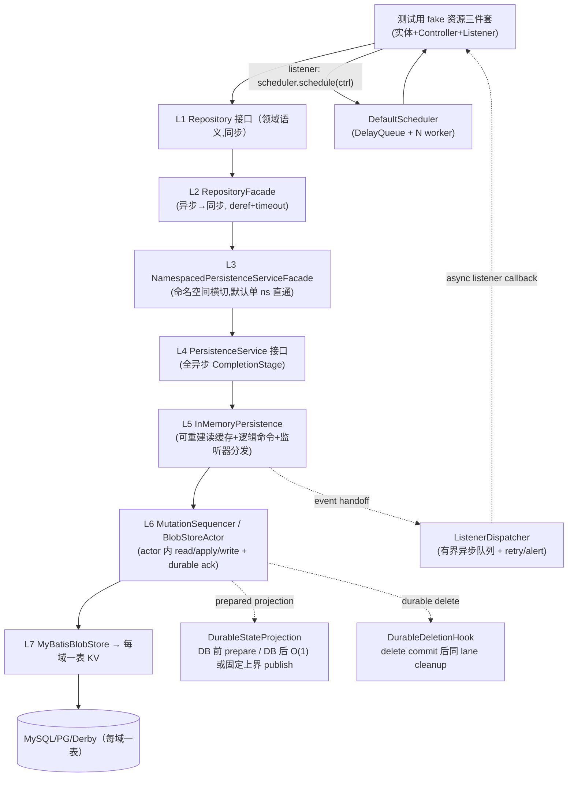

<!--
  Licensed to the Apache Software Foundation (ASF) under one
  or more contributor license agreements.  See the NOTICE file
  distributed with this work for additional information
  regarding copyright ownership.  The ASF licenses this file
  to you under the Apache License, Version 2.0 (the
  "License"); you may not use this file except in compliance
  with the License.  You may obtain a copy of the License at

      http://www.apache.org/licenses/LICENSE-2.0

  Unless required by applicable law or agreed to in writing,
  software distributed under the License is distributed on an
  "AS IS" BASIS, WITHOUT WARRANTIES OR CONDITIONS OF ANY
  KIND, either express or implied.  See the License for the
  specific language governing permissions and limitations
  under the License.
-->

# amoro-ams-v2 控制面框架 Spec — 调度框架 + 七层存储语义复刻

> 2026-08-22。决策链：采访确认（七层全套复刻 / 纯框架不接真实资源 / 语义重实现 / 每个行为先写失败的 JUnit 5 测试再实现 + 本地 Docker MySQL 5.7 流程验证）。
> 参考语义：control-plane 技能家族（overview / scheduler / state-machine / persistence）。宿主模块 amoro-ams-v2（Spring Boot 3.5.16，commit 1cfa9728f）。
> 历史方向/实现说明：`process-appmanager-redesign-options.md`、`process-control-plane-spec.md`、`process-reconciler-architecture.md`；当前 Process 资源权威规格为 `amoro-ams-v2-process-spec.md`，历史文档不覆盖本 spec 的框架契约。

---

## 1. 目标与非目标

**目标**：在 amoro-ams-v2 内语义重实现 SSP AppManager 的**通用资源控制面框架**——调度循环 + 七层持久化，资源无关：接入新资源只需实现实体 + Controller + PersistenceListener 三件套，不修改框架任何代码。JUnit 5 单测全覆盖；Docker MySQL 5.7 环境完成流程验证。

**非目标**：本框架任务本身不接任何真实资源（Process 由独立 spec/plan 实施）；与 v1 AMS 的集成/切换；多节点；Optimizer 域；前端；REST 资源端点（沿用现有 HealthController，不新增）。

**Success 判据**：
1. 框架语义与技能文档一致：DelayQueue 调度、同资源天然串行、TerminalState、退避序列、Listener 事件链、启动重放、七层存储读写路径、resourceVersion 并发。
2. 单测矩阵（§9）全绿，且**不依赖 Docker**即可运行；Docker MySQL 5.7 集成与流程验证（§8）单独分组可重复执行。
3. 测试中新增一种 fake 资源只写三件套即完成接入（资源无关性证明）。

---

## 2. 总体架构与包结构



单 Maven 模块内分包（决策：不嵌套子模块）：

```
org.apache.amoro
├── control                    # 契约层（对应 appmanager-controller-api）
│   ├── Controller             # key() + void invoke()
│   ├── ControllerKey          # domain + resourceId，跨域隔离
│   ├── Scheduler              # schedule / unschedule / postStart / shutdown
│   ├── TerminalState          # 单例异常, writableStackTrace=false
│   ├── DefaultScheduler       # DelayQueue + N SchedulerWorker(daemon)
│   ├── ScheduledController    # Delayed; resourceId、nextDesiredTime、backOffAttempts（并发字段 volatile）
│   ├── SchedulerWorker        # peek/wait/poll→invoke→重入队; 异常退避不丢弃
│   ├── Clock / BackoffPolicy  # {3,3,5,8,13,21,34,55}s + [0,250)ms 抖动, 可注入
│   ├── RandomSupplier         # 可注入随机源（抖动可确定性测试）
│   ├── SchedulerWaitStrategy  # signal version + Condition 等待；时钟推进须显式 signal
├── persistence                # 存储契约与内存层（对应 persistence-database）
│   ├── Repository / Selector  # L1 领域语义接口与选择器
│   ├── PersistenceService     # L4 全异步契约: create/modify(id,fn)/get/delete/select/addListener/postStart
│   ├── PersistenceListener    # afterCreated/afterModified/afterDeleted/postStart
│   ├── ListenerEventSink / ListenerEnvelope  # T5 handoff port；T6 提供有界实现
│   ├── DurableStateProjection # DB 前 prepare immutable index snapshot，commit 后 O(1) publish
│   ├── DurableDeletionHook    # delete commit 后同 lane cleanup；失败 fence name
│   ├── MutationCommand        # deferred 操作类型/expectedVersion/updateFn，禁止预计算候选
│   ├── InMemoryPersistence    # L5: 内存 map、逻辑命令入口、durable 后发布、监听器分发
│   ├── ListenerDispatcher     # 有界异步事件队列、listener retry/alert
│   ├── facade/                # L2 RepositoryFacade + L3 namespace 横切
│   └── blob/                  # blob 落库层（对应 k8s-style-impl）
│       ├── BlobStore          # L7 blob 落库契约
│       ├── BlobStoreActor     # L6 每域 mutation lane，有界 mailbox
│       └── MyBatisBlobStore / ResourceBlobMapper   # L7
├── serde                      # 版本化序列化
│   ├── VersionAwareJacksonSerde（格式策略化: JSON 默认 / YAML 按域）/ SerdeRegistry / VersionedResourceConverter
└── config                     # Spring 装配 + 配置属性
```

---

## 3. 契约层接口（核心签名）

```java
public interface Controller {
  ControllerKey key();
  void invoke();
}

public final class ControllerKey {
  // value object: domain + resourceId
}

public interface Scheduler {
  void schedule(Controller controller);   // 幂等接入调度（同 ControllerKey 单飞行去重, §4）
  void schedule(Controller controller, Duration nextDelay); // 携带延迟重排（§4.6 single-flight 的 delay 载体；资源层 TransitionResult.nextDelay 经此传递）
  void unschedule(ControllerKey key);      // 删除资源时终止排队/在途 entry；幂等
  void postStart();                        // 接口形状保留的 no-op；worker 仅由 DefaultScheduler 生命周期 start 启动，重放入口在 PersistenceService.postStart
  void shutdown(Duration timeout);         // 优雅停机（保真偏差 #1）
}

public interface SchedulerWaitStrategy {
  long signalVersion();
  void awaitChange(long observedVersion) throws InterruptedException;
  void awaitChange(long observedVersion, Duration maximumWait) throws InterruptedException;
  void signal();
}

public interface PersistenceService<R> {   // 全异步
  CompletionStage<R> create(R resource);
  CompletionStage<R> modify(String id, Function<R, R> updateFn); // lane 内无条件原子 read-apply-write
  CompletionStage<R> modify(
      String id, long expectedResourceVersion, Function<R, R> updateFn); // version CAS
  CompletionStage<R> get(String id);
  CompletionStage<R> delete(String id);
  CompletionStage<R> delete(String id, long expectedResourceVersion); // version CAS
  CompletionStage<List<R>> select(Selector<R> selector);
  void addListener(PersistenceListener<R> listener);
  void postStart();                        // 加载存量 + 逐资源回调 listener.postStart
}

public interface PersistenceListener<R> {
  void afterCreated(R resource);
  void afterModified(R resource);
  void afterDeleted(R resource);
  void postStart(R existingResource);      // 存量重放: 在此 scheduler.schedule(ctrl)
}

public interface ListenerEventSink<R> {
  HandoffResult handoff(ListenerEnvelope<R> event); // ACCEPTED / DROPPED；不执行回调
}

public interface DurableStateProjection<R> {
  PreparedProjectionUpdate prepare(PersistenceChange<R> change); // pure、非阻塞、禁止 I/O
}

public final class PersistenceChange<R> {
  // CREATE(previous=null,current), MODIFY(previous,current), DELETE(previous,current=null)；均 detached
}

public interface PreparedProjectionUpdate {
  void commit(); // 只能做 immutable snapshot O(1) 切换或已声明固定上界的 key delta；不得抛异常
}

public interface DurableDeletionHook<R> {
  void afterDurableDelete(R deletedResource); // 同 lane、非阻塞、禁止 I/O
}
```

TerminalState：单例、`writableStackTrace=false`；worker 捕获后**永久停止该资源调度**。

## 4. 调度器语义（复刻 + 三处已确认改良）

1. **MailBox 串行**：worker 从队列取到期包装 → invoke → 计算下次时间 → 重入队。同一资源同一时刻至多一个 Controller 在执行，结构上无并发重入。`DelayQueue` 只负责 deadline 排序和到期后的非阻塞 `poll()`，worker 不调用裸 `take()` 或真实时间的 timed poll：它先读取 `SchedulerWaitStrategy.signalVersion()`，再 peek head、按注入 `Clock` 计算剩余时间，并调用 `awaitChange(version, remaining)`；空队列调用无超时重载。生产实现用 `Condition`，在 signal version 已变化时立即返回，避免 peek 与 await 之间丢信号。新增或缩短 deadline、unschedule 和 shutdown 都必须 `signal()`。单独推进 fake Clock**不会**唤醒等待；测试必须通过 `FakeWaitStrategy.advanceClockAndSignal(...)` 原子推进时钟并发信号（保真台账 #10）。
2. **invoke 三分支**：成功 → `backOffAttempts=0`、next=now+delay；TerminalState → 不再入队；其他 Throwable → 实际发出的退避序列固定为 `{3,3,5,8,13,21,34,55}` 秒，超出后封顶 55 秒，再加 `[0,250)` 毫秒抖动，**无限重试**。实现必须先按当前 attempt 取值、再递增，避免 pre-increment 导致第二个 `3s` 被跳过。退避与到期计算均消费注入的单调时钟与可注入随机源。
3. worker daemon、命名 `amoro-control-worker-%d`；`ScheduledController` 的 nextDesiredTime/backOffAttempts/rescheduleRequested **显式 volatile**（参考实现依赖队列锁的隐式 happen-before，复刻时不采用该隐蔽前提）。
4. **改良 #1 优雅停机**：shutdown 停止接受 schedule（后续 `schedule` 抛 `RejectedExecutionException`）→ 停止取件 → 有限等待在途 invoke（默认 10s）→ 超时放行（level-triggered 下依赖重启重放收敛）。`unschedule` 在 shutdown 期间及之后仍幂等清理/无操作，不抛拒绝异常。
5. **改良 #2 worker 不静默丢弃**：参考实现在 worker 层 catch Throwable 后永久丢弃控制器（OOM 级故障下资源状态机静默停摆）；本实现 worker 只记日志并按退避重入队，仅 TerminalState 终止调度。
6. **改良 #3 同 ControllerKey 单飞行（single-flight）**：调度器维护 `ConcurrentHashMap<ControllerKey, ScheduledEntry>`；裸 resourceId 不能跨资源域唯一。每个 entry 是该次注册的 generation identity，状态为 `QUEUED/CLAIMED/TERMINATED`；所有 schedule/worker-claim/unschedule 状态迁移和 deadline 合并都在 `synchronized(entry)`（或等价 per-key lock）内完成，禁止两个 updater 并行 remove/reinsert。`schedule()` 语义：
   - 无条目 → 入队新包装并登记；
   - `QUEUED` → 原子比较 deadline；新 deadline 更早时在 entry 锁内从 `DelayQueue` 移除**同一个包装**、更新后重新入队。因为 updater 被 entry 锁串行化，remove=false 只表示 worker 已 take；此时把 entry 标为 `CLAIMED` 并合并 reschedule deadline。较晚请求不得推迟既有任务；实现不创建 tombstone，队列元素数不得随重复 schedule 增长；
   - 条目在途（正被 invoke）→ **不入队**，将 `rescheduleRequested` 的 deadline 原子收敛为所有请求中的最早值，worker 于 invoke 返回后按该 deadline 重入队——保证紧急取消不被普通轮询推迟，并保证任何时刻同一资源至多一个包装在飞；
   - 调用方取到旧 entry 后发现 `TERMINATED` → 不得复用或重新入队旧包装；identity-aware remove 后从 map 重新查找/putIfAbsent 新 entry。并发 schedule 只有成功安装的 entry 能入队，失败候选不得遗留队列元素；
   - TerminalState → entry 标记 `TERMINATED`，并用 `map.remove(key, entry)` 移除；
   - `unschedule(key)` → 在 entry 锁内标记 `TERMINATED`，QUEUED 时移除包装、CLAIMED 时允许当前 invoke 返回但禁止重入队，再用 identity-aware `map.remove(key, entry)` 移除。随后同 key 重建得到新 entry identity；旧 worker 不得删除或重排新 entry。

## 5. 七层存储语义

### 5.1 读写路径

- **深不可变边界**：`ControlledResource` 及其全部 nested value/collection 按契约深不可变（final 字段、构造时防御复制、集合不可修改、无 mutator），但 Java 泛型无法静态证明该约束，因此框架仍以 serde round-trip 的 `detachedCopy` 隔离所有不可信 alias。create 入参在入队时复制；modify 的 updateFn 只接收当前 canonical snapshot 的 detached copy，必须返回新的资源实例；候选在入库/发布前再次复制并校验；get/select/stage 返回值和 listener envelope 均为 detached copy。调用方、updateFn 或 listener 永远拿不到 cache 的 canonical 引用，原地修改后抛错、serde/DB 失败或读取后修改均不能旁路 durable-first。
- **读走内存**：map 点查/selector 候选枚举不触 DB；返回前做 detached copy。select 支持按 collection/kind 与谓词过滤，谓词同样只接收 detached copy。
- **写路径（durable-first）**：调用线程只构造含可选 expected resourceVersion、updateFn 与操作类型的 `MutationCommand` 并入队；无版本重载用于 lane 内无条件原子 read-apply-write，带版本重载用于 Controller/命令/清理器 CAS。每持久化域唯一的 mutation sequencer/actor 在自己的串行 lane 内执行“读取最新已提交 canonical 值 → detached copy → 校验前置条件 → 应用 updateFn（InvariantCheck）→ 分配 resourceVersion → 序列化候选 → 让所有 `DurableStateProjection` prepare immutable index snapshot 或固定上界 key delta → DB INSERT/UPDATE/DELETE”。projection prepare 必须纯、非阻塞、无 I/O，并完成所有可能失败的计算/分配；prepare 失败发生在 DB 前，命令无副作用。updateFn 同样不得 I/O、递归调用 PersistenceService 或产生外部副作用。**DB 成功后**仍在同一 lane 发布新的 canonical cache snapshot，并调用 prepared projection 的 non-throwing commit；commit 只允许 O(1) immutable snapshot 原子切换，或已在域契约声明固定 key 数上界的逐 key 可见性更新，禁止未绑定资源规模的遍历/分配。随后把逐 listener 的 detached `ListenerEnvelope` 交给 `ListenerEventSink`，最后以 detached 返回值成功完成 mutation stage。这里的 same-lane 只保证写入顺序，**不等于**两个独立 `AtomicReference` 或 cache/index 容器的跨对象原子可见性；若领域读操作必须同时依赖资源正文与多个索引，领域必须把供读的 canonical map 与这些索引聚合进同一个 immutable projection snapshot 并只读取一次引用，或提供有严格重试边界的等价 read barrier，不能先读索引再裸读 framework cache。DELETE 还必须在 cache/projection publish 后、delete stage 完成与下一条同名 mutation 出队前，同步执行域注册的 `DurableDeletionHook`；Process 用它直接 key-only unschedule。hook 只允许非阻塞的进程内 cleanup/queue handoff，禁止 DB、网络或等待 future。hook 若意外失败，框架返回 `PostCommitCleanupException` 并 fence 该 name，fence record 暂存 detached deleted snapshot，repair 在同一 lane 重试 hook，成功后清除 snapshot/fence 并允许同名 create；进程若在 hook 前崩溃，新进程没有旧 scheduler entry，DB 重放为空即可安全解除该进程内窗口。禁止在入队前读取旧值或预计算候选，否则两个并发 modify 会基于同一版本丢更新。mailbox 满、detached copy/projection prepare/serde/DB 明确失败时 stage exceptional，内存/resourceVersion/index/listener 均不变。数据库是持久事实源，内存及二级索引仅是可从 DB 重建的读投影。
- **确认语义**：actor 接受消息不等于写成功；调用方收到成功 `CompletionStage` 时，数据库变更已经完成。框架不允许在已向调用方确认成功后仅靠后台无限重试补数据库。
- **提交结果未知**：连接中断等异常可能发生在 DB 已提交之后。actor 用新连接按 name 点读并按操作类型比较：INSERT 的 previous=缺失、candidate=新行；UPDATE 的 previous=旧行、candidate=新行；DELETE 的 previous=旧行、candidate=缺失。读到 candidate（DELETE 为缺失）→ 按成功发布；读到 previous → 确认未提交并 exceptional、内存不变；读到第三种值、读失败或无法证明 → `PersistenceOutcomeUnknownException`，fence 该 resource key，禁止后续写，直至 repair reload 从 DB 重建并解除。不得把 DELETE 的“缺失”误判为失败，也不得把 outcome unknown 当普通失败立即重试。

### 5.2 并发控制（四机制）

1. 单写者串行（主机制）：每持久化域的 mutation sequencer/BlobStoreActor 串行处理逻辑命令；读取最新值、执行 updateFn、生成候选、DB 写和内存发布全部在同一 lane。串行对象是 mutation，而不是调用线程预先算好的候选值。
2. 应用层 resourceVersion：create 入参必须为未持久化版本 `0`，框架在首次 INSERT 候选上分配 `1`；调用方不得自选初始版本。此后每次成功 modify 恰好 +1；Controller、外部命令和条件清理必须调用带 `expectedResourceVersion` 的 modify/delete 重载，版本不匹配 → `PreconditionFailedException`，本次不生效、**不自动重试**（下一轮 reconcile/命令重读最新版本后收敛）。无版本 modify 只用于明确需要 lane 内原子累加等框架/领域操作，不能被 Process 状态机旁路使用。
3. 唯一名称防重复创建：同域写序列化 + DB 主键；`DuplicateKeyException` → `ResourceAlreadyExists`。如实现 pending reservation，DB 失败时必须释放，且在 DB 成功前不得出现在可读内存 map。
4. outcome-unknown fencing：按 `(domain,name)` 阻止后续 mutation，避免未知提交后在旧内存快照上继续写；健康指标和告警必须暴露 fenced key 数。

### 5.3 单表 KV（DDL，每域一表）

**表名按持久化域参数化（评审 R2）**：每个 `PersistenceService` 域实例绑定一张同构表——默认域 `amoro_resource`（SSP 为 `appmanager`，改名避免语义混淆）；**Process 域按其独立规格绑定 `amoro_process`**，使其具备独立保留期和条件批量清理生命周期。运行时清理不得使用 `TRUNCATE`；全表 truncate 仅用于测试 teardown 或显式停机维护。参考实现为全资源单表，此偏差记台账 #14。**域以描述符 `PersistenceDomain(domainName, table, serdeFormat)` 声明**——表名与 serde 格式只在描述符处定义（表名经枚举白名单校验，防注入）；框架装配提供默认域 bean（amoro_resource / JSON），新域以独立 bean 注册。`MyBatisBlobStore`/mapper 的 SQL 五种不变，表名来自域绑定。三库各有初始化脚本；MySQL/PostgreSQL 使用 `CREATE TABLE IF NOT EXISTS`，仓库实际 Derby 10.14.2.0 不支持该语法，因此 Derby 使用 plain `CREATE TABLE`，initializer 先以 metadata 判空，仅在缺表时执行，并只容忍并发建表产生的 table-exists SQLState。MySQL 5.7 版（所有域表同构）：

```sql
CREATE TABLE IF NOT EXISTS amoro_resource (
    name       VARCHAR(256) NOT NULL,          -- 资源全局唯一 ID
    collection CHAR(50)     NOT NULL,          -- 资源 kind 小写
    value      MEDIUMTEXT   NOT NULL,          -- Base64(JSON(apiVersion + 完整资源))
    last       DATETIME     NOT NULL,          -- 最后更新时间（应用赋值；DATETIME 规避 TIMESTAMP 2038 与隐式 ON UPDATE 副作用）
    PRIMARY KEY (name)
) ENGINE=InnoDB DEFAULT CHARSET=utf8mb4;
```

- `value` 用 **MEDIUMTEXT**：序列化上限 65536 指原始 JSON 字节，Base64 后约 +33% 会溢出 TEXT 的 65535 字节（MySQL 严格模式报错、非严格模式静默截断——比报错更糟）。
- 三库类型必须按各自方言实现，不能复制 MySQL 类型：MySQL 5.7 为 `value MEDIUMTEXT`、`last DATETIME`；PostgreSQL 为 `value TEXT`、`last TIMESTAMP(3) WITHOUT TIME ZONE`；Derby 为 `value CLOB`、`last TIMESTAMP`。本期运行时集成覆盖 Derby 与 MySQL 5.7；PostgreSQL 脚本做静态契约检查，未运行 PostgreSQL 集成测试前必须明确记为未验证。
- `collection` **无二级索引**（忠实参考：读全部依赖内存；代价记录于保真台账）。
- 建表走 Spring Boot `SqlDataSourceScriptDatabaseInitializer`（schema.sql），无 Flyway/Liquibase。
- SQL 仅五种：INSERT / UPDATE / DELETE / 按 (collection,name) 点查 / 按 collection 全量游标。

### 5.4 版本化 serde 与 schema 演化契约（读取时懒升级）

**序列化契约**（`ResourceSerde<R>`）：

- `DeserializedResource<R> deserialize(byte[]) → { resource, modifiedDuringDeserialization }`——转换发生数据修补时置标志，**启动加载时回写 DB**（懒迁移，无停机迁移脚本）。
- 序列化**永远写最新版本**：实体携带 `apiVersion` 常量（如 `process/v2` 发布后，一切写路径产出 v2）。
- 反序列化五步：readTree → 读 `apiVersion`（缺失 → "not a versioned resource" 异常）→ 按版本查 Converter → convert 链逐级升级至最新 → 修补则置标志。
- **格式策略化（评审 R2）**：默认 JSON；按域/资源类型可选 YAML（`jackson-dataformat-yaml`，模块 pom 自包含定版）。apiVersion 与 Converter 链对两种格式语义一致；Base64 编码规避 YAML 空白敏感问题。

**演化纪律（严格档，采访确认 2026-08-22）**——保证 Converter 永远只做"补默认值/字段搬运"：

| 允许 | 禁止 |
|---|---|
| 新增字段（必须带默认值：Converter 补默认或字段初始化，**优先经 Converter**——等价参考实现"新增字段优先 Converter 补默认值，而非 SQL 迁移脚本"） | 修改字段语义 |
| 重命名（= 删旧加新 + Converter 搬运） | 复用已废弃字段名 |
| 类型变更（= 删旧 deprecate + 加新） | 物理删除字段（只能标 deprecated 且不再写入） |
| 枚举加值 | 修改已有枚举值含义 |

**未知字段策略**：Jackson `FAIL_ON_UNKNOWN_PROPERTIES=false`——旧代码读新数据不抛异常（升级窗口期双向兼容）；未知字段**容忍丢弃，不做保留回写**（单节点滚动窗口极小，保留回写成本高于收益；AppManager 同款取舍）。

**版本共存与永久保留（采访确认）**：多版本行在库中共存，懒升级读时归一；**旧 Converter 与每版本 golden fixture 测试永久保留**——活跃资源可能跨版本共存，删除旧 Converter 会使启动加载失败；"批量回写后删旧 Converter"的大扫除策略被否（每次升级需回写任务且期间不可停机）。

**Converter 注册与启动校验**：Spring classpath 扫描 `VersionedResourceConverter`（替代参考实现的 Reflections，惯用法适配）；注册时执行两项启动自检——① 冲突检测：同 (资源类型, 输入版本) 重复注册即启动失败；② 链完整性：存在历史版本但通往最新的 Converter 链缺环即启动失败。

**测试要求**：每版本 golden fixture（样本文件）永久锁死；往返一致；最旧→最新全链转换；未知字段容忍（新数据旧读不炸）。

- 序列化缓冲上限默认 65536 字节，**可配置**（参考实现硬编码，超大资源会溢出——已知缺陷，改良为配置项并记台账）。

---

## 6. 事件链与启动重放

```
启动: PersistenceService.postStart(DB 全量游标加载 → 内存 map + projection 重建 → 逐资源尝试 handoff POST_START 事件)
异步: ListenerDispatcher → listener.postStart → scheduler.schedule(controller)
      —— DB 是事实源, 内存可全丢可重建；handoff 丢失由资源域 repair sweep 补偿
写入: mutation 编排(§5.1: 入队逻辑命令 → actor 内 read/apply/prepare projection/write
      → DB 成功 → 发布内存+projection → DELETE 同 lane hook → 尝试 handoff → 完成 mutation stage)
异步: ListenerDispatcher → listener callback → DelayQueue；DB 失败则内存/listener/stage-success 均不发生
```

listener 回调失败不能回滚已经 durable 的资源，也**不能把已经成功的 mutation stage 改成失败**：durable write 与内存发布完成后，mutation stage 按成功完成；listener 异步执行，故障只进入独立的有界重试与告警通道。T4 的 `ListenerEventSink` 是 durable lane 与异步实现之间的固定 port，T5 用 fake sink 验证 handoff，T6 的 `ListenerDispatcher` 提供有界实现。Dispatcher 内部 event envelope 固定携带 `(domain,name,resourceVersion,eventType,listenerIdentity,detachedResourceSnapshot)`；对同一 `(listenerIdentity,domain,name)` 串行保持 create/modify/delete 的 handoff 顺序，失败重试完成或耗尽前不越过该 pair 的后续事件，但不得阻断其他 listener 或其他 resource key。全局不承诺顺序，进程崩溃/repair 会产生重复投递，因此 listener 必须幂等且按最新资源做 level-triggered 副作用，不能把事件快照当最终事实。dispatcher 队列满时 mutation stage 仍成功，同时递增 dropped-event 指标并告警；资源域 repair sweep 必须补偿该事件（首个 Process 资源提供有界分页的 `ActiveProcessRescheduler`）。删除的立即 unschedule 由同一 mutation lane 的 `DurableDeletionHook` 保证，afterDeleted listener 仅作幂等补偿，不能作为唯一正确性路径。single-flight 使重复 schedule/unschedule 安全。

## 7. Spring Boot 装配与配置

- `ControlPlaneAutoConfiguration`：Scheduler / PersistenceService / InMemoryPersistence / BlobStoreActor / Serde 的 Bean 装配与销毁回调（Actor 排空、Scheduler shutdown 挂入 SmartLifecycle）。
- 配置键（`AmoroControlProperties`，前缀 `amoro.control`）：

| key | 默认 | 含义 |
|---|---|---|
| `amoro.control.scheduler.workers` | 10 | worker 数（参考实现代码默认 10） |
| `amoro.control.scheduler.delay-ms` | 3000 | 常规调度周期 |
| `amoro.control.storage.max-resource-bytes` | 65536 | 序列化缓冲上限 |
| `amoro.control.actor.queue-capacity` | 1024 | mailbox 有界队列（与参考实现容量一致；满时写方失败上抛） |
| `amoro.control.listener.workers` | 4 | listener 专用 worker；不占 mutation lane 或 scheduler worker |
| `amoro.control.listener.queue-capacity` | 1024 | listener 事件有界队列；满时 mutation 仍成功并记录 dropped/alert |
| `amoro.control.listener.max-retries` | 3 | 首次回调失败后最多重试次数；耗尽后告警并等待资源域 repair sweep |
| `amoro.control.listener.retry-delay-ms` | 1000 | listener 独立重试间隔；不得占用 mutation lane 或 scheduler worker |
| `amoro.control.repository.timeout-ms` | 10000 | L2 `RepositoryFacade` 等待异步 persistence 的最大时间 |
| `amoro.control.lifecycle.shutdown-timeout-ms` | 10000 | scheduler、listener dispatcher 和 actor 各自有限排空的统一上限 |

scheduler/listener workers、两类 queue-capacity、listener retry-delay、repository timeout 和 lifecycle shutdown timeout 必须 `>0`，listener max-retries 必须 `>=0`；非法值在 Spring context 启动时 fail-fast。ListenerDispatcher 停机时先拒绝新 handoff，再在统一 lifecycle shutdown timeout 内排空；Scheduler 和 actor 分别使用同一配置值作为各自阶段的最大等待，不把三段时间合并成一个无界全局等待。未完成事件记录 dropped/shutdown 指标并由重启 postStart/资源域 repair 重建。

- 数据源沿用标准 `spring.datasource.*`；**`mybatis-spring-boot-starter` 不被 Boot BOM 管理**（第三方 starter），必须显式定版（3.0.x 线，实现时验证与 Boot 3.5 的适配版本）。**MySQL 5.7 约束：pin `mysql-connector-j` 8.x**（Boot BOM 默认 9.x 已不支持 5.7）。**依赖自包含原则（用户确认）：amoro-ams-v2 的第三方依赖版本一律在本模块 pom 内独立定义，不依赖父 pom 的 dependencyManagement/版本属性**——v2 与 v1 解耦演进，父 pom 为 v1 需要调版本时不波及 v2。

## 8. 验证环境：本地 Docker MySQL 5.7

```bash
# mysql:5.7 仅 amd64 镜像, Apple Silicon 走 Rosetta 模拟
docker pull mysql:5.7
docker run -d --name amoro-mysql57 --platform linux/amd64 \
  -p 3307:3306 \
  -e MYSQL_ROOT_PASSWORD="${AMORO_V2_MYSQL_ROOT_PASSWORD:?set privately}" \
  -e MYSQL_DATABASE=amoro_v2 \
  mysql:5.7 --character-set-server=utf8mb4 --collation-server=utf8mb4_unicode_ci
```

- 端口 **3307**（避免与本机既有 mysql:8.0 容器冲突）。
- Spring profile `mysql57`：`jdbc:mysql://localhost:3307/amoro_v2?useSSL=false&characterEncoding=utf8` + schema.sql 自动建表。
- docker 集成测试打 `@Tag("docker-mysql")` + 端口 3307 assumption 探测（第二道保险）；**激活机制**：模块 pom 用属性驱动 `<excludedGroups>${docker-mysql.excluded}</excludedGroups>`（默认 `docker-mysql`），`-Pdocker-it` profile 置空该属性并注入 `spring.profiles.active=mysql57` —— 严禁 pom 字面量 excludedGroups（`-Dgroups` 无法覆盖字面量，会静默假绿）。无 Docker 环境默认全量单测离线绿。

## 9. JUnit 5 单测矩阵（Jupiter）

| 组件 | 用例 |
|---|---|
| DefaultScheduler | 同 ControllerKey 串行并跨域隔离；在途再次 schedule；最早 deadline 合并（慢请求不能推迟紧急请求）；排队/在途 unschedule；删除后同 key 新 generation 不受旧 worker 影响；signal-version 防丢唤醒；fake clock 只有 advance+signal 才到期；退避序列精确值与 `[0,250)` 抖动界；TerminalState 永久停止；普通异常无限重试不丢弃；登记表无泄漏；优雅停机 |
| InMemoryPersistence | CRUD/select 读走内存但返回 detached copy；create 初始版本 1；并发 deferred modify 无丢更新；原地修改/抛错/serde 或 DB 失败不能改变 canonical cache；create/get/select/listener 无 mutable alias；DB 成功前内存/listener/stage 均不成功；INSERT/UPDATE/DELETE outcome unknown 分别点读消解或 fence；updateFn 禁改 name；resourceVersion 自增；expectedResourceVersion modify/delete 冲突拒绝且无重试；delete hook 阻塞期间同名 create 不出队，hook 失败 fence，旧 cleanup 不误杀新 entry；listener 失败不反转 mutation stage并进入有界重试/告警 |
| BlobStoreActor | mailbox 串行（N 并发写无丢失更新，终态可断言）；FIFO；有界队列拒绝；停机排空 |
| MyBatisBlobStore（@docker-mysql） | 五种 SQL 语义；**双域双表绑定（表名参数化，各自隔离读写）**；MySQL `MEDIUMTEXT/DATETIME` 真库执行；Derby `CLOB/TIMESTAMP` + metadata-guard plain CREATE 本地幂等；PG `TEXT/TIMESTAMP(3) WITHOUT TIME ZONE` 静态契约且明确未做 runtime；DuplicateKey→ResourceAlreadyExists；重启重建=落库内容；懒升级回写 |
| serde | v1→v2→v3 转换链；apiVersion 缺失/未知版本报错语义；Base64(JSON) 往返一致；**YAML 分支（Base64(YAML) 往返 + 同一转换链）**；超限资源报错 |
| **流程验证（@docker-mysql, 端到端）** | fake 资源三件套：create → afterCreated → schedule → Controller 多轮 invoke（含一次异常退避、一次版本冲突放弃后下轮收敛）→ TerminalState 终止 → **重启（新 Scheduler/Persistence 实例）后 postStart 重放，资源从 DB 重建并继续收敛** —— 即"DB 是事实源"的运行时证明 |
| 资源无关性 | 第二种 fake 资源（不同 collection/实体/Controller）仅新增三件套即通过同一套流程用例 |

## 10. 验收标准

1. §9 矩阵全绿（离线部分）+ Docker MySQL 5.7 流程验证绿。
2. `JAVA_HOME=jdk-11 ./mvnw clean compile -Pskip-dashboard-build` 与 `JAVA_HOME=jdk-17 ./mvnw -pl amoro-ams-v2 clean package` 均不回归。
3. spotless/checkstyle 过（语法保持 GJF 1.7 可解析：**不用** record / switch 表达式 / 文本块 / instanceof 模式匹配 / sealed 类 / 模式 switch；新增 sql/yaml 文件同样带 Apache 协议头——rat verify 会检查）。
4. 新增依赖仅：mybatis-spring-boot-starter、mysql-connector-j(8.x, runtime)、jackson-dataformat-yaml、（测试）无新框架。

## 11. 实施拆分（每步独立 RED→GREEN→Review→验证→本地提交）

| 阶段 | 内容 | 产出 |
|---|---|---|
| F1 | 契约层 + 调度器 + BackoffPolicy + 全部调度器单测 | 调度循环可跑（fake Controller 直连 Scheduler） |
| F2 | T4/T7 契约与 serde → T8 mutation sequencer/actor → T5/T6 内存发布与 listener；配套内存/actor/serde 单测（blob 用 fake） | 完整 read-apply-write 串行且 durable-first，无真 DB 依赖 |
| F3 | L7 MyBatisBlobStore + Spring 装配 + DDL + Docker MySQL 5.7 集成测试 + 端到端流程验证 | 本 spec 全部验收闭环 |

## 12. 保真台账（与参考实现的记录偏差）

| # | 偏差 | 性质 |
|---|---|---|
| 1 | 优雅停机（参考无，daemon 裸退） | 缺陷修复 |
| 2 | worker 捕获异常不静默丢弃控制器 | 缺陷修复 |
| 3 | 同 ControllerKey single-flight；跨域隔离且 earliest deadline 合并（参考允许重复 ScheduledController，部分资源另用 KeyedLock） | 缺陷修复 |
| 4 | ScheduledController 字段显式 volatile | 隐蔽前提显式化 |
| 5 | 序列化缓冲上限 65536 改为可配置 | 缺陷修复（参考硬编码溢出） |
| 6 | Converter 注册用 Spring 扫描替代 Reflections | 惯用法适配 |
| 7 | 表名 appmanager → amoro_resource；L3 命名空间默认单 ns 直通 | 语义保留的命名适配 |
| 8 | mailbox 容量固定为 1024（与参考 BlobService actor 一致），满时写方失败 | 参考语义保留并显式化 |
| 9 | 参考 `applyIf` 谓词改为显式 expectedResourceVersion modify/delete 重载；冲突异常改为 `PreconditionFailedException` | 惯用法适配，CAS 语义不变 |
| 10 | `DelayQueue` 只排序/非阻塞 poll；worker 用 signal-version `SchedulerWaitStrategy` + 注入 Clock 等待，所有 deadline 变化显式 signal | 可测性与正确性：裸 take 不能被虚拟时钟唤醒；versioned condition 避免 peek/await 丢信号 |
| 11 | 线程名 `amoro-control-worker-*`、Micrometer ExecutorServiceMetrics 观测省略、`modify(ns,name,fn)` 重载随单 ns 裁剪（未来多 ns 需扩接口） | 杂项命名/裁剪记录 |
| 12 | single-flight 登记表在 TerminalState/删除时移除条目 | 参考实现无此表；新增结构必须自带回收 |
| 13 | serde 格式策略化（JSON 默认 / YAML 按域） | 用户需求：Process 以 Base64(YAML) 持久化；apiVersion/转换链语义不变 |
| 14 | 每持久化域一张表（参考为全资源单表 `appmanager`） | 用户需求：Process 独立新表——独立保留期/清理生命周期 |

## 13. 风险与开放问题

- mysql:5.7 arm64 模拟性能一般（仅测试用途，可接受）；若拉取受阻备选 `mysql:5.7.44`（末版）。
- Process Spec 已决定使用独立 `amoro_process` 事实表，不投影或双写 v1 `table_process`；灰度期由触发范围互斥，历史记录分别查询。
- JIRA issue 号仍为占位。
- 全仓 spotless 的 GJF 1.7 语法约束持续生效，直至仓库升级格式化器（届时可解锁 Java 17 语法）。

---

## 14. Process 迁移适配结论（评审 R2，2026-08-22，作为下一份 Process spec 的输入）

> **设计模型已完成 P0 文档定稿、尚未实现**：权威内容见 `amoro-ams-v2-process-spec.md`（spec 冻结意图 + desiredState 唯一可变 / attempt 最新完整 + 历史摘要 / v1 十态名称 / snowflake ID 按 string；YAML 整对象经 `PersistenceDomain("process","amoro_process",YAML)` 持久化）。本节只保留框架适配结论。

用户目标流程：**SB3 定期读取表持久化信息 → 定期生成 Process 调度 → 提交远端 Spark 或本地 Local 线程（类似 Iceberg TableMaintainer 模式）→ Process 持久化为 Base64(YAML) 存独立新表**。逐段判定：

| 目标能力 | 框架支撑 | 判定 |
|---|---|---|
| 定期读取表信息 | 框架外触发器（@Scheduled 扫描器，共享 DB 读 v1 表元数据），create 即 spec 写入 | 满足（组合） |
| 定期生成 Process 调度 | create → afterCreated → schedule 原生主链路；spec/status 与 resourceVersion 对应 desired/status 与 CAS | 原生满足 |
| 远端 Spark / 本地线程执行 | Controller/Transition + 引擎适配器（执行层属 Process spec 范畴） | 满足，附硬约束 |
| Base64(YAML) 新表持久化 | serde 格式策略化（#13）+ 每域一表（#14），本 spec 已修订 | 满足（已修订） |

**Process spec 必须落实的设计项**（本次评审识别，非框架缺口）：

1. **本地执行不得阻塞 scheduler worker**：Transition 只做"派发到本地线程池 + 返回 UNCOMPLETED"，完成状态靠后续轮次 observe 收敛（等待 = 下次排期）；远端 submit/poll 同为单步。
2. **本地引擎依赖**：iceberg/paimon 格式模块（Java 8 字节码，JDK17 可载入）+ 从 YAML spec 重建表操作；触发器生成 YAML 时冻结全量参数（等价 prepareSubmission），执行器只解释不重组。
3. **准入去重**（同表同 Action 单活跃）：KV 模式无生成列唯一索引——单实例内以 `(tableId, canonicalAction)` keyed mutex 包住 active select 与 durable create；多实例启用前另加 DB 唯一约束、leader 或数据库 CAS。
4. **提交幂等**：attempt/submission_key/payload 冻结语义嵌入 Process YAML（整资源 CAS 替代行级 state_version）；远端错误分类必须由 v2 adapter contract tests 验证，不直接宣称沿用现状。
5. **前端/历史可见性**：v1 前端查 `table_process` 关系表看不到新 blob 表——需读端点或投影，是迁移期显性断点。
6. **脱敏**：YAML 含完整 processParameters/SQL，日志与 last_error 沿用脱敏不变量。
