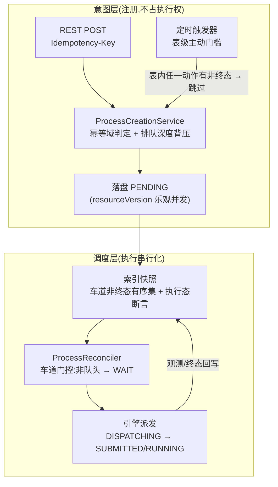

<!--
  Licensed to the Apache Software Foundation (ASF) under one
  or more contributor license agreements.  See the NOTICE file
  distributed with this work for additional information
  regarding copyright ownership.  The ASF licenses this file
  to you under the Apache License, Version 2.0 (the
  "License"); you may not use this file except in compliance
  with the License.  You may obtain a copy of the License at

      http://www.apache.org/licenses/LICENSE-2.0

  Unless required by applicable law or agreed to in writing,
  software distributed under the License is distributed on an
  "AS IS" BASIS, WITHOUT WARRANTIES OR CONDITIONS OF ANY
  KIND, either express or implied.  See the License for the
  specific language governing permissions and
  limitations under the License.
-->

# Spec: AMS v2 Process 创建准入与执行串行化解耦(意图注册 / 执行车道)

> 状态:**Draft / 需求采访已定稿(D1–D4)/ 业务代码未实现**
>
> 范围:`amoro-ams-v2` 首版,单实例控制面;REST 手工创建与定时触发共用同一创建服务
>
> 配置键:`amoro.process.creation.max-pending-per-table-action`(默认 16)
>
> 前置文档:`amoro-ams-v2-process-spec.md`(主规格,本文对其 §5.2/§6.3/§8.2 的修订见 §14)

## 1. 已确认前提(采访记录,2026-08-26 定稿)

| 编号 | 决策点 | 结论 |
|---|---|---|
| D1 | 执行车道互斥粒度 | **车道按 (tableId, action)** —— 不同动作可并行执行;**定时触发门槛按 tableId** —— 表内任一动作存在非终态进程即跳过本轮。两层粒度并存 |
| D2 | 车道互斥原语位置 | **现架构内收敛** —— 车道占用登记于索引快照,由持久写路径断言强制(搭载在既有派发落盘写上,不新增数据库往返);持久化比较并交换下沉记入 L2/L3 预留(§13),本期不实现 |
| D3 | 排队背压 | **有界队列** —— 每 (tableId, action) 非终态进程数上限 N,默认 16,0 表示无界;超限创建返回 `409 PENDING_QUEUE_FULL` |
| D4 | 排队执行语义 | **显式冻结语义** —— 参数在创建时规范化冻结,排队进程轮到执行时按创建时刻意图原样派发,不做派发前重评估;排队进程取消走既有廉价路径(PENDING + CREATED → directCancel) |

补充确认(采访前已收敛):幂等键机制(绑定域 `(tableId, action, sha256(key))` + `requestHash` 内容指纹)原样保留,与排队正交;进程名生成统一到 amoro-common 共享雪花生成器。

## 2. 目标与非目标

### 2.1 目标

1. **意图注册与执行串行化解耦**:REST 创建 = 注册执行意图并落盘为 PENDING,创建期不再受"该 (表, 动作) 已有存活进程"约束;同一 (表, 动作) 的非终态进程按创建时间先进先出排队,同一时刻至多一个进入执行阶段。
2. **定时触发保持每表至多一个存活进程**:由触发器创建前主动查询索引(表级非终态存在性)保证,替代当前"被动捕获 409 拒绝"的防堆积方式。
3. **排队背压**:每 (表, 动作) 有界队列,超限拒绝,防止外部调用方无界堆积导致调和器轮询负载线性增长。
4. **标识统一与可观测性**:进程名切换到与 v1 同源的 `SnowflakeIdGenerator`(54 位、时间戳跨模块可解码);幂等键哈希前缀作为派生只读投影暴露,便于人工比对。

### 2.2 非目标

1. 多实例部署下的车道互斥(持久化比较并交换下沉)—— L2/L3 预留,见 §13;
2. 排队顺序的优先级策略(手动优先于定时等)—— 先进先出,策略留待后续;
3. 派发前参数重评估或重新规划 —— 冻结语义不变;
4. 状态机(RUN/CANCEL 状态转移集合)变更 —— 零变更,PENDING 的语义从"待派发"自然扩展为"排队或待派发";
5. 引擎端口、结果回写、TTL 清理、执行回收器 —— 零变更。

## 3. 术语定义

| 术语 | 定义 |
|---|---|
| 意图注册(Intent Registration) | REST/定时创建一个 Process:规范化冻结参数、幂等域判定、落盘 PENDING。注册成功不等于获得执行权 |
| 执行车道(Execution Lane) | 每 `(tableId, action)` 一个逻辑车道;车道内非终态进程按 `(spec.createdAt, name)` 字典序全序排队,同一时刻至多一个进程处于执行态 |
| 执行态(Executing) | `phase ∈ {UNKNOWN, SUBMITTED, RUNNING, CANCELING}`,或 `phase == PENDING && attempt.submitState == DISPATCHING`(派发命令在途)。执行态进程持有车道 |
| 车道门控(Lane Gating) | 调和器在"预备派发"转移前检查自己是否为车道内最早的非终态进程(队头);非队头则进入 WAIT 轮询 |
| 队头(Head) | 车道内 `(createdAt, name)` 最小的非终态进程。`createdAt` 为 ISO-8601 字符串,字典序即时间序;`name` 作全序决胜键 |
| 排队深度(Queue Depth) | 车道内非终态进程总数(含执行态)。准入背压与排队深度的度量口径一致 |
| 表级非终态存在性(Table-level Non-final Presence) | 该 tableId 下任一动作存在非终态进程的布尔判定,供定时触发门槛使用 |
| 冻结参数(Frozen Parameters) | 创建时经 `ProcessCreateIntent.freezeParameters` 规范化的不可变参数;`requestHash` 即对其规范化编码的 SHA-256 |
| 持久写路径断言(Durable Write-path Assertion) | 索引快照 `apply(previous, current)` 在仓库发布(单写者 + resourceVersion 乐观并发控制)时执行的不变量检查;违反即抛 `ProcessIndexConflictException`,写失败 |

## 4. 现状基线与问题陈述

### 4.1 现状(2026-08-26 代码基线)

创建判定序(`ProcessCreationService.create`):准入互斥 → 结果未知预留检查 → 幂等域判定(同键同内容重放 / 同键异内容 409)→ **活跃单槽检查(非终态存在即 `409 ACTIVE_PROCESS_EXISTS`)** → 落盘。索引快照以 `activeByTableAction` 维护"(表, 动作) → 非终态进程唯一"不变量,写路径断言 `ACTIVE_PROCESS`。定时触发器不自查存在性,依赖创建服务的 409 拒绝防止每窗口堆积(`ProcessTriggerScanner.evaluateAndMaybeCreate` 捕获 `ProcessAdmissionException` 后仅记 debug 日志)。

REST 表层现状(`f7a449c1f`,2026-08-26):`ProcessController` / `ProcessServiceImpl` 两层,创建端点直接返回 `ProcessResource`(创建恒 200,首次与幂等重放响应不可区分,`Idempotency-Replayed` 响应头已删除,契约变化已拍板接受)。本规格沿用该契约,不再引入 201/200 区分或重放头。

### 4.2 问题

1. **注册受阻**:长耗时优化运行期间,外部调用方无法注册后续意图(同动作第二个创建被 409 拒绝),只能自行定时重试;调用方在不可靠网络上的自然诉求是"提交即受理、稍后查询"。
2. **定时侧防堆积依赖副作用**:以被动拒绝作为防堆积机制,使"定时只能运行一个"这一业务规则隐式依附于创建期单槽断言;解耦后该依附关系必须显式化,否则定时触发将每分钟堆积一个排队进程。
3. **无界风险的对偶**:一旦放开单槽,外部调用方可以无界注册非终态进程,每个进程各有一个调和器按轮询间隔调度,控制面负载随队列深度线性增长——必须有界。

## 5. 设计总览



三个解耦点:**注册与执行解耦**(创建不再断言活跃唯一,改断言深度上限)、**门控与状态机解耦**(排队等待以 WAIT 步实现,状态转移集合不变)、**定时门槛与创建断言解耦**(触发器自查表级存在性,创建服务不再代劳)。

## 6. 不变量(前 / 后对比)

| 不变量 | 现状 | 目标 |
|---|---|---|
| 每 (表, 动作) 非终态进程数 | ≤ 1(创建期强制) | ≤ max-pending-per-table-action(默认 16;0 = 无界) |
| 每 (表, 动作) 执行态进程数 | ≤ 1(由非终态唯一间接保证) | ≤ 1(索引写路径断言 `EXECUTING_LANE` 显式强制) |
| 车道内派发顺序 | ——(无排队) | 严格先进先出:按 `(createdAt, name)` 全序,非队头不得进入 DISPATCHING |
| 每 tableId 定时触发产生进程 | 每窗口 ≤ 1(被动 409 保证) | 每窗口 ≤ 1 且表内无任何非终态时才可能产生(主动门槛保证) |
| 幂等域 `(表, 动作, sha256(key))` | 键绑定持续到 TTL 物理删除 | 不变;重放判定先于深度检查,重放不受深度限制 |
| 排队进程执行内容 | —— | 等于创建时刻冻结参数;派发前不重评估 |

## 7. 组件变更规格

### 7.1 C1 `ProcessCreationService`:判定序重排与排队深度背压

新判定序(准入互斥内,互斥与结果未知预留逻辑不变):

1. 结果未知预留检查(`IDEMPOTENCY_IN_PROGRESS`)—— 不变;
2. 幂等域判定 —— 不变:同键同 `requestHash` → 重放原资源(重放**不占用深度配额,亦不受深度限制**);同键异内容 → `409 IDEMPOTENCY_KEY_REUSED`;
3. **[新增] 排队深度检查**:索引快照查询该 `(tableId, action)` 非终态进程数,`≥ N && N > 0` → `409 PENDING_QUEUE_FULL`(新错误码,见 §8);
4. **[移除] 活跃单槽检查**:`ACTIVE_PROCESS_EXISTS` 分支整体删除;
5. 构造资源、落盘 —— 不变。

深度计数与幂等判定同读一个索引快照引用;同 scope 由分片互斥串行化,计数一致。`ProcessAdmissionException.Code` 新增 `PENDING_QUEUE_FULL`,移除 `ACTIVE_PROCESS_EXISTS`。

### 7.2 C2 `ProcessIndexSnapshot`:索引重构

`activeByTableAction`(非终态唯一)拆分/改造为三个视图,随快照原子发布:

| 视图 | 结构 | 用途 |
|---|---|---|
| 车道非终态有序集 | `tableId\|action → rank tree[(createdAt, name)]`(结构共享) | 队头判定、深度计数、先进先出全序 |
| 执行态映射 | `tableId\|action → name`(至多一个) | 写路径断言 + 可观测 |
| 表级非终态存在性 | `tableId → boolean`(由各车道非终态集派生) | 定时触发门槛查询 |

新增只读 API(实现于 `ProcessIndexSnapshot`,经 `indexProjection().current()` 暴露):

```java
int nonFinalCount(String tableId, String action);          // 深度背压
Optional<String> laneHead(String tableId, String action);  // 车道门控:最早非终态进程名
boolean tableHasNonFinal(String tableId);                  // 定时表级门槛
```

**写路径断言变更**:`apply(previous, current)` 中,`ACTIVE_PROCESS` 断言(非终态唯一)由 `EXECUTING_LANE` 断言替代 —— 当前资源转入执行态(§3 定义)且同车道已有**另一进程名**处于执行态 → `ProcessIndexConflictException("EXECUTING_LANE", scope, incumbent, contender)`。原 `ACTIVE_PROCESS` 断言删除(非终态多存合法化)。执行态判据必须与调和器门控判据共享同一个谓词函数,避免两处定义漂移。

车道释放无需专门动作:进程转入终态时 `apply` 将其移出非终态有序集与执行态映射,队头自动前移。

既有 `activeOrder` rank tree(`(createdAt, name)`,仅收非终态)保留,作为车道有序集的现成实现基础;列表读视图、幂等视图、TTL 过期视图零变更。

### 7.3 C3 `ProcessReconciler.stageAndSubmit`:派发门控

在现有两个 WAIT 前置(引擎未注册、结果持久化槽饱和)之前新增**车道门控**:

```
laneHead(myTableId, myAction) != myName  →  Step.WAIT(轮询间隔 pollIntervalMillis)
```

门控点位于"预备派发"落盘写(PENDING + CREATED → DISPATCHING)之前;既有的 resourceVersion 乐观并发写与 §7.2 的 `EXECUTING_LANE` 写断言构成双重保障 —— 门控是常态路径(避免无谓落盘),断言是硬不变量(拦截门控读快照过期导致的竞态:并发 DISPATCHING 落盘只有一方成功,败者下轮收敛)。

推进延迟由水平触发收敛保证:执行态进程转入终态 → 索引发布 → 等待中的队头在下一次轮询到期时重新评估并通过门控;推进延迟上界为一个轮询间隔。无需新增事件通路。

排队进程的取消不经过车道:desiredState=CANCEL 的 PENDING + CREATED 进程走既有 `directCancel` 直接落终态并释放队列槽位,不派发引擎命令——该路径已有实现,本规格零变更,仅明确其语义归属。

### 7.4 C4 `ProcessTriggerScanner`:表级主动门槛

`evaluateAndMaybeCreate` 在插件评估通过(`shouldCreate`)之后、构造创建意图之前:

```
indexProjection().current().tableHasNonFinal(table.tableId())  →  true 则跳过本轮
```

跳过记 debug 日志(与现被动拒绝日志级别一致)。分钟窗口幂等键(`scan|scanIdentity|lockKey|window`)与重放语义不变;扫描器需新增对索引投影的依赖注入(经 `ProcessDomainAssembly`)。

### 7.5 C5 进程名生成统一

`ProcessCreationService.nextName()` 由手搓的 `(millis << 20) | sequence` 切换为 `amoro-common` 的 `SnowflakeIdGenerator.INSTANCE.generateId()`(54 位 JS-safe:40 位 10ms 时间戳 + 5 位 machineId + 8 位序列),仍以十进制字符串落 `ProcessResource.name`。收益:与 v1 进程 ID 同源,前端可用统一的 `extractTimestamp` 解码;machineId 位为多实例预留。名字形态(纯数字字符串)不变,REST 路径与持久化格式零影响。原 NAME_SEQUENCE 与手搓位运算代码删除。

### 7.6 C6 幂等键前缀派生投影

`idempotencyKeyHash` 形如 `sha256:<64 hex>`;其前 8 个十六进制字符即前缀,**派生只读、不持久化、不加 schema 字段**:REST get/list 投影层暴露 `idempotencyKeyPrefix` 便于运维与调用日志做人工比对。匹配判定仍走完整哈希,前缀无匹配语义(碰撞不构成正确性风险,仅展示用途)。

### 7.7 C7 契约文档(OpenAPI)

`ProcessController` 创建端点注解补齐:

1. `Idempotency-Key` 参数说明:每次业务意图生成一个全局唯一值(UUID 或雪花均可),重试必须复用同值;同键同内容重放返回原进程(200),同键异内容 409;键绑定持续至 TTL 物理删除;
2. 创建语义:成功即注册排队,`phase=PENDING` 表示排队或待派发;同 (表, 动作) 非终态超上限返回 `409 PENDING_QUEUE_FULL`;
3. 排队执行语义:按创建时刻冻结参数原样执行,不做派发前重评估;排队期间可 PATCH 取消(廉价路径)。

## 8. REST 契约变更

| 项 | 变更 |
|---|---|
| `POST .../processes` 同 (表, 动作) 已有存活进程 | ~~409 ACTIVE_PROCESS_EXISTS~~ → **200 + 排队中的 PENDING 资源**(创建恒 200 契约沿用 `f7a449c1f`;破坏性变更,见下) |
| `POST .../processes` 超过深度上限 | **409 PENDING_QUEUE_FULL**(新错误码,响应体含当前深度) |
| 幂等重放 | 不变:200 返回原资源;与首次创建响应不可区分(`Idempotency-Replayed` 头已随 `f7a449c1f` 移除,不恢复) |
| 其余端点 | 零变更 |

**兼容性说明**:`ACTIVE_PROCESS_EXISTS` 错误码从创建路径移除(枚举与映射同步删除)。依赖该 409 做轮询重试的客户端应改为"201 后按 `phase` 轮询"。此为本规格唯一的破坏性契约变更,随阶段二一次性切换,不留过渡开关。

## 9. 配置

```yaml
amoro:
  process:
    creation:
      # 每 (表, 动作) 非终态进程数上限(含执行中);超限的创建返回 409 PENDING_QUEUE_FULL。
      # 0 表示无界。默认 16。定时触发表级门槛独立于本键,不受其影响。
      max-pending-per-table-action: 16
```

绑定于既有 `AmoroProcessProperties` 的 `creation` 块;键名、默认值、注释随本规格进入 `application.yaml` 全量键清单(当前 36 键 → 37 键)。

## 10. 并发与一致性分析

| 场景 | 分析 |
|---|---|
| 同 (表, 动作) 并发创建 | 分片互斥串行化,深度计数与幂等判定同快照一致;第 N+1 个创建在互斥内可见前 N 个 |
| 门控读快照过期(两进程同时认为自己非队头之后同时派发) | 不可能:队头唯一由全序决定;但"队头已判、前一个队头尚未完全释放"类竞态由 `EXECUTING_LANE` 写断言兜底:并发 DISPATCHING 落盘仅一方成功,败者 `Step.DONE` 后下轮收敛 |
| 深度检查与并发落盘 | 同 scope 创建在互斥内串行;跨 scope 创建互不影响深度 |
| 可重试 FAILED 占位 | FAILED 非终态(重试预算未耗尽)仍是非终态有序集成员,占据队头直至转终态——与"执行态占道"一致的保守语义,防止交替执行 |
| UNKNOWN 阶段 | 属执行态,持有车道:提交结果未知期间不得放行下一个,防重复执行 |
| 排队进程取消 | directCancel 落终态即出队,队头前移;与车道无交互 |
| 定时门槛竞态(门槛查询后、创建前表内出现新进程) | 表级门槛是"尽量不堆积"的策略层;偶发穿透仅多产生一个排队进程,由深度上限与下轮门槛收敛,无正确性风险 |
| 结果未知预留 | 与排队正交:预留期间同 scope 创建仍被 `IDEMPOTENCY_IN_PROGRESS` 拦截,不变 |
| 重启恢复 | 非终态有序集随索引从持久行重建,排队关系与队头判定跨重启保持 |

## 11. 验证矩阵

| 层 | 用例 |
|---|---|
| 单元(索引) | 深度计数正确性;`laneHead` 全序(同 createdAt 由 name 决胜);`EXECUTING_LANE` 断言(双执行态转移被拒);`tableHasNonFinal` 跨动作聚合;终态出队后队头前移 |
| 单元(创建) | 第二个同动作创建 200 PENDING;第 N+1 个 409 `PENDING_QUEUE_FULL`(响应含深度);N=0 无界;重放穿透深度限制;`ACTIVE_PROCESS_EXISTS` 不再出现 |
| 单元(调和) | 两进程严格先进先出;队头终态后队头推进延迟 ≤ 轮询间隔;排队进程 PATCH 取消走 directCancel 且后继成为队头;UNKNOWN 持道期间队头 WAIT |
| 单元(定时) | 表内任一动作非终态 → 跳过;全终态 → 正常创建;窗口内重放不变 |
| 单元(标识) | 进程名 = `SnowflakeIdGenerator` 输出;`extractTimestamp` 可解码;前缀派生正确 |
| docker-it(E2E, 真MySQL) | 排队 → 执行 → 终态 → 下一进程执行的全链路;TTL 与重启重放不因排队退化 |

回归门:阶段一、阶段二各自交付时,离线全量 + docker-it 全量必须绿;`ACTIVE_PROCESS_EXISTS` 相关既有断言重写为排队语义。

## 12. 分阶段交付

| 阶段 | 内容 | 行为变更 | 提交 |
|---|---|---|---|
| 一 | C5 + C6 + C7 | 零(纯增量) | 独立提交 |
| 二 | C1 + C2 + C3 + C4 + 配置键 | 创建契约切换(§8) | 独立提交 |
| 三 | 预留(§13) | —— | 本期不排期 |

## 13. 预留设计与开放项

1. **车道互斥下沉为持久化比较并交换(L2/L3)**:参照 v1 `DefaultTableRuntime` 的 PROCESS_ID 属主模式 —— 车道获取/释放为数据库条件更新(`UPDATE ... SET owner=? WHERE lane=? AND owner=0 AND state_version=?`),跨实例安全。触发条件:启用多实例部署。主规格 §5.2 既有结论("启用多实例前必须增加数据库唯一约束、leader 串行化或等价数据库 CAS")在车道语义下延续有效。
2. **排队优先级策略**:先进先出为基线;手动/定时差异化优先级、按表公平性等留待运行数据支持后排期。
3. **排队深度指标暴露**:深度计数已入索引,导出为指标(含按表分布)留待可观测性专项。
4. **派发前参数重评估**:明确非目标(冻结语义),若未来表结构漂移导致排队意图频繁过时,以"排队取消 + 重新创建"为人机协议,不引入自动重评估。

## 14. 对主规格(`amoro-ams-v2-process-spec.md`)的影响

| 主规格章节 | 影响 |
|---|---|
| §5.2 同表同 action 单活跃 | 判定序第 4 步(非终态存在 → 409)由深度背压替代;"多实例前提"结论延续(§13.1);`(tableId,action)→name` map 语义改为执行态映射,新增车道有序集 |
| §6.3 定时触发 | 新增表级主动门槛(先于创建意图构造);窗口幂等键不变 |
| §8.2 端点总表 | create 语义:成功 = 注册排队;新错误码 `PENDING_QUEUE_FULL`;`ACTIVE_PROCESS_EXISTS` 移除 |
| §7 状态机 | 零变更;PENDING 语义注释扩展为"排队或待派发" |
| §9 清理 / §11 验证矩阵 | TTL 与重放不受影响;验证矩阵按本文 §11 增补排队用例 |

主规格在本规格实现合入时同步修订上述章节。

## 15. 来源索引(2026-08-26 代码基线)

| 事实 | 位置 |
|---|---|
| 创建判定序(幂等→活跃单槽→落盘) | `amoro-ams-v2/src/main/java/org/apache/amoro/process/ProcessCreationService.java:94-151` |
| 幂等域解析与冻结参数 | `amoro-ams-v2/src/main/java/org/apache/amoro/process/ProcessCreateIntent.java:72-105` |
| 索引活跃映射与写断言 | `amoro-ams-v2/src/main/java/org/apache/amoro/process/ProcessIndexSnapshot.java:151-232` |
| 派发落盘写(DISPATCHING,乐观并发) | `amoro-ams-v2/src/main/java/org/apache/amoro/process/ProcessReconciler.java:329-376` |
| 调和器 WAIT 前置现状 | `amoro-ams-v2/src/main/java/org/apache/amoro/process/ProcessReconciler.java:254-269,330-337` |
| 定时触发被动拒绝(无自查) | `amoro-ams-v2/src/main/java/org/apache/amoro/process/trigger/ProcessTriggerScanner.java:114-152` |
| 手搓进程名生成 | `amoro-ams-v2/src/main/java/org/apache/amoro/process/ProcessCreationService.java:210-213` |
| v1 共享雪花生成器(54 位) | `amoro-common/src/main/java/org/apache/amoro/utils/SnowflakeIdGenerator.java` |
| v1 属主 CAS(对照参考) | `amoro-ams/src/main/java/org/apache/amoro/server/table/DefaultTableRuntime.java:424-457,583-630`;CAS SQL `TableRuntimeMapper.java:188-192` |
| 错误码 → HTTP 映射 | `amoro-ams-v2/src/main/java/org/apache/amoro/process/rest/ApiError.java:42-67` |
