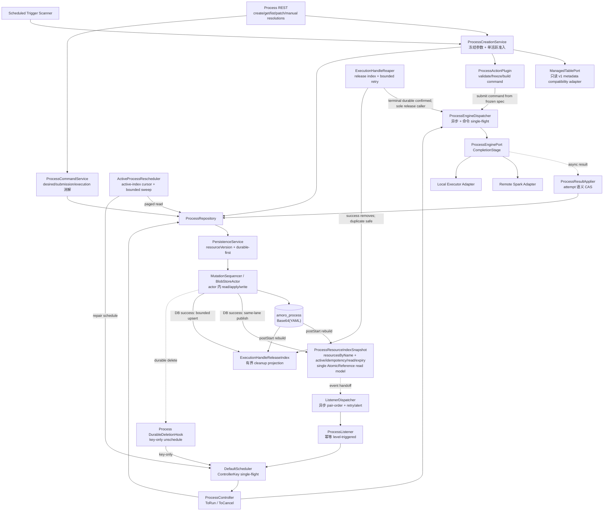
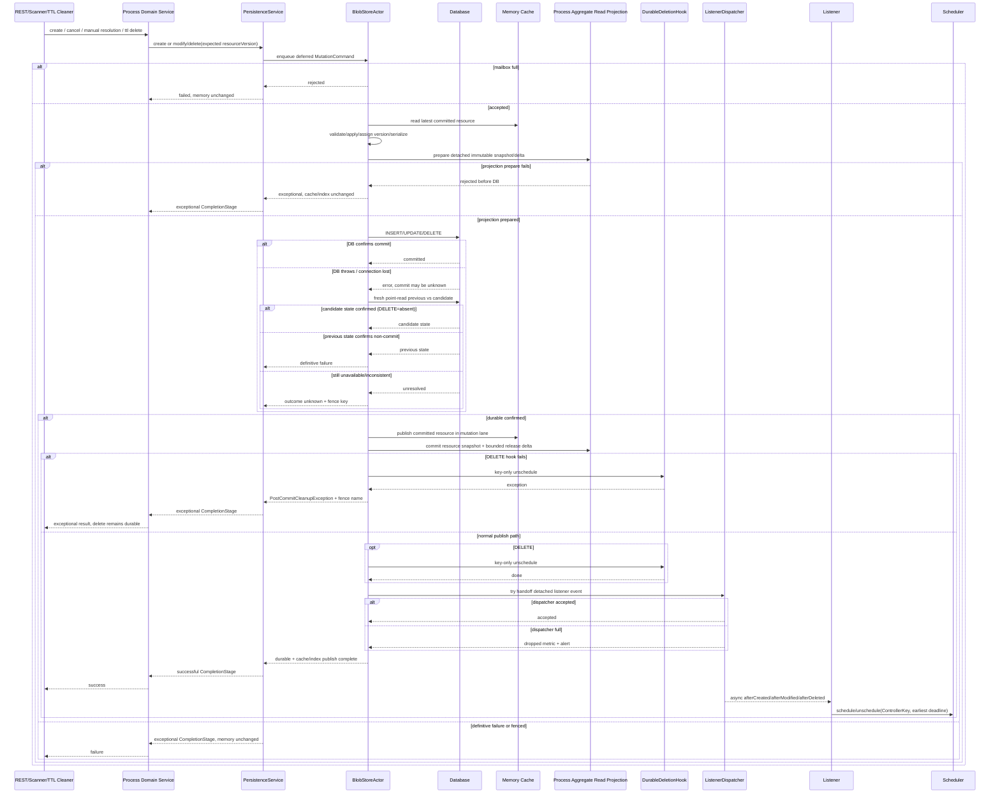
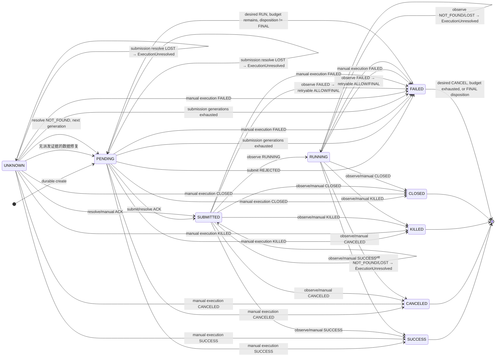
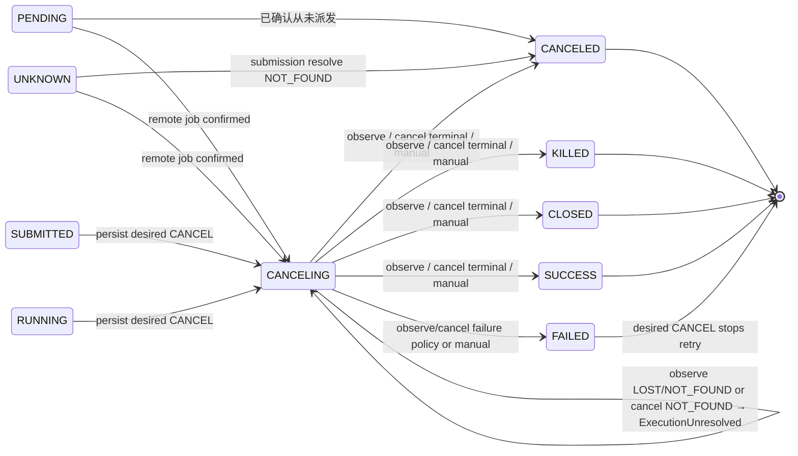
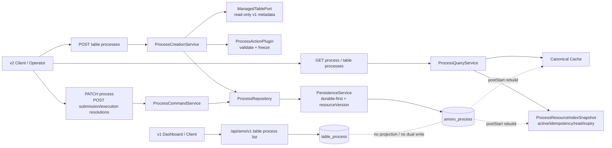

<!--
  Licensed to the Apache Software Foundation (ASF) under one
  or more contributor license agreements.  See the NOTICE file
  distributed with this work for additional information
  regarding copyright ownership.  The ASF licenses this file
  to you under the Apache License, Version 2.0 (the
  "License"); you may not use this file except in compliance
  with the License.  You may obtain a copy of the License at

      http://www.apache.org/licenses/LICENSE-2.0

  Unless required by applicable law or agreed to in writing,
  software distributed under the License is distributed on an
  "AS IS" BASIS, WITHOUT WARRANTIES OR CONDITIONS OF ANY
  KIND, either express or implied.  See the License for the
  specific language governing permissions and limitations
  under the License.
-->

# amoro-ams-v2 Process 资源设计规格

> 状态：**Draft / P0 技术评审已完成；首版 action scope、scheduled trigger 兼容承诺与 P7B 本地执行放置共 3 项业务边界待逐项确认；代码尚未实现**
>
> 评审基线：`jira/process-dev`，commit `1cfa9728f2d9b3e56e025c02ba7e9afc5054b335`，2026-08-22
>
> 实施计划：`tasks/ams-v2-process-plan.md`；任务清单：`tasks/ams-v2-process-todo.md`
> 本文中的 `ProcessResource`、`ProcessEnginePort`、Controller、REST 路由和表结构均为待实现设计，不代表当前仓库已有相应代码。

---

## 1. 目标、边界与成功标准

### 1.1 目标

在 `amoro-ams-v2` 中全新实现声明式 Process 控制面：

1. 定时扫描或手工请求生成不可变执行规格；
2. 将 Process 先持久化，再通过 level-triggered Controller 调和；
3. 支持远端 Spark 与本地线程池两类引擎；
4. 对提交不确定、取消竞态、进程重启和版本升级保持可恢复、可审计；
5. 提供 `/api/ams/v2` 创建、查询、列表、取消和人工消解接口；
6. 明确 v1 的事实基线、差异、迁移路径和兼容边界。

### 1.2 非目标

- 不复用 v1 `ProcessService`/`TableProcessExecutor` 的线程模型或事件状态机；
- 不原地迁移或接管 v1 正在执行的 Process；
- 不在本轮实现多 AMS 实例并发写；
- 不修改 v1 Process 状态机、SQL、Thrift、REST 响应或前端语义；唯一兼容例外是 P8 可在 v1 Javalin 路由层增加只读 endpoint usage counter，用于证明迁移退场条件，不读取或记录 parameters；
- 不在本轮引入鉴权或字段级权限控制。

### 1.3 成功标准

- 架构图、接口图、状态图与迁移表之间无语义冲突；
- 每个状态迁移只有一个写入者，通过 `resourceVersion` CAS 生效；
- 数据库提交成功是 create/modify/delete 成功确认的前提；
- 固定终态、可重试失败、提交未知和取消未知均有确定处理；
- 同一 `(tableId, action)` 的两个并发入口最多创建一个活跃 Process；
- v1/v2 差异矩阵、灰度切换和回退边界可直接用于实施；
- 所有新增能力在完成代码与测试之前保持 Draft，不标记为已实现。

---

## 2. 事实基线与证据分级

### 2.1 当前仓库事实

| 事实 | 证据 |
|---|---|
| `amoro-ams-v2` 当前只有 Spring Boot 启动类、`HealthController`、配置和健康检查测试，没有 Process、控制面持久化或 `/api/ams/v2/processes` 实现 | `amoro-ams-v2/src/main/java/org/apache/amoro/AmoroAmsV2Application.java`；`amoro-ams-v2/src/main/java/org/apache/amoro/controller/HealthController.java` |
| v1 有十个 Process 状态 | `amoro-common/src/main/java/org/apache/amoro/process/ProcessStatus.java` |
| v1 事件只有 SUBMIT/COMPLETE/RETRY/CANCEL/KILL 六类，没有 `CANCEL_CONFIRMED` | `amoro-common/src/main/java/org/apache/amoro/process/ProcessEvent.java` |
| v1 `ExecuteEngine` 没有四分类提交、提交消解或统一观测契约 | `amoro-common/src/main/java/org/apache/amoro/process/ExecuteEngine.java` |
| v1 远端 Spark 适配器调用 `/spark/job/submit`、`/spark/job/state`、`/spark/job/kill`；异常观测被折叠成 UNKNOWN，未证明远端提交幂等或 resolve 能力 | `amoro-common/src/main/java/org/apache/amoro/process/HttpRemoteSparkStandAloneSubmit.java` |
| v1 `ProcessService` 的无界工作队列使有效并行度固定为 corePoolSize=10；默认最多初始 1 次 + 重试 3 次 | `amoro-ams/src/main/java/org/apache/amoro/server/process/ProcessService.java` |
| v1 取消先写 `CANCELED` 再 best-effort 调远端，且没有面向表 Process 的取消 REST | `amoro-ams/src/main/java/org/apache/amoro/server/process/ProcessService.java`；`amoro-ams/src/main/java/org/apache/amoro/server/dashboard/DashboardServer.java` |
| v1 状态迁移由 JVM `transitionLock` 串行，不是数据库行锁；`KILL_REQUESTED` 的允许目标与 executor 写 `CLOSED` 存在不一致 | `amoro-ams/src/main/java/org/apache/amoro/server/process/DefaultTableProcessStore.java`；`amoro-ams/src/main/java/org/apache/amoro/server/process/executor/TableProcessExecutor.java` |
| v1 列表参数使用 `pageSize`，响应为 `OkResponse` 的 `result={list,total}`；表不存在时返回 200 空页 | `amoro-ams/src/main/java/org/apache/amoro/server/dashboard/controller/ProcessController.java`；`amoro-ams/src/main/java/org/apache/amoro/server/dashboard/response/OkResponse.java`；`amoro-ams/src/main/java/org/apache/amoro/server/dashboard/response/PageResult.java`；`amoro-web/src/services/table.service.ts` |
| v1 前端展示完整 parameters、summary、trackUri 和十态过滤 | `amoro-web/src/views/tables/components/Process.vue` |
| v1 Action 的规范化值为大写连字符，例如 `EXPIRE-SNAPSHOTS`，不是下划线 | `amoro-common/src/main/java/org/apache/amoro/Action.java`；`amoro-common/src/main/java/org/apache/amoro/IcebergActions.java`；`amoro-common/src/main/java/org/apache/amoro/PaimonActions.java` |
| 当前 v1 Process 列表路由/Controller 未注册 endpoint usage counter；因此不能把不存在的既有指标写成迁移证据 | `amoro-ams/src/main/java/org/apache/amoro/server/dashboard/DashboardServer.java`；`amoro-ams/src/main/java/org/apache/amoro/server/dashboard/controller/ProcessController.java` |

### 2.2 历史候选资产，不是当前实现

历史提交 `7a60c87db` 中曾出现 `SubmissionOutcome`、`SubmissionResolution`、`ProcessObservation` 和取消竞态测试。这些类型可作为设计输入，但该提交不是当前 HEAD 的祖先；其中远端适配器的 `resolveSubmission` 仍返回 `UNSUPPORTED`。因此：

- 本文不把这些类型或测试称为“现有代码”；
- v2 需要重新定义并实现自己的引擎端口；
- 当前远端服务不能支撑自动消解 UNKNOWN，必须保留人工消解路径。

### 2.3 参考实现边界

SSP AppManager 用于验证调度与持久化模式，但不是 Amoro 的现有实现。已核实的关键语义是：Blob actor 在数据库操作成功后才完成写 Future，之后内存更新和 listener 才发生；数据库是重启事实源。v2 可改良 single-flight、失败修复和 API，但不得把参考实现描述成当前 Amoro 代码。

---

## 3. 资源模型

### 3.1 顶层模型

```yaml
apiVersion: process/v1          # Process 资源 schema 版本，不是 /api/ams/v1
collection: process
name: "1948372910284737281"    # 永远按字符串传输，避免 JavaScript 64 位整数精度丢失
resourceVersion: 7
spec:
  table:
    catalog: prod
    database: db1
    table: orders
    tableId: "42"
  action: expire-snapshots      # v2 稳定 wire value：lower-kebab-case
  executionEngine: remote-spark
  triggerSource: MANUAL         # MANUAL / SCHEDULED
  createdAt: 2026-08-22T10:00:00Z
  desiredState: RUN             # RUN / CANCEL；只允许 RUN -> CANCEL
  request:
    idempotencyKeyHash: "sha256:2a4f..." # 不存原始 Idempotency-Key
    requestHash: "sha256:87bc..."        # path + canonical request body
  parameters:                   # 创建时冻结；提交、重试、恢复均只读
    olderThanMillis: 1724284800000
    retainLast: 1
  retryPolicy:
    maxRetries: 3               # 初始尝试之外允许的重试次数
    maxSubmissionRetries: 2     # 每个 action attempt 内，初次派发之外允许的新代次提交次数
    retryDelaySeconds: 30
status:
  phase: RUNNING
  retryNumber: 1                # 初始尝试为 0；最大值等于 maxRetries
  attempt:
    dispatchGeneration: 1       # 当前 action attempt 内的提交代次；初始为 0
    submissionKey: "1948372910284737281:1:1"
    requestHash: "sha256:9f3a..."
    submitState: ACKNOWLEDGED    # CREATED/DISPATCHING/ACKNOWLEDGED/REJECTED/UNKNOWN/CONFLICT/UNAVAILABLE
    externalId: application_001
    dispatchedAt: 2026-08-22T10:00:05Z
    retryDisposition: AUTO       # AUTO/ALLOW/FINAL；人工执行消解可覆盖
    finishedAt: null             # 当前 action attempt 结束时间；可早于资源最终 finishedAt
    submissionHistory:           # 只归档已结束的旧提交代次；上限 maxSubmissionRetries
      - dispatchGeneration: 0
        submissionKey: "1948372910284737281:1:0"
        requestHash: "sha256:9f3a..."
        outcome: NOT_FOUND
        manualResolution: null
        finishedAt: 2026-08-22T10:00:04Z
    manualResolutions:
      submission: null           # 只属于当前 dispatchGeneration
      execution: null            # 属于当前 action attempt 的已确认/未决执行
    lastError: null              # 当前 attempt 的结构化失败；重试时归档到 attemptHistory
  attemptHistory:
    - retryNumber: 0
      dispatchGeneration: 0
      submissionKey: "1948372910284737281:0:0"
      requestHash: "sha256:4e8b..."
      outcome: FAILED
      externalId: application_000
      retryDisposition: AUTO
      submissionHistory: []
      manualResolutions:
        submission: null
        execution: null
      finishedAt: 2026-08-22T10:00:03Z
      reason: ENGINE_FAILED
  lastObservedAt: 2026-08-22T10:05:00Z
  lastCancelAttemptAt: null      # CANCELING 下幂等 cancel 的重发节流依据
  nextReconcileAt: 2026-08-22T10:05:03Z # 持久化业务门控；提前唤醒不执行副作用
  engineBackoffAttempts:         # 每个 operation 独立、跨重启保留；0..7 饱和
    submit: 0
    resolve: 0
    observe: 0
    cancel: 0
  conditions:
    - type: EngineUnreachable
      status: "False"
      reason: ObservationRecovered
      message: ""
      lastTransitionTime: 2026-08-22T10:05:00Z
      lastUpdateTime: 2026-08-22T10:05:00Z
  summary:
    trackUri: "https://spark.example/jobs/application_001"
    result:
      expiredSnapshots: 12
  failure: null
  submittedAt: 2026-08-22T10:00:06Z
  startedAt: 2026-08-22T10:00:40Z
  finishedAt: null
```

每条非 null `manualResolutions.{submission|execution}` 记录固定包含：`idempotencyKeyHash`、规范化命令 payload 的 `commandHash`、`submissionKey`、attempt `requestHash`、`outcome`、可选 externalId/retryAllowed、脱敏截断后的 reason、操作者上下文和 `resolvedAt`。submission 记录只约束当前 `dispatchGeneration`；当权威 NOT_FOUND 结束该代次时，它随代次摘要进入有界 `submissionHistory`。execution 记录随 action attempt 进入有界 `attemptHistory`，不建立无界旁路审计数组。

每条 condition 固定包含 `type/status/reason/message/lastTransitionTime/lastUpdateTime`，并允许可选 `observedCapabilityVersion`；该可选字段只用于 `ResolutionUnsupported` 与 `CancellationUnsupported`，其他 reason 必须为 null，避免把任意 adapter metadata 塞入 condition。

两个 requestHash 语义不同：`spec.request.requestHash` 是 REST/scanner 创建意图 hash；`status.attempt.requestHash` 是引擎提交命令 hash，规范输入固定为 `processName + retryNumber + canonicalAction + executionEngine + canonical parameters`，明确排除 `submissionKey/dispatchGeneration`。因此同一 action attempt 的多个提交代次共享 requestHash，不同 retryNumber 的 attempt 使用不同 requestHash。

为确保有界 history 不会在终态写入时突破 Framework 65536 原始字节上限，首版硬上限固定为 `maxRetries<=3`、`maxSubmissionRetries<=2`（最多 12 个提交代次）。canonical parameters 不超过 16 KiB，summary.result 不超过 8 KiB，trackUri/externalId 分别不超过 2048/512 UTF-8 字节；reason/condition/failure/lastError message 各不超过 512 字节，capabilityVersion 不超过 128 字节，operator principal/request metadata 各不超过 256 字节；conditions 按 type 唯一且最多 8 条。边界入口先校验/截断允许截断的文本，引擎结构化 payload 超限按不可信输入拒绝；任意 mutation 序列化后仍超过 65536 字节则在 DB 写前失败且内存不变，禁止依赖数据库截断。P1 必须构造“所有字段取合法最大值 + 4 个 action attempts × 每个 3 个 submission generations + 8 个 conditions + 最终 failure/finishedAt”的 max-legal-shape，并证明最后一次终态 CAS 后 persistence YAML 原始字节和 REST JSON 原始字节都仍 `<65536`；若实测超限，必须在 P1 下调字段 cap 或预留固定 headroom 后再定稿，不能把终态写失败当运行时正常拒绝。

### 3.2 字段所有权

| 字段 | 规则 | 唯一写入者 |
|---|---|---|
| `metadata.*`（apiVersion/collection/name/resourceVersion） | name 创建后不可变；resourceVersion 每次成功写 +1 | 框架持久化层 |
| `spec.table/action/executionEngine/triggerSource/createdAt/parameters/retryPolicy` | 创建后不可变 | `ProcessCreationService` |
| `spec.request.*` | 创建意图的幂等键 hash 与 payload hash；与资源同生命周期 | `ProcessCreationService` |
| `spec.desiredState` | 只允许 `RUN -> CANCEL`，不可恢复为 RUN | 命令服务 |
| `status` 执行字段 | 每轮最多完成一个逻辑步骤，通过 Framework 带 expectedResourceVersion 的 modify 重载写入；服务层不复制迁移判断 | `ToRunTransition` / `ToCancelTransition` / `ManualResolutionTransition` |
| `status.summary` | action adapter 返回的有界结构；禁止无界日志、堆栈或任意大 payload | 引擎观测结果，经 Transition 落库 |
| `status.attempt.lastError` | 当前尝试的结构化错误；预算内 FAILED 也保留，重试时归档 | Transition |
| `status.attempt.finishedAt` | 当前 action attempt 进入 FAILED 或固定终态时同 CAS 写入；用于归档与 handle release，预算内 FAILED 也非空 | Transition |
| `status.attempt.submissionHistory/manualResolutions` | 当前提交代次至多一条 submission 审计；旧代次归档到有界 submissionHistory；当前 action attempt 至多一条 execution 审计 | `ManualResolutionTransition`（由 CommandService 调用） |
| `status.engineBackoffAttempts.*` | submit/resolve/observe/cancel 四个固定字段独立计数，范围 0..7 饱和；UNAVAILABLE 同 CAS 递增，非 UNAVAILABLE 结果同 CAS 归零对应字段 | `ProcessResultApplier` 经 Transition 规则写入 |
| `status.failure` | 仅最终 `FAILED` 从当前 attempt 错误归并，message 截断和脱敏 | Transition |

### 3.3 不变量

1. `spec` 除 `desiredState` 外创建后不可变；执行器不得重算 parameters。
2. `desiredState` 单调：`RUN -> CANCEL`；没有 resume API。
3. `dispatchGeneration` 在每个 action attempt 内从 0 开始，`dispatchGeneration <= maxSubmissionRetries`；`submissionKey = processName + ":" + retryNumber + ":" + dispatchGeneration`。同 key 必须对应同 requestHash，冻结参数不变时同一 action attempt 的各代次 requestHash 相同。
4. `retryNumber` 从 0 开始，`retryNumber <= maxRetries`；总尝试次数最多 `maxRetries + 1`。
5. `attemptHistory.size() <= maxRetries`，每个 attempt 的 `submissionHistory.size() <= maxSubmissionRetries`；当前 attempt/提交代次不重复放入各自 history。attempt summary 保留该次执行的 externalId（若有）用于幂等 release，完整资源最多保留 `(maxRetries + 1) * (maxSubmissionRetries + 1)` 个提交代次摘要。
6. 固定终态为 `SUCCESS/CANCELED/KILLED/CLOSED`。
7. `FAILED` 仅在 `desired=CANCEL`、`retryNumber >= maxRetries` 或当前 attempt 的 `retryDisposition=FINAL` 时最终；否则是可重试决策点。
8. 创建态为 `PENDING`。`UNKNOWN` 仅保留给导入、数据修复或无法归类的历史状态；`postStart` 不改写已持久化 phase/attempt。
9. submit/resolve/observe/cancel 不可用不等于业务失败，不消耗重试预算。submit 的 UNAVAILABLE 只表示 adapter 可证明请求未发送/未被接收；一旦是否产生副作用不确定，必须返回 UNKNOWN。
10. submission resolve 的权威 `NOT_FOUND` 只结束当前提交代次：有 submission 预算时归档旧代次并生成新 key；代次预算耗尽时把当前 action attempt 置为 `FAILED/SUBMISSION_NOT_ACCEPTED`，再由 action retry/finality 规则处理。权威 `REJECTED`、权威远端 `FAILED` 以及 submission 代次耗尽形成的 FAILED 才消耗 action retry 预算；已确认 externalId 后的 observe/cancel `NOT_FOUND` 进入 `ExecutionUnresolved`，不消耗预算、不自动重试。
11. `name` 和所有外部 ID 在 REST/前端均为字符串。
12. 墙上时间用注入的 `java.time.Clock`（UTC）；调度 delay 用框架单调时钟，二者不得混用。
13. `status.nextReconcileAt` 是跨重启的业务门控；DelayQueue deadline 只是进程内唤醒优化。提前唤醒只能按剩余时间重排，不能调用引擎或消耗预算。
14. 手工创建必须携带 `Idempotency-Key`；scope 为 `(tableId,canonicalAction,keyHash)`。同 scope 不同 requestHash 必须冲突，同 hash 必须返回原资源。
15. 每条人工消解命令必须携带 `Idempotency-Key`、`submissionKey` 和 attempt `requestHash`；状态修改和审计记录在同一次 durable CAS 中完成。延迟命令只能重放已归档 action attempt/提交代次的同一结论，不能修改后续 generation 或 attempt。
16. 任意 CAS 进入固定终态时必须同时写非 null `status.finishedAt`；进入最终 FAILED 时必须在同一 CAS 写 `failure` 和 `finishedAt`。TTL 不负责修补缺失终态时间。
17. `engineBackoffAttempts` 只有 submit/resolve/observe/cancel 四个固定字段，值在 `0..7` 饱和；进程重启不得归零。某 operation 返回 UNAVAILABLE 时按写入前的 counter 计算退避并在同一 CAS 饱和 +1；该 operation 任意非 UNAVAILABLE 结构化结果在同一 CAS 归零。UNKNOWN/CONFLICT/UNSUPPORTED/LOST 随后使用各自业务间隔，不继续占用 engine backoff。
18. 当前 action attempt 一旦进入 FAILED 或固定终态，必须在同一 CAS 写 `attempt.finishedAt`；若整个 Process 已最终，再同时写顶层 `status.finishedAt`。新 retry attempt 的 attempt.finishedAt 重新为 null，旧值随 attemptHistory 归档。ExecutionHandleReleaseIndex 的 firstSeenAt 取该持久化时间，重启不得用当前时间延后 hard retention。
19. 从可重试 FAILED 创建下一 action attempt 时，在同一 CAS 把四个 engineBackoffAttempts 重置为 0，并清除 SubmissionUnresolved、ExecutionUnresolved、EngineUnreachable、CancellationUnsupported；DataRepaired 是资源级审计标记，不能随 attempt 轮换清除。
20. 权威 `EngineObservation.FAILED` 的 `EngineFailure.retryable=false` 必须在同一 CAS 把当前 attempt `retryDisposition=FINAL`；`retryable=true` 设置为 `ALLOW` 并继续受 maxRetries/desired 约束。迟到引擎结果不得覆盖已由 attempt-bound 人工结论写入的 FINAL/审计。

### 3.4 Conditions

| type | 置 True | 清除 | 自动行为 |
|---|---|---|---|
| `EngineUnreachable` | 任一 operation 返回 UNAVAILABLE，且对应持久化 backoff counter >0 | 每个 operation 的非 UNAVAILABLE 结果只归零自身字段；四字段全为 0 时清除 | submit 保持同 generation/key 并回到 UNAVAILABLE 待重投；其他操作保持 phase；按持久化 counter 退避，不耗预算，重启后续接原序列 |
| `SubmissionUnresolved` | submit=UNKNOWN/CONFLICT，或 resolve=UNSUPPORTED/UNAVAILABLE/CONFLICT | 权威 ACK、权威 NOT_FOUND、resolve LOST 转入 ExecutionUnresolved，或人工消解成功 | 未取得权威 NOT_FOUND 前禁止生成新 submissionKey；UNAVAILABLE 按对应 engine backoff；UNKNOWN/CONFLICT 每 60s resolve；capability=false，或 `ResolutionUnsupported` 记录的 capabilityVersion 仍等于当前值时只本地检查/告警，新 capabilityVersion 明确支持后才恢复 resolve |
| `ExecutionUnresolved` | durable DISPATCHING 后本地提交 registry/intent 丢失且 resolve 返回 LOST；已 ACK 后 observe 返回 LOST/权威 NOT_FOUND，或 cancel 返回权威 NOT_FOUND | 当前 identity 的 attempt-bound 人工执行消解成功 | NOT_FOUND 只能证明当前无法找到 execution，不能证明维护动作未产生副作用；每 5min 只刷新 reminder/告警，当前 unresolved attempt/identity 的自动 submit/resolve/observe/cancel 调用数必须为 0；独立 reaper 仍可 release 其他已 durable terminal attempt 的 handle |
| `CancellationUnsupported` | capabilities 已明确 `supportsCancellation=false`，或 cancel 返回 UNSUPPORTED；同时记录当前 capabilityVersion | 新 capabilityVersion 且 `supportsCancellation=true` 后 CAS 清除，或当前 attempt 结束 | 已知 false 时首次也不调用 cancel；相同 capabilityVersion（含重启）不再重复 cancel；保持 CANCELING、按常规 poll observe 至自然终态并告警 |
| `DataRepaired` | 仅导入/历史数据的固定终态缺 `attempt.finishedAt` 或 `status.finishedAt`，或最终 FAILED 缺任一时间/failure，被 ToRun/ToCancel 修补 | 不自动清除，作为数据修补审计标记保留 | 不产生引擎调用；只有一个时间存在时复用该时间，两个都缺时使用本轮 injected Clock 的 now 并明确审计；正常创建和正常迁移路径禁止置位 |

listener 分发失败属于框架健康状态，不写入 Process resource，避免“为记录 listener 失败而再次触发 listener”的递归。它通过指标、告警、框架有界重试与 Process 域 `ActiveProcessRescheduler` 观测和修复。`ProcessActiveIndex` 同时维护 `(tableId,action)→name` 准入 map 与按 `(createdAt,name)` 排序的非最终资源 persistent rank tree；rescheduler 只从后者按稳定 cursor/batch 扫描，每轮另有最大运行时长。到达末尾后下一轮从头开始；扫描中插入到 cursor 之前的资源最迟在下一轮覆盖。不得遍历全缓存或从包含大量终态历史的 read view 过滤活跃资源。

---

## 4. 总体架构与持久化时序

### 4.1 组件架构图



数据库是持久事实源，内存仅是读缓存。`CompletionStage` 成功表示数据库写已经成功，不表示“仅成功入队”。

### 4.2 create/modify 时序



图中的 `M` 与 `X` 是 same-lane 的两个顺序发布点，不宣称跨对象原子。Framework cache 仅供 mutation actor 读取最新 canonical 值；所有 Process 对外 get/list、准入、rescheduler 与 TTL 候选读取都只取得一次 `X` 的 `AtomicReference`，并从同一个 `ProcessResourceIndexSnapshot.resourcesByName` 取正文，所以一次读只能看到完整旧版或完整新版。mutation stage 在 `X` commit 后才成功完成。

listener 失败或 dispatcher 满不改变已成功的持久化结果和 mutation stage。框架记录 retry/dropped 指标与告警；Process 域的 `ActiveProcessRescheduler` 按 active-index cursor/批次周期扫描非最终资源并补一次 `schedule`。single-flight 使重复调度安全。

---

## 5. 调度、ControllerKey 与单活跃准入

### 5.1 ControllerKey

框架 single-flight key 必须是 `ControllerKey(domain, resourceId)`，Process 使用 `("process", processName)`。仅用裸 `resourceId` 会使不同资源域发生碰撞。

同 key 多次 schedule 合并为**最早到期时间**：新请求更早则缩短 deadline；更晚请求不得推迟已存在的紧急取消或补偿调度。

### 5.2 同表同 action 单活跃

v2 第一阶段是单实例部署，但 REST 与 scanner 仍可能并发。`ProcessCreationService` 对 `(tableId, canonicalAction)` 使用 keyed mutex；同一临界区只取得一次 `ProcessResourceIndexSnapshot` 引用，并读取其中的 `resourcesByName`、active 与 idempotency view。`ProcessActiveIndex` 包含用于准入的 `(tableId,action)→name` map，以及只收 §7.1 非最终资源、供修复扫描使用的 `(createdAt,name)` persistent rank tree；它们与 Process 对外 canonical read map 随同一个 snapshot 一次原子切换：

1. 进入临界区；
2. 手工请求先按 `(tableId,action,idempotencyKeyHash)` 查询所有保留期内资源：同 requestHash → 返回原资源；不同 hash → `409 IDEMPOTENCY_KEY_REUSED`；
3. scanner 使用稳定 scan intent key（由 tableId/action/调度器提供的 logical scheduled fire time 生成，不用实际执行时的 `now`），相同调度窗口重放同样返回原资源；
4. 未命中幂等索引时，查询非最终资源；存在则返回 `409 ACTIVE_PROCESS_EXISTS`；
5. 否则构造含 request hashes 的资源并等待 durable create 成功；
6. 离开临界区。

“非最终”采用 §7.1 的最终谓词，而不是简单状态集合。多实例部署不在本期保证范围；启用多实例前必须增加数据库唯一约束、leader 串行化或等价数据库 CAS，不能继续依赖 JVM mutex。

若 keyed mutex 不能在配置的短超时内取得，返回 `409 IDEMPOTENCY_IN_PROGRESS` 和 `Retry-After`，不无限等待。若 durable create 返回 `PersistenceOutcomeUnknown`，该 `(tableId,action)` 的 admission reservation 必须保留并进入 degraded 状态；在按 process name 点读/reload 判定提交结果前，REST 与 scanner 均不得再次创建。明确失败才释放 reservation，明确成功则发布资源并转为正常 active/idempotency index。

---

## 6. 引擎端口

### 6.1 v2 自有契约

```java
interface ProcessEnginePort {
  EngineCapabilities capabilities(); // immutable local snapshot；禁止 I/O
  CompletionStage<SubmissionOutcome> submit(SubmissionCommand command);
  CompletionStage<SubmissionResolution> resolveSubmission(
      String submissionKey, String requestHash);
  CompletionStage<ProcessObservation> observe(String externalId);
  CompletionStage<CancellationOutcome> cancel(String externalId);
  CompletionStage<Void> release(String externalId); // 该次执行的终态结果已 durable 后幂等 cleanup
}
```

| 结果 | 枚举与语义 |
|---|---|
| `SubmissionOutcome` | `ACKNOWLEDGED(externalId)` / `REJECTED(reason)` / `UNKNOWN` / `CONFLICT` / `UNAVAILABLE` |
| `SubmissionResolution` | `ACKNOWLEDGED(externalId)` / `NOT_FOUND` / `UNAVAILABLE` / `UNSUPPORTED` / `CONFLICT` / `LOST(reason)` |
| `ProcessObservation` | `KNOWN(EngineObservation)` / `NOT_FOUND` / `UNAVAILABLE` / `LOST(reason)` |
| `CancellationOutcome` | `ACCEPTED` / `ALREADY_TERMINAL(EngineObservation)` / `NOT_FOUND` / `UNAVAILABLE` / `UNSUPPORTED` |

约束：

- `EngineCapabilities` 首版含 `supportsSubmissionResolution`、`supportsCancellation` 两个 boolean 与 `capabilityVersion`（1..128 字节稳定字符串），是 adapter registry 的无 I/O immutable snapshot。version 必须由 adapter 实现/API 契约/相关配置的 canonical hash 或等价持久版本生成：相同部署配置跨重启保持不变，只有经验证的能力变更才变化；它用于避免已知不支持的调用和识别真实能力升级，但不能替代每次端口结果的权威分类；
- adapter 若返回 submission/cancel `UNSUPPORTED`，必须在完成该 future 前原子发布相应 capability=false、version 不变的新 snapshot，避免下一轮重复调用；Process 在 condition 中持久化 `ResolutionUnsupported`/`CancellationUnsupported` 和该 capabilityVersion。相同 version 即使进程重启也保持零对应命令 I/O；配置或 plugin reload 验证能力恢复后必须发布新的 version+true，状态机才可清除/恢复调用；
- adapter 只有在远端协议明确返回“该 submissionKey/externalId 不存在”时才能返回 `NOT_FOUND`；超时、5xx、解析失败一律为 `UNAVAILABLE`。只有 submission resolution 的 NOT_FOUND 能证明该幂等提交未被接受；ACK 后 observe/cancel 的 NOT_FOUND 不能证明动作无副作用，状态机必须转 `ExecutionUnresolved` 而非自动 FAILED/CANCELED/重试；submit 按下一条更严格地区分 UNAVAILABLE/UNKNOWN；
- submit 的异常翻译更严格：只有 DNS/本地前置校验/连接建立前失败等可证明请求未发送的情况才是 UNAVAILABLE；请求已写出、响应丢失、超时或 5xx 无法证明副作用时必须是 UNKNOWN。resolve/observe/cancel 的超时、5xx、解析失败仍为 UNAVAILABLE；
- `LOST` 只表示“本地 adapter 可能已产生执行副作用，但用于确认提交或观测执行的 registry/intent 已丢失”，不能等价为 NOT_FOUND/FAILED，也不能自动重投；首版本地 adapter 在 durable `DISPATCHING` 后重启、ACK 尚未落库且 registry/intent 缺失时由 `resolveSubmission` 返回 LOST，在 ACK 已落库但 handle 缺失时由 `observe` 返回 LOST；
- `EngineObservation` 固定包含 remotePhase、可选 trackUri/summaryDelta 和可选 `EngineFailure(code,message,retryable)`；remotePhase 只允许 `SUBMITTED/RUNNING/SUCCESS/FAILED/CANCELED/KILLED/CLOSED`，且 FAILED 必须携带 EngineFailure、非 FAILED 禁止携带 failure。observe KNOWN 可使用全部 remotePhase；cancel 的 `ALREADY_TERMINAL` 只允许 `SUCCESS/FAILED/CANCELED/KILLED/CLOSED`，adapter 若在该分支返回 SUBMITTED/RUNNING 属于契约违例，边界拒绝并映射为 UNAVAILABLE，不写 finishedAt；
- trackUri 来自不可信引擎响应，adapter 边界只接受无 user-info、无控制字符、scheme 为小写规范化 `http`/`https` 的绝对 URI；其他 scheme、相对 URI和解析失败一律丢弃并告警，不能依赖前端再次判断。部署可额外配置 host allowlist；未配置时仍执行上述 scheme/结构校验；
- 适配器返回结构化摘要，状态机负责持久化；
- `ProcessEngineDispatcher` 建立两个业务命令 single-flight 域和一个 cleanup 域：`SubmissionIdentity(processName,submissionKey,requestHash)` 在 submit future **及其结果 durable apply 完成前**同时排斥 submit/resolve；`ExecutionIdentity(processName,externalId)` 同时排斥 observe/cancel；`ReleaseIdentity(executionEngine,externalId)` 只合并终态 durable 后的重复 release，不阻塞已完成的 observation result apply。Controller 命中前两个 flight 时不调用 adapter，只返回 `COMMAND_IN_FLIGHT` 并短延迟重排。只有 submit 已完成为 UNKNOWN/CONFLICT 且结果已落库，或进程重启后 dispatcher 中已无该 flight，才允许 resolve 当前 identity；
- 异步回调经 `ProcessResultApplier` 落库：重新读取最新资源，只要 attempt key/hash 仍匹配且结果与当前 submitState 兼容，就保留最新 desired 并 CAS 写回；CAS 冲突可重新读取后有界重试。不能只用 dispatch 前的 resourceVersion 丢弃 ACK，否则并发 cancel 会丢 externalId、制造远端孤儿；
- attempt 已轮换或结果已被权威消解时，迟到结果不覆盖新 attempt；冲突结果置告警并进入人工处置，不静默吞掉；
- Controller 只发起异步命令并返回，禁止在 scheduler worker 上 `get/join`；阻塞 HTTP client 必须包在独立有界 I/O pool；
- dispatcher 对五个 adapter future 强制 `engine.command-timeout` 完成边界：submit 外层超时按可能已发送的 UNKNOWN，resolve/observe/cancel/release 超时按 UNAVAILABLE；adapter 仍应使用更短的连接/请求超时主动完成。该边界保证 ReleaseIdentity/claimed release entry 不会因永不完成的 future 永久悬挂；
- 本地 adapter 只派发到专用 action pool 并立即完成 submit future，任务完成由后续 observe 收敛；对曾进入 durable DISPATCHING 的 key，重启后 registry/intent 缺失时 `resolveSubmission` 必须返回 LOST 并等待人工执行消解，绝不能返回 NOT_FOUND；
- 本地 action pool 在接收任务前队列满是可证明“未产生副作用”的权威拒绝，返回 `REJECTED(CAPACITY_EXHAUSTED)` 且不创建 handle；不得映射为 UNKNOWN、UNAVAILABLE 或静默丢弃；
- `release(externalId)` 不是业务取消，而是“该 externalId 的执行终态结果已写入 Process”的幂等资源释放。任意 mutation（异步 observation/cancel 回调或 `ManualResolutionTransition`）只有在固定终态或 FAILED（包括预算内可重试 FAILED）CAS 成功时，`ProcessIndexProjection` 才把该 attempt 放入 release index；CAS 失败或结果仍为 SUBMITTED/RUNNING 时禁止产生 entry。`ExecutionHandleReaper` 是唯一的 `release` 调用方，`ProcessResultApplier`、REST 与 CommandService 都不直接 release，避免人工消解与异步结果出现不同 owner。attempt 归档必须保留 externalId，使崩溃重放可再次清理旧 attempt。重复 release 和未知 handle 必须成功 no-op；远端 adapter 可立即 no-op，本地 adapter 删除 terminal result/handle；
- 执行终态 CAS 与 release 之间的窗口由独立 `ExecutionHandleReaper` 收敛：它按有序 execution-release index 有界扫描，失败按独立有界退避重试，不反转已持久化结果。周期 sweep 是正确性路径，terminal listener/reaper wake 只缩短延迟；即使 listener 丢失或进程在 CAS 后崩溃，postStart 也会从当前/历史 attempt 重建。当前 attempt 为 ExecutionUnresolved 时，只冻结该 identity 的四个业务命令；reaper 仍必须继续清理其他已 durable terminal attempt。TTL 在所有 local handle 已 release 前禁止删除 Process 行，不能用 delete 时的 volatile delta 补偿。为防 registry 永久泄漏，本地 terminal result 另有可配置 hard retention（默认 7 天）；超时仍未收到 release 时清理并告警；若对应终态尚未 durable，之后 observe 返回 LOST、由人工执行消解处理，不能伪造业务终态；
- 进程在异步回调前崩溃时，由已持久化的 DISPATCHING/nextReconcileAt 在重启后进入 resolve；同一进程内的慢 submit future 未完成时绝不调用 resolve。若本地 action 已派发但 ACK 尚未持久化，该精确 crash window 必须收敛到 ExecutionUnresolved，人工执行消解允许在没有 externalId 时按 submissionKey/requestHash 完成；
- 当前 `HttpRemoteSparkStandAloneSubmit` 只可复用已验证的 URL/字段映射，不能原样作为 v2 端口实现。

### 6.2 Action wire value

v2 API 采用稳定 lower-kebab-case，由 `ProcessActionRegistry` 显式映射到格式实现。首版 action matrix 固定如下；这是 create 时的能力边界，不在运行到一半后降级：

| v2 action | Paimon 候选 pair / engine | Iceberg 候选 pair / engine |
|---|---|---|
| `expire-snapshots` | `EXPIRE-SNAPSHOTS` / `remote-spark` | `EXPIRE-SNAPSHOTS` / `local` |
| `clean-orphans` | `CLEAN-ORPHANS` / `remote-spark` | `CLEAN-ORPHAN-FILES` / `local` |
| `sync-table-meta` | `SYNC-TABLE-META` / `local` | 不支持 |

上表是当前文档候选 scope，不是仓库事实能够自动决定的产品优先级。当前 v1 还支持 Iceberg `expire-data/clean-dangling-delete/auto-create-tags/sync-hive-tables` 等维护动作；是否首版只交付上表 5 个 pair 必须由业务决策 L2 明确确认。L2 未关闭前不得把任何 pair 注册为 v2 supported；若确认当前候选，则 P7A 交付两个 Paimon remote pair，P7B 交付两个 Iceberg local pair和一个 Paimon local pair（无论 P7B 最终选 native 还是 v1 execution proxy）。不支持或尚未完成的 `(tableFormat, action, executionEngine)` 在 create 时返回 `400 INVALID_ACTION`，不得注册后延迟到运行期失败。不得直接把 `EXPIRE_SNAPSHOTS` 等下划线值写入 v2 wire contract。

### 6.3 表事实与 Action 集成边界

`amoro-ams-v2` 当前没有 v1 `TableManager/TableRuntime` 依赖，但 create/scanner 必须验证真实 tableId、format 与触发条件。当前代码证明仅靠 `table_identifier INNER JOIN table_metadata` 不足以复刻 scheduled gate：`PaimonExpireSnapshotProcess.trigger` 还读取 cleanup state、实际 `snapshotCount` 与 retainMax；`PaimonCleanOrphansProcess.trigger` 还读取 cleanup state、current snapshot commitTime，并对 static-table decision 回写时间；Iceberg factory 用 cleanup state 做 interval gate，本地 action 成功后再通过 `TableRuntime.updateState` 回写。v2 因此固定以下自有技术端口，禁止 P6 临时注入 `org.apache.amoro.server.*` 类型或直接调用 v1 Process Service：

```java
interface ManagedTablePort {
  CompletionStage<Optional<ManagedTableSnapshot>> resolve(TableCoordinates coordinates);
  CompletionStage<CursorPage<ManagedTableSnapshot>> scan(String cursor, int limit);
}

interface ManagedTableProbePort {
  CompletionStage<TableProbeFacts> probe(
      ManagedTableSnapshot table, String canonicalAction, Instant logicalFireTime);
}

interface ScheduledActionCheckpointPort {
  CompletionStage<ScheduledActionCheckpoint> load(String tableId, String canonicalAction);
  CompletionStage<ScheduledActionCheckpoint> compareAndSet(CheckpointMutation mutation);
}

interface ProcessActionPlugin {
  String action();
  boolean supports(String tableFormat, String executionEngine);
  ScheduledEvaluation evaluateScheduled(
      ManagedTableSnapshot table, ScheduledActionFacts facts, Instant logicalFireTime);
  FrozenActionIntent validateAndFreezeManual(
      ManagedTableSnapshot table, JsonNode requestedParameters);
  SubmissionCommand buildSubmission(ProcessResource process); // 只读冻结 spec + server engine profile
}
```

`ManagedTableSnapshot` 只含 canonical coordinates、string tableId、format 和 action allowlist 后的配置视图；`TableProbeFacts` 只允许 action 声明的标量（首个候选为 Paimon snapshotCount/currentSnapshotCommitTime），probe adapter 内部可用 server-side catalog profile 加载表，但 credentials、keytab、principal secret、完整 Hadoop site 或原始 table object 都不得返回、落入 Process 或日志。基础事实读取来自 `table_identifier INNER JOIN table_metadata`，已有查询见 `TableMetaMapper.selectTableMetaByName`；v2 首个 `V1ManagedTableReadAdapter` 使用 v2 自有只读 Mapper 适配该 schema，三库 contract test 锁定列名/format/tableId，不复用 v1 Java Service，也不写 v1 表。

`ScheduledActionCheckpointPort` 只写 v2 自有 `amoro_process_trigger` Framework domain，key 为 `(tableId,canonicalAction)`，记录 `lastGateAt/reason/resourceVersion`；它不写 v1 `table_runtime_state`。灰度首次无 v2 checkpoint 时，允许一个 v2 自有只读 seed mapper 读取 `table_runtime_state.state_key='cleanup_state'` 的 allowlist timestamp 字段并解析成 checkpoint seed，以免切流后立刻重复维护；解析失败隔离到该表并告警，禁止导入其他 runtime state。后续 trigger 事实使用 v2 checkpoint、最新成功 Process 的冻结 trigger/finished time及实时 allowlisted probe；所有 scheduled interval 必须不长于 Process retention，保证成功 Process 被 TTL 删除前 interval gate 已自然过期。这个 schema adapter 是迁移期明确兼容边，不代表复用 v1 Process 实现。

`ScheduledEvaluation` 只能返回“创建冻结 intent”“无操作”或“只持久化 checkpoint 的 skip decision”，不能自行写数据库/调用引擎。若 L3 选择保留 v1 scheduled 语义，Paimon expire 必须执行 interval + snapshotCount>retainMax gate；Paimon clean-orphans 必须执行 interval + non-static + snapshotCommitTime>lastGateAt gate，static skip 以 logicalFireTime durable 更新 v2 checkpoint；Iceberg 两个候选 action 使用最新成功 Process/v1 seed 的 interval gate。若 L3 选择 v2 固定 schedule/Process-history 重设计，则必须先在 §10 差异矩阵明确删除哪些 snapshot-count/static-table/cleanup-state gate、可能增加的任务和元数据 I/O，再改写 P7 验收；当前仓库不能替用户决定该兼容承诺。

手工参数与 scheduled probe 都必须经同一个 `ProcessActionPlugin` 产出 `FrozenActionIntent`。其中所有非敏感、会影响 action 语义的值（例如 olderThan、retain count、trigger snapshot/time）在 create 前 canonicalize 并写入 `spec.parameters`；后续 retry/recovery 的 `buildSubmission` 只能读取冻结 Process spec 与已命名的 server engine profile，禁止重新读取实时 table properties 后改变命令语义。scanner 使用 `ManagedTablePort.scan` 的稳定 cursor/batch，逐表加载 checkpoint/probe/最新成功 Process 后调用 action plugin；表加载/格式探测/probe/checkpoint 失败隔离到该表并记录指标，不中断整轮。

P6 交付上述端口、`amoro_process_trigger` domain、只读 metadata/v1 checkpoint-seed adapter、scanner 编排和 fake probe/action plugin；P7A/P7B 在 L2/L3/L1 相应门禁关闭后分别交付真实 probe/action plugin 与 engine adapter。由此 P6 可以独立测试准入与事实冻结，P7 才声明具体格式动作已可运行。

---

## 7. 状态机

### 7.1 状态分类与最终谓词

| 分类 | phase | 调度规则 |
|---|---|---|
| 活跃 | `UNKNOWN/PENDING/SUBMITTED/RUNNING/CANCELING` | 继续调和 |
| 可重试失败 | `FAILED` 且 `desired=RUN` 且 `retryNumber < maxRetries` 且 `retryDisposition!=FINAL` | retryDelay 后继续调和 |
| 固定终态 | `SUCCESS/CANCELED/KILLED/CLOSED` | 抛 `TerminalState`，停止调度 |
| 最终失败 | `FAILED` 且（`desired=CANCEL`、预算耗尽或 `retryDisposition=FINAL`） | 抛 `TerminalState`，停止调度 |

### 7.2 状态图

#### 7.2.1 desired=RUN



#### 7.2.2 desired=CANCEL



UNKNOWN/CONFLICT/UNAVAILABLE 本身不产生“已取消”或“已失败”结论。图中没有 `CANCEL_CONFIRMED` 事件；v2 是 level-triggered 调和，终态来自携带实际 remotePhase 的权威 observation、cancel `ALREADY_TERMINAL(EngineObservation)` 或 attempt-bound 人工执行消解。任一非固定终态 phase（`PENDING/UNKNOWN/SUBMITTED/RUNNING/CANCELING`）若带 `ExecutionUnresolved`，人工执行消解都可收敛到 `SUCCESS/FAILED/CANCELED/KILLED/CLOSED`；图中为避免重复 25 条箭头，只在 RUN 图逐项标出 FAILED、在 CANCEL 图的 CANCELING 箭头合并标注，其契约以 §8.6 为准。所有这些结论同一 CAS 写 `attempt.finishedAt`；仅最终谓词成立时写顶层 `status.finishedAt`，而 desired=CANCEL 下 FAILED 必为最终。提交阶段的 resolve NOT_FOUND 能证明该 submissionKey 未被接受，按 generation 预算轮换；submission resolve LOST 保持当前 phase 并置 ExecutionUnresolved。执行阶段在 ACK 后出现 observe/cancel NOT_FOUND 只能证明当前查不到 execution，不能证明维护动作未产生副作用，因此与 LOST 一样置 ExecutionUnresolved 并冻结自动重投。

### 7.3 ToRunTransition

| 当前 phase/attempt | 单步动作 | 结果与下一步 |
|---|---|---|
| `ExecutionUnresolved=True` | 不为当前 identity 调用 submit/resolve/observe/cancel；到达 reminder deadline 时仅 CAS 刷新 `nextReconcileAt=now+executionUnresolvedReminderInterval` 并告警 | 保持当前 phase/attempt，等待 attempt-bound 人工执行消解；提前唤醒零写入、零业务命令 I/O；独立 reaper 可 release 旧 terminal attempt |
| `UNKNOWN` 且无任何派发证据 | CAS phase→`PENDING` | 立即重排 |
| `PENDING/UNKNOWN` + `CREATED/UNAVAILABLE` 且到达 nextReconcileAt | 先 durable CAS attempt→`DISPATCHING`/nextReconcileAt，再异步 dispatch 同 generation/key 的 submit | callback：ACK→保存 externalId 并转 `SUBMITTED`；REJECTED→写 attempt.lastError 并转 `FAILED`，若最终谓词成立则同 CAS 写 failure/finishedAt；UNKNOWN/CONFLICT→置 `SubmissionUnresolved`；UNAVAILABLE→submitState=`UNAVAILABLE`，按 submit backoff 写 nextReconcileAt，不置 SubmissionUnresolved、不换 key |
| `PENDING/UNKNOWN` + `DISPATCHING/UNKNOWN/CONFLICT` 且到达消解时间，且无当前 SubmissionIdentity flight | capability=false，或 `ResolutionUnsupported.observedCapabilityVersion==capabilities.version` 时只 CAS 刷新 60s deadline/告警；否则异步 resolve 当前 generation 的同 key/hash | callback：ACK→`SUBMITTED`；权威 NOT_FOUND 且 generation 预算未尽→归档当前 submission、`dispatchGeneration+1`、生成新 key 并置 phase=`PENDING`/submitState=`CREATED`；代次耗尽→`FAILED/SUBMISSION_NOT_ACCEPTED`，若最终谓词成立则同 CAS 写 failure/finishedAt；LOST→置 `ExecutionUnresolved`、清除 SubmissionUnresolved 并写 5min reminder；UNAVAILABLE→engine backoff；UNSUPPORTED→以 `SubmissionUnresolved.reason=ResolutionUnsupported` 和当前 capabilityVersion 落库，且 adapter snapshot 已降为 false；CONFLICT→60s 重查/告警 |
| 当前 SubmissionIdentity/ExecutionIdentity 已有 flight | 不调用任何 adapter | `COMMAND_IN_FLIGHT`，按短延迟重排；flight 完成后的 durable callback/listener 会再次提前唤醒 |
| attempt 已 ACK、phase 未推进 | 补偿 CAS→`SUBMITTED` | 立即重排 |
| `SUBMITTED/RUNNING` 且到达 nextReconcileAt | 异步 observe externalId | callback：运行态更新；远端 FAILED 写 attempt.lastError/attempt.finishedAt，并把 failure.retryable=false/true 映射为 retryDisposition=FINAL/ALLOW，若最终谓词成立则同 CAS 写顶层 failure/finishedAt；固定终态与两层 finishedAt 同 CAS 落库；UNAVAILABLE 保持并退避；权威 NOT_FOUND 或 LOST 均置 `ExecutionUnresolved`、禁止自动重投并等待人工消解 |
| `FAILED` 且预算未尽且 `retryDisposition!=FINAL` | 将旧 attempt 摘要（含 externalId/finishedAt）追加 history，retryNumber+1，创建新 attempt，归零四 operation backoff 并清除 attempt-scoped conditions，CAS→`PENDING` | retryDelay 后重排 |
| `FAILED` 且预算耗尽或 `retryDisposition=FINAL`，failure、attempt.finishedAt、status.finishedAt 均存在 | 无写入 | TerminalState |
| 最终 `FAILED` 但 failure 或任一 finishedAt 缺失（仅导入/修复数据） | CAS 从 attempt.lastError 归并缺失 failure；两个时间只有一个存在时复用它，两个都缺时使用 injected Clock now；记录 DataRepaired | 下一轮 TerminalState |
| 固定终态且 attempt.finishedAt/status.finishedAt 均存在 | 无写入 | TerminalState |
| 固定终态但任一 finishedAt 缺失（仅导入/修复数据） | CAS 用已有时间补另一处，两个都缺时使用 injected Clock now；记录 DataRepaired | 下一轮 TerminalState |

每轮重新读取资源并按 resourceVersion CAS。所有让当前 action attempt 进入 FAILED 或固定终态的分支都在同一 CAS 写 `attempt.finishedAt`；只有最终谓词成立时再写顶层 `status.finishedAt`。CAS 冲突只结束本轮，由 listener/下一次调度读取最新值，不在旧快照上循环重试。

### 7.4 ToCancelTransition

| 当前 phase/attempt | 单步动作 | 结果与下一步 |
|---|---|---|
| 固定终态且 attempt.finishedAt/status.finishedAt 均存在 | 无写入 | TerminalState |
| 固定终态但任一 finishedAt 缺失（仅导入/修复数据） | CAS 用已有时间补另一处，两个都缺时使用 injected Clock now；记录 DataRepaired | 下一轮 TerminalState |
| `FAILED` 且 failure、attempt.finishedAt、status.finishedAt 均存在 | 不再重试，不调用远端取消 | TerminalState |
| 最终 `FAILED` 但 failure 或任一 finishedAt 缺失（仅导入/修复数据） | 不调用远端取消；CAS 从 attempt.lastError 归并缺失 failure；用已有时间补另一处，两个都缺时使用 injected Clock now；记录 DataRepaired | 下一轮 TerminalState |
| `ExecutionUnresolved=True` | 不为当前 identity 调用 submit/resolve/observe/cancel；到达 reminder deadline 时仅 CAS 刷新 `nextReconcileAt=now+executionUnresolvedReminderInterval` 并告警 | 保持当前 phase/attempt，等待 attempt-bound 人工执行消解；提前唤醒零写入、零业务命令 I/O；独立 reaper 可 release 旧 terminal attempt |
| `PENDING/UNKNOWN` + `CREATED/UNAVAILABLE`（确认请求从未发送） | CAS→`CANCELED` 并写 finishedAt | TerminalState |
| `PENDING/UNKNOWN` + `DISPATCHING/UNKNOWN/CONFLICT` 且到达消解时间，且无当前 SubmissionIdentity flight | capability=false，或 `ResolutionUnsupported` 的 capabilityVersion 未变化时只本地复查/告警；否则异步 resolve 当前 generation 的同 key/hash | callback：NOT_FOUND→同 CAS 写 `CANCELED`+finishedAt；ACK→保存 externalId 并转 `CANCELING`；UNAVAILABLE→engine backoff；UNSUPPORTED→持久化 `ResolutionUnsupported+capabilityVersion`，且 adapter snapshot 已降为 false；CONFLICT→60s 重查；LOST→置 ExecutionUnresolved、清除 SubmissionUnresolved 并写 5min reminder，均不盲重投 |
| `PENDING/UNKNOWN/SUBMITTED/RUNNING` 且 externalId 已确认 | CAS→`CANCELING` | 立即重排 |
| 当前 SubmissionIdentity/ExecutionIdentity 已有 flight | 不调用任何 adapter | `COMMAND_IN_FLIGHT`，按短延迟重排；flight 完成后的 durable callback/listener 会再次提前唤醒 |
| `CANCELING` 且 `supportsCancellation=false`，但 CancellationUnsupported 缺失或记录的 capabilityVersion 已过期 | 不调用 cancel；CAS 置位/刷新 CancellationUnsupported 为当前 capabilityVersion、`nextReconcileAt=now` | 下一轮进入已知不支持的 observe 分支；首次进入 CANCELING 也保持 cancel 调用数为 0 |
| `CANCELING` 且 `CancellationUnsupported=True`，当前 capabilityVersion 已变化且 supportsCancellation=true | CAS 清除 CancellationUnsupported、`nextReconcileAt=now` | 下一轮才执行 cancel，保持每轮一个逻辑步骤 |
| `CANCELING` 且 `CancellationUnsupported=True`，其 capabilityVersion 与当前相同，或当前仍 `supportsCancellation=false` | cancel deadline 无论是否到期都不调用 cancel；未到 observe deadline 则 `WAIT_UNTIL`，到期只异步 observe externalId | observation callback 与普通 observe 行相同；保持告警，重启后仍为零 cancel I/O |
| `CANCELING` 且 cancel 到期（从未请求或超过 cancelRetryInterval）、`supportsCancellation=true`、`CancellationUnsupported!=True`，且无当前 ExecutionIdentity flight | 先 CAS `lastCancelAttemptAt=now`，再异步 dispatch 幂等 cancel | callback：ACCEPTED→写 nextReconcileAt；ALREADY_TERMINAL(EngineObservation)→按实际终态落库，固定终态同 CAS 写两层 finishedAt，FAILED 写 attempt.lastError/attempt.finishedAt 并把 failure.retryable 映射为 FINAL/ALLOW；因 desired=CANCEL 最终谓词必成立，同 CAS 写顶层 failure/finishedAt；权威 NOT_FOUND→置 `ExecutionUnresolved`，不能伪造已取消；UNAVAILABLE→cancel backoff；UNSUPPORTED→置 CancellationUnsupported 并记录当前 capabilityVersion，后续只 observe/告警 |
| `CANCELING` 且 observe 到期、cancel 未到重发时间 | 异步 observe externalId | callback：observed CANCELED/KILLED/CLOSED/SUCCESS 写 phase+两层 finishedAt；FAILED 写 attempt.lastError/attempt.finishedAt、按 failure.retryable 写 FINAL/ALLOW，且 desired=CANCEL 下同 CAS 写顶层 failure/finishedAt；仍运行→写下个 deadline；UNAVAILABLE→保持并退避；权威 NOT_FOUND 或 LOST 置 `ExecutionUnresolved`，不能伪造已取消 |

取消请求只持久化 `desiredState=CANCEL`；接口层不直接调用引擎、不直接伪造 CANCELED。durable modify 成功后即使进程崩溃，postStart 仍会按 CANCEL 继续调和。

### 7.5 调度结果

Transition 返回 `FINISHED`、`WAIT_UNTIL(nextReconcileAt)`、`COMMAND_IN_FLIGHT` 或 `COMMAND_DISPATCHED`。业务失败先落为 phase=`FAILED`，再由最终谓词决定是否结束。框架异常退避只处理未预期 Throwable，不替代业务 retryPolicy。

`status.nextReconcileAt` 与 phase/condition 在同一次 durable CAS 中写入。Controller 被 listener 或默认调度提前唤醒时，若 `now < nextReconcileAt`，只能以剩余 Duration 重排并立即返回。desired CANCEL、人工消解等外部命令必须在同一次 modify 中把 nextReconcileAt 设为 now，从而抢占旧等待。

当 listener、Controller 和 transition 同时请求重排时，scheduler 合并为最早 deadline；业务门控仍由 nextReconcileAt 保证。首版配置默认值固定为常规轮询 3s、SubmissionUnresolved 本地能力复查/远端消解 60s、cancelRetryInterval 10s、ExecutionUnresolved 人工处置提醒 5min，均必须 `>0`，非法启动配置 fail-fast。引擎调用返回 UNAVAILABLE 时，Transition 读取对应 `engineBackoffAttempts.{submit|resolve|observe|cancel}`，按写入前的 0..7 饱和 counter 复用 Framework 精确退避序列 `{3,3,5,8,13,21,34,55}s + [0,250)ms jitter`，再在同一 CAS 写 counter+1 与 Process wall-clock `nextReconcileAt`；同一 operation 的任意非 UNAVAILABLE 结果在同一 CAS 把自身 counter 归零。四字段随资源持久化，重启后从原 attempt 继续；各 operation 互不重置，`EngineUnreachable` 仅在四字段全零时清除。

### 7.6 ManualResolutionTransition

人工结论的合法性和状态派生只实现一次：`ManualResolutionTransition.apply(currentResource, command)` 是纯状态函数，负责 attempt/generation identity、condition、idempotency 审计、submissionHistory 轮换、phase/retryDisposition、failure/finishedAt、operation backoff 和 nextReconcileAt。`ProcessCommandService` 只负责读取、调用该 Transition 并提交 expected-resourceVersion CAS；REST Controller、CommandService 和 `ProcessResultApplier` 均不得复制人工迁移规则。submission ACK/NOT_FOUND 是 resolve 的权威非 UNAVAILABLE 结论，必须在同一 CAS 把 `engineBackoffAttempts.resolve=0`、清除 SubmissionUnresolved；若四个 operation counter 随后全为 0，再清除 EngineUnreachable。NOT_FOUND 在 desired=RUN 时按 generation 预算生成新 key 或形成 `FAILED/SUBMISSION_NOT_ACCEPTED`，在 desired=CANCEL 时同 CAS 写 `CANCELED+finishedAt`。execution 的五种人工终态结束当前 attempt，必须把四个 operation counter 全部归零并清除 SubmissionUnresolved、ExecutionUnresolved、EngineUnreachable、CancellationUnsupported；固定终态同 CAS 写 phase/两层 finishedAt，FAILED 同 CAS 写 attempt.finishedAt，只有最终谓词成立时再写顶层 failure/finishedAt。所有固定终态和最终 FAILED 都必须满足 §3.3 的时间戳/失败不变量。

### 7.7 首版运行时配置

| key | 默认 | 校验/语义 |
|---|---:|---|
| `amoro.process.reconcile.poll-interval-ms` | 3000 | `>0`，常规 observe 周期 |
| `amoro.process.reconcile.submission-unresolved-interval-ms` | 60000 | `>0`，UNKNOWN/CONFLICT 的 resolve 周期；UNSUPPORTED 时只本地复查 capability/告警 |
| `amoro.process.reconcile.cancel-retry-interval-ms` | 10000 | `>0`，幂等 cancel 最短重发间隔 |
| `amoro.process.reconcile.command-in-flight-delay-ms` | 250 | `>0`，命中 dispatcher flight 后短延迟重排，不执行 I/O |
| `amoro.process.reconcile.execution-unresolved-reminder-interval-ms` | 300000 | `>0`，ExecutionUnresolved 只刷新告警/等待人工消解，禁止当前 identity 的 submit/resolve/observe/cancel；不阻断独立 release cleanup |
| `amoro.process.engine.command-timeout-ms` | 30000 | `>0`，五个 adapter future 的强制完成上限；submit timeout 保守归 UNKNOWN，其他命令归 UNAVAILABLE |
| `amoro.process.rescheduler.interval-ms` | 30000 | `>0`，listener 丢事件的周期修复 |
| `amoro.process.rescheduler.batch-size` | 256 | `1..1000`，每轮 active-index 候选上限 |
| `amoro.process.rescheduler.max-runtime-ms` | 1000 | `>0`，单轮墙上运行时间上限 |
| `amoro.process.ttl.interval-ms` | 60000 | `>0` |
| `amoro.process.ttl.batch-size` | 100 | `1..1000`，每轮 expiry-index 候选上限 |
| `amoro.process.ttl.retention-days` | 30 | `>=7`，且不短于公开的客户端幂等重试窗口 |
| `amoro.process.execution-reaper.interval-ms` | 60000 | `>0` |
| `amoro.process.execution-reaper.batch-size` | 100 | `1..1000`，每轮 release-index 候选上限 |
| `amoro.process.local.terminal-result-retention-days` | 7 | `>=1`；只作为持久化长期失败时的内存泄漏兜底，超时清理必须告警 |

所有非法值在 Spring context 启动时 fail-fast。action retryPolicy 的服务端配置见 §8.3，两类配置不互相覆盖。

---

## 8. REST 接口

### 8.1 统一约定

- 基础路径：`/api/ams/v2`；REST 请求和响应使用 JSON。Base64(YAML) 仅是持久化格式，绝不复用为 HTTP serializer。
- 成功响应直接返回 API resource model；它可与领域字段同构，但由 HTTP message converter 独立序列化。
- `name`、tableId、externalId 均为字符串。
- 时间字段为 RFC 3339 UTC 字符串（`Instant`，后缀 `Z`）；前端按浏览器本地时区展示，不做固定时区加减。
- 当前按用户确认返回完整 `spec.parameters`。本期不实现鉴权/字段级权限；在接入不可信网络或多租户前，鉴权与敏感参数分级是发布前置项。
- 日志、condition/failure/lastError message 必须截断和脱敏；不得记录完整请求参数。
- `page` 从 1 开始，默认 1；`pageSize` 默认 20，最大 50；排序固定为 `spec.createdAt DESC, name DESC`。完整资源仍逐项返回；50 × 65536B 的理论原始上界约 3.2MiB，响应不得再提供绕过该上限的 unpaged/all 模式。
- 请求 DTO 在 HTTP 边界校验并拒绝未知顶层字段；parameters 由 action-specific schema 严格校验。响应模型未来只做可选字段的 additive evolution，客户端必须容忍未知响应字段。
- 远端引擎 HTTP 响应一律视为不可信输入：校验 code/data/status/qid/URI 类型和长度后才能生成端口结果；原始响应不得直接进入 API、日志或 YAML。

### 8.2 端点总表

| 方法 | 路径 | 语义 | 成功 |
|---|---|---|---|
| POST | `/tables/{catalog}/{db}/{table}/processes` | 手工创建；服务端冻结 parameters | 201 + resource |
| GET | `/processes/{name}` | 点查 | 200 + resource |
| GET | `/tables/{catalog}/{db}/{table}/processes?action&status&page&pageSize` | 列表 | 200 + page |
| PATCH | `/processes/{name}` | 部分更新；首版唯一允许字段为 desiredState=CANCEL | 200 + resource |
| POST | `/processes/{name}/submission-resolutions` | 创建一条人工提交消解命令/审计记录 | 200 + resource |
| POST | `/processes/{name}/execution-resolutions` | 消解已丢失的本地执行结果并记录审计 | 200 + resource |

#### 8.2.1 接口交互图



图中虚线只表示迁移期的显式隔离，不表示数据同步。v2 路由不代理 v1，v1 前端也不会自动读取 `amoro_process`。

### 8.3 创建

请求必须带 `Idempotency-Key` header（1..128 个可打印 ASCII 字符）。服务端只持久化 SHA-256；requestHash 使用规范化 path、canonical action、executionEngine 和 canonical JSON parameters 计算，字段顺序不影响 hash。首版客户端不能提交 retryPolicy；`ProcessCreationService` 从服务端配置冻结 `maxRetries=3`（允许范围 0..3）、`maxSubmissionRetries=2`（允许范围 0..2）和 `retryDelay=30s`（允许范围 1s..1d），非法启动配置直接失败。手工与 scanner 入口必须读取同一配置快照。

```json
{
  "action": "expire-snapshots",
  "executionEngine": "remote-spark",
  "parameters": {
    "olderThanMillis": 1724284800000,
    "retainLast": 1
  }
}
```

首次成功返回 201；CreationService 构造的未持久化对象 resourceVersion=0，Framework durable INSERT 后响应的初始 resourceVersion=1。初始 phase=`PENDING`、desiredState=`RUN`、retryNumber=0、dispatchGeneration=0，首个 submissionKey 为 `{name}:0:0`。相同 key/hash 的已完成 create 重放返回 200 + 原资源，并带 `Idempotency-Replayed: true`；相同 key 不同 hash 返回 `409 IDEMPOTENCY_KEY_REUSED`；同 intent 正在创建返回 `409 IDEMPOTENCY_IN_PROGRESS` + `Retry-After`。表不存在返回 `404 TABLE_NOT_FOUND`；action/engine 不支持返回 400；同表同 action 已有其他非最终资源返回 `409 ACTIVE_PROCESS_EXISTS`；持久化不可用返回 503。

### 8.4 取消

`PATCH /api/ams/v2/processes/{name}` 请求：

```json
{ "desiredState": "CANCEL", "reason": "operator request" }
```

首版 PATCH 只接受上述 `desiredState=CANCEL`；RUN、其他字段和未知字段均返回 400，避免形成未承诺的通用资源修改面。reason 进入审计日志但不写入未脱敏错误字段。`ProcessCommandService` 调用唯一的 `ToCancelTransition.requestCancel(current, now)` 纯函数，再使用 expectedResourceVersion modify：常规活跃态在同一 CAS 写 `desired=CANCEL,nextReconcileAt=now`；若当前是预算内可重试 FAILED，该 CAS 会使 FAILED 变为最终，因此必须同时从 attempt.lastError 归并 failure 并写 finishedAt。重复请求返回当前资源；固定终态返回当前资源，不改变终态。资源不存在返回 404。接口线程不直接调用引擎。

### 8.5 人工提交消解

端点：`POST /api/ams/v2/processes/{name}/submission-resolutions`。

请求必须带新的 `Idempotency-Key` header；其 hash 与结论一起保存到当前 attempt、当前 `dispatchGeneration` 的 `manualResolutions.submission`。

```json
{
  "submissionKey": "1948372910284737281:1:1",
  "requestHash": "sha256:9f3a...",
  "resolution": "ACKNOWLEDGED",
  "externalId": "application_001",
  "reason": "verified in Spark history server"
}
```

或：

```json
{
  "submissionKey": "1948372910284737281:1:1",
  "requestHash": "sha256:9f3a...",
  "resolution": "NOT_FOUND",
  "reason": "verified by remote submission ledger"
}
```

规则：

- `submissionKey/requestHash` 必须同时匹配当前 unresolved attempt 的当前 dispatchGeneration；不得只凭 process name 或 retryNumber 修改状态；
- 仅允许当前 attempt=`DISPATCHING/UNKNOWN/CONFLICT` 且 `SubmissionUnresolved=True`；
- ACK 必须带 externalId；NOT_FOUND 不得带 externalId；reason 必填并进入审计；
- `desired=RUN`：ACK→`SUBMITTED`；NOT_FOUND 在 generation 预算未尽时把当前代次及其审计归档、`dispatchGeneration+1`、生成新 submissionKey 并置 phase=`PENDING`/submitState=`CREATED`，预算耗尽时写 `FAILED/SUBMISSION_NOT_ACCEPTED`，若该 FAILED 已最终则在同一 CAS 写 failure+finishedAt；绝不重用已判定 NOT_FOUND 的旧 key；
- `desired=CANCEL`：ACK→`CANCELING`，NOT_FOUND→在同一 CAS 写 `CANCELED` 和 `finishedAt`；
- 命令服务先按 submissionKey/requestHash 定位当前或归档 action attempt/提交代次，再检查已有审计：同一 idempotency keyHash + commandHash 返回 replay；同 key 不同 commandHash 返回 `409 IDEMPOTENCY_KEY_REUSED`；同一提交代次已有其他 resolution key 或不同结论时返回 `409 SUBMISSION_RESOLUTION_CONFLICT`；
- 若 generation/attempt identity 已归档且存在完全相同审计记录，返回当前资源并标记 replay；否则返回 `409 PROCESS_ATTEMPT_STALE`，绝不把旧 externalId 写入新 generation 或新 attempt；
- 结论、脱敏截断后的 reason、操作者上下文和状态变化通过命令服务在同一次 resourceVersion CAS 中落库，REST 不直接改对象。

当前没有权限系统，因此该端点与其他 v2 API 处于同一网络信任边界；未来接入鉴权时它必须具备单独的运维权限与审计查询。

### 8.6 人工执行消解

端点：`POST /api/ams/v2/processes/{name}/execution-resolutions`。仅用于 `ExecutionUnresolved=True` 的当前 attempt，同样要求新的 `Idempotency-Key`、精确 `submissionKey/requestHash` 和必填 reason。该 condition 可能来自 ACK 后 observe LOST，也可能来自本地 action 已派发但 ACK 未落库时 resolve LOST；后一种情况没有 externalId 仍允许人工执行消解。

```json
{
  "submissionKey": "1948372910284737281:1:1",
  "requestHash": "sha256:9f3a...",
  "resolution": "FAILED",
  "retryAllowed": false,
  "reason": "local action handle was lost after restart; partial effects reviewed"
}
```

允许结论为 `SUCCESS/FAILED/CANCELED/KILLED/CLOSED`；仅 `FAILED` 必须携带 `retryAllowed`。`FAILED + retryAllowed=true` 设置 `retryDisposition=ALLOW`，仍受 maxRetries 与 desiredState 约束；false 设置 `FINAL`。`SUCCESS/CANCELED/KILLED/CLOSED` 在同一 CAS 写真实 phase、`attempt.finishedAt`，且因固定终态成立同时写顶层 `status.finishedAt`；FAILED 在同一 CAS 写 `attempt.lastError/retryDisposition/attempt.finishedAt`，若最终谓词成立再归并 `status.failure/status.finishedAt`，预算内可重试 FAILED 只是不写顶层 `status.finishedAt`。结论与 `manualResolutions.execution` 在同一次 CAS 中落库并清除 `ExecutionUnresolved`，`nextReconcileAt=now`。延迟命令、keyHash/commandHash 重放和权限边界与 §8.5 相同；该 attempt 已有不同执行结论或不同 resolution key 时使用 `409 EXECUTION_RESOLUTION_CONFLICT`。

### 8.7 列表响应

```json
{
  "items": [
    {
      "apiVersion": "process/v1",
      "collection": "process",
      "name": "1948372910284737281",
      "resourceVersion": 7,
      "spec": { "action": "expire-snapshots", "parameters": {} },
      "status": { "phase": "RUNNING" }
    }
  ],
  "total": 1,
  "page": 1,
  "pageSize": 20
}
```

表不存在返回 `404 TABLE_NOT_FOUND`，这是相对 v1 “200 空页”的有意变更。

列表不得每次对全域资源做全量排序或为过滤遍历该表全部历史。`ProcessResourceIndexSnapshot` 是 Process 唯一对外内存读模型：同一个 immutable aggregate 内同时包含 `resourcesByName` canonical persistent map，以及 active、idempotency、read、expiry 四类 correctness-sensitive 索引。`ProcessRepository.get/list`、准入、rescheduler、TTL cleaner 每次操作只读取一次 aggregate `AtomicReference`，之后的正文与索引读取都限定在该 snapshot；禁止从索引取得 name 后再访问 Framework cache。这样 DB 后 framework cache→aggregate projection 的 same-lane 顺序发布窗口只会让读者看到完整旧 snapshot，不会形成“旧 phase view + 新 resource”、delete 的“旧 name + 缺正文”或 create replay 的跨投影组合；mutation stage 只在 aggregate commit 后完成。

`ProcessReadIndex` 在 durable publish/delete 时为每个资源维护最多四个轻量 view entry：`(tableId,ALL)`、`(tableId,action)`、`(tableId,phase)`、`(tableId,action,phase)`，每个 view 使用按 `(createdAt DESC,name DESC)` 排序且带 subtree-size 的 immutable persistent rank tree。`resourcesByName`、active/idempotency map 与 `readViews: viewKey→rankTreeRoot` 的顶层映射都必须是结构共享的 persistent hash trie/persistent ordered map（或具备相同可证明上界的结构），不能用“复制普通 immutable Map 后替换一个 root”。设资源数为 R、view 数为 V、单 view 元素数为 n，一次资源更新最多触及固定 4 个 read view，prepare 的总访问与节点分配上界为 `O(log R + log V + log n)`（常数倍固定 view 更新），不得复制全部 V 个 view root 或全部 n 个 entry；rank slice 为 `O(log n + pageSize)`。普通同 phase 且 sort key 不变的 status 更新不改 read tree；postStart 从 DB 构造完整新 aggregate 后单次发布。`ProcessIndexProjection` 在 DB 前 prepare 全部结构共享节点、DB 后以一个 `AtomicReference` O(1) 切换。

TTL 使用 aggregate 中的 `ProcessExpiryIndex(finishedAt ASC,name ASC)`，只收录满足最终谓词且 finishedAt 非 null 的资源。Local execution cleanup 使用独立 `ExecutionHandleReleaseIndex`，由 `byHandle: ConcurrentHashMap<HandleKey,ReleaseEntry>` 做 `(executionEngine,externalId)` 去重，并由 `dueOrder: ConcurrentSkipListMap<ReleaseOrderKey,HandleKey>` 提供真正的有序 due scan；`ReleaseOrderKey=(nextReleaseAt,executionEngine,externalId)`。两个结构的 upsert/reschedule/remove 都在按 HandleKey 的固定 striped lock 下完成，reaper 取得 dueOrder 候选后也必须在同一锁下校验 `byHandle` 中记录的 order key，过期候选只清除且计入本轮 visited 上限。任一 local externalId 的执行终态结果 durable publish 时以预先准备、最多 `maxRetries+1` 个 handle 的 bounded delta 加入；release 成功从两个结构移除，失败则原子换成新 nextReleaseAt/order key。它不参与 API/admission 判定，与 aggregate 无需跨索引原子；upsert/release 两种锁顺序中，upsert 后 success remove 表示 cleanup 已完成，success remove 后再次 upsert 最多触发一次幂等重复 release，不会漏清理。

reaper cursor 是 exclusive `ReleaseOrderKey`；每轮从 `higherEntry(cursor)` 开始，selected/stale/in-flight 每个候选都计入 visited，`visited<=batchSize`。遇到首个 `nextReleaseAt>now` 或到达 map 尾部即停止并把下一轮 cursor 重置为 before-first；扫描期间插入到 cursor 之前的 due entry 最迟在下一轮回绕处理。选中有效 due entry 后在 striped lock 内从 dueOrder claim/remove，再异步调用唯一的 release owner；失败 callback 以新 deadline 重入，成功删除 byHandle，adapter 超时保证 claimed entry 最终有 callback。postStart 从当前 attempt 与有界 attemptHistory 重建；10 万 entry 时单轮不扫描/排序全 index，也不读全 Process cache。

`ReleaseEntry` 固定为 `(executionEngine,externalId,processName,firstSeenAt,releaseAttempts,nextReleaseAt)`；单个 Process 最多贡献 `maxRetries+1` 个条目。firstSeenAt 固定取该 attempt 持久化的 finishedAt；重复 upsert 保留最早 firstSeenAt 和已有 backoff，不能延后 hard retention 或把失败计数归零。release 异常使用 `{3,3,5,8,13,21,34,55}s` 饱和退避，成功即移除；该 cleanup backoff 仅在内存中，重启可从 0 重新开始，但 hard retention 不因重建或重复 upsert 延后。上述读模型和索引都不是事实源，任何不一致都以 DB reload 重建，不单独落库。

### 8.8 统一错误体

```json
{
  "code": "ACTIVE_PROCESS_EXISTS",
  "message": "an active process already exists",
  "timestamp": "2026-08-22T10:00:01Z",
  "traceId": "..."
}
```

机器可读 code 至少包括：`VALIDATION_FAILED`、`INVALID_ACTION`、`INVALID_ENGINE`、`TABLE_NOT_FOUND`、`PROCESS_NOT_FOUND`、`ACTIVE_PROCESS_EXISTS`、`IDEMPOTENCY_KEY_REQUIRED`、`IDEMPOTENCY_KEY_REUSED`、`IDEMPOTENCY_IN_PROGRESS`、`PRECONDITION_FAILED`、`PROCESS_ATTEMPT_STALE`、`SUBMISSION_RESOLUTION_CONFLICT`、`EXECUTION_RESOLUTION_CONFLICT`、`PERSISTENCE_UNAVAILABLE`、`PERSISTENCE_OUTCOME_UNKNOWN`、`ENGINE_CONTROL_UNAVAILABLE`、`INTERNAL_ERROR`。两个 persistence 错误均返回 503；outcome unknown 表示服务已 fence 该 key，客户端不得立即换新 ID 重试。

| HTTP | code 范围 |
|---|---|
| 400 | malformed JSON、未知/缺失字段、`VALIDATION_FAILED`、`INVALID_ACTION`、`INVALID_ENGINE`、`IDEMPOTENCY_KEY_REQUIRED` |
| 404 | `TABLE_NOT_FOUND`、`PROCESS_NOT_FOUND` |
| 409 | `ACTIVE_PROCESS_EXISTS`、`IDEMPOTENCY_KEY_REUSED`、`IDEMPOTENCY_IN_PROGRESS`、`PRECONDITION_FAILED`、`PROCESS_ATTEMPT_STALE`、`SUBMISSION_RESOLUTION_CONFLICT`、`EXECUTION_RESOLUTION_CONFLICT` |
| 503 | `PERSISTENCE_UNAVAILABLE`、`PERSISTENCE_OUTCOME_UNKNOWN`、`ENGINE_CONTROL_UNAVAILABLE` |
| 500 | `INTERNAL_ERROR`；message 不暴露堆栈、SQL 或原始远端响应 |

### 8.9 v1 前端字段派生

本轮不改前端，但 v2 客户端 adapter 必须显式完成下列映射，不能依赖同名字段偶然兼容：

| v1 `Process.vue` 字段 | v2 来源 | 说明 |
|---|---|---|
| `processId` | `name` | 保持 string，不转 Number |
| `status` | `status.phase` | 十态名称保持 |
| `processType` | `spec.action` | 值改为 lower-kebab |
| `processStage` | 无直接等价 | v1 生产代码当前默认 `default`；v2 首版显示 `-`，action 若有阶段可在有界 `status.summary.stage` 中声明 |
| `executionEngine` | `spec.executionEngine` | 稳定 engine wire value |
| `externalProcessIdentifier` | `status.attempt.externalId` | 未 ACK 时为空 |
| `retryNumber` | `status.retryNumber` | 初始为 0 |
| `createTime` | `spec.createdAt` | RFC 3339 UTC；浏览器本地展示 |
| `finishTime` | `status.finishedAt` | null 显示 `-` |
| `failMessage` | `status.failure.message`，或可重试 FAILED 时 `status.attempt.lastError.message` | 已截断脱敏 |
| `processParameters` | `spec.parameters` | 按本期决策完整返回 |
| `summary` | `status.summary` | 后端已只保留合法绝对 http/https trackUri；前端仍应安全渲染并使用 `rel=noopener noreferrer` |

---

## 9. 清理与 schema 演化

### 9.1 TTL 清理

运行时禁止 `TRUNCATE amoro_process`。`ProcessTtlCleaner` 不遍历全 cache，而是从 `ProcessExpiryIndex(finishedAt ASC,name ASC)` 用稳定 cursor 读取至 cutoff 为止；单轮最多取得 batchSize 个候选。索引只选择：

- 满足 §7.1 最终谓词；
- `finishedAt < now - retention`；
- 若资源的当前/历史 attempt 含 local externalId，则这些 handle 在本进程 lifecycle 的 `ExecutionHandleReleaseIndex.byHandle` 中都已因 release 成功（包括 unknown-handle no-op）移除；pending、in-flight、失败退避或仅靠 hard-retention 尚未完成幂等确认的 entry 均阻止删除；
- 每批不超过配置的 batchSize。

每个 index entry 固定带 `(finishedAt,name,resourceVersion)`；cleaner 从一次 aggregate snapshot 读取候选正文并再次校验最终谓词、finishedAt/cutoff、版本及 local handle cleanup gate 后，逐条调用带 `expectedResourceVersion` 的 durable delete 重载，不在旧快照上删除。startup lifecycle 必须先完成 Process aggregate 与 release index 的 postStart 重建，再启动 TTL cleaner；因此“byHandle 不存在”在当前 lifecycle 中只可能来自已成功幂等 release，而不是重建尚未完成。expiry cursor 为 `(finishedAt,name,inclusive)`：成功删除或确认不再 eligible 后保存该 key 的 exclusive cursor；cleanup 尚未完成或版本冲突时立即结束本轮并保存同一 key 的 inclusive cursor，保证下轮重读且不永久跳过；到达 cutoff/尾部后重置为 before-first，扫描期间插到 cursor 之前的 entry 最迟下一轮回绕处理。Process 域把 `scheduler.unschedule(ControllerKey("process",name))` 注册为 Framework `DurableDeletionHook`：它在 delete DB commit/cache remove 后、delete stage 完成和下一条同名 mutation 出队前同步执行；因此 delete 成功已包含直接 unschedule，delete 失败不得 unschedule，也不存在“旧 delete 晚到终止同名新资源”的窗口。afterDeleted listener 只作幂等补偿。delete prepared projection **不得**再以 volatile delta 补建 release entry；所有 local handle 必须在行仍可重建时先完成 cleanup，避免 DELETE 后崩溃永久丢失 handle。可重试 FAILED、SubmissionUnresolved、ExecutionUnresolved、CANCELING 和其他活跃资源不得进入 expiry index。全表 truncate 只允许测试 teardown 或人工、显式停机维护。

资源删除的 prepared aggregate projection 只删除 `resourcesByName` 与 active/idempotency/read/expiry entry；delete hook 只做 key-only unschedule，不直接执行引擎 I/O，也不承担 release durability。release 条目以 `(executionEngine,externalId)` 为独立 cleanup key；只要任何 local handle 尚在 byHandle，Process 行就不能删除。进程在 release success 后、DELETE 前崩溃时，重启会从尚存 Process 行安全地幂等重建并再次 release；DELETE 成功后崩溃则因删除前 gate 已确认 cleanup，不会丢失待办。retention 默认 30 天、硬下限 7 天，并且必须不短于客户端最长自动重试窗口。超过资源保留期后同一 key 不再保证重放，因此 API 文档必须公开该窗口。

### 9.2 Process schema 版本

首版资源 schema 为 `process/v1`，与 REST 路径 `/api/ams/v2` 是两个独立版本空间。Converter 修改的是 Base64 解码后的 `value` 文档；数据库表没有 `apiVersion` 列。启动懒升级必须先成功写回数据库，再发布升级后的内存对象。

---

## 10. v1 差异、迁移与兼容边界

### 10.1 契约差异矩阵

| 维度 | v1 当前事实 | v2 决策 | 迁移影响 |
|---|---|---|---|
| 实现 | `ProcessService` + `TableProcessExecutor` + 事件迁移 | 新资源控制面 + level-triggered reconcile | 不复用运行时状态机 |
| 存储 | v1 process/关系表 | `amoro_process` Base64(YAML) | 不双写、不直接行迁移 |
| 列表路径 | `/api/ams/v1/tables/catalogs/{catalog}/dbs/{db}/tables/{table}/processes` | `/api/ams/v2/tables/{catalog}/{db}/{table}/processes` | 客户端显式切换 |
| 列表页 | `OkResponse.result={list,total}`，query=`type,status,page,pageSize` | 直接 `{items,total,page,pageSize}`，query=`action,status,page,pageSize` | 前端 adapter 改造 |
| 表不存在 | 200 + 空页 | 404 `TABLE_NOT_FOUND` | 调用方处理 404 |
| action | 大写连字符的格式 Action | lower-kebab v2 canonical action | 经 registry 显式映射 |
| ID | 后端 long，前端存在精度风险 | string end-to-end | 禁止 Number 转换 |
| 参数/摘要 | parameters 与任意 summary map 均展示 | 仍返回完整 parameters；summary 改为有界 action 结果 | 当前无权限；保留脱敏边界 |
| processStage | 生产 `TableProcess` 当前默认 `default`，前端单列展示 | 首版无顶层等价字段；可选 `summary.stage` | 前端默认显示 `-` |
| 时间 | long epoch millis | RFC 3339 UTC `Instant` | 前端 adapter 解析后按浏览器本地时区展示 |
| 状态机 | 事件驱动；CANCEL_REQUESTED 可直接写 CANCELED | desired 单调 + 观测确认 | v2 不复刻 v1 取消语义 |
| 重试 | 默认 retryNumber 0..3，共最多 4 次 | `maxRetries=3` 同样最多 4 个 action attempt；每个 attempt 另有有界 dispatchGeneration，默认最多 3 个提交代次 | 指标需同时按 retryNumber/dispatchGeneration 对齐 |
| UNKNOWN/缺失执行 | 远端异常折叠 UNKNOWN，无 resolve | 提交 resolve 的权威 NOT_FOUND 才允许生成有界新 generation；ACK 后 observe/cancel NOT_FOUND 或 LOST 均进入人工执行消解 | 禁止因远端记录缺失自动重跑有副作用维护动作 |
| CLOSED | v1 KILL_REQUESTED 目标校验与 executor 写 CLOSED 不一致 | v2 由权威 observation 到 CLOSED | 不把 v1 不一致当兼容承诺 |

### 10.2 灰度与回退

1. 部署 v2，但关闭 scanner 和创建入口；验证 DB、健康检查和只读能力。
2. 选择表/action 灰度；先停止对应 v1 新建，等待其活跃 Process 排空。
3. 开启 v2 scanner/创建入口，并把该灰度范围的读流量切到 v2。
4. v1 历史记录继续由 v1 endpoint 读取至其保留期结束；v2 不伪装成统一历史视图。
5. 回退时停止 v2 新建，等待或人工收敛 v2 活跃资源，再恢复 v1 新建；不得让两个实现同时为同一表/action 调度。

### 10.3 明确不兼容边界

- v2 不接管 v1 活跃 Process、externalId 或 retryNumber；
- 迁移期 v2 只通过 `ManagedTablePort` 读取现有 `table_identifier/table_metadata` 表事实；这是只读 schema compatibility adapter，不复用 v1 Process Service、不向 v1 表双写。现有 metadata schema 变更必须先通过 v2 三库 contract test；
- v2 不承诺 v1 的即时 CANCELED、200 空页、Action 大写值或响应包装；
- v1/v2 并行期不保证跨两套存储的“全局同表同 action 单活跃”，由灰度范围开关保证互斥；
- 前端改造、权限系统和统一历史查询是后续专题，不属于本轮实现。

### 10.4 v1 生命周期与废弃门禁

当前 **不废弃 v1，也没有删除日期**：v2 尚未实现，更未经过生产证明。v1 只有在以下证据全部成立后，才能进入 advisory deprecation：

1. v2 覆盖已登记的关键 action/engine/客户端；
2. 至少一个完整生产观察窗口内，v2 成功率、延迟、UNKNOWN、取消收敛和重复创建指标达标；
3. v1 新建流量为 0、活跃 Process 为 0，所有客户端已切换；
4. v1 历史查询已超过承诺保留期或已有经验证的替代入口；
5. 回退演练通过，且变更公告、迁移指南和 owner 已明确。

进入 advisory deprecation 后仍不自动删除代码。删除 v1 需要独立决策、零使用量指标和单独实施计划；本 Spec 不授权删除 v1 代码、表、路由或配置。

灰度期至少记录：按版本/action 的 create 数、active 数、terminal 结果、UNKNOWN/SubmissionUnresolved 数、取消收敛时长、API 调用方与 v1 endpoint 使用量。v2 指标来自 v2 Micrometer counter/gauge/timer；当前仓库没有可直接复用的 v1 endpoint counter，因此 P8 的明确兼容例外是在 v1 Javalin route after-handler 增加只读 counter，label 仅含稳定 route template、method、status，不含 catalog/table/parameters 等高基数字段或敏感数据。反向代理 access log 可作旁证，但未验证部署覆盖前不能作为唯一验收来源。没有这些可回查数据源，不能证明迁移完成。

---

## 11. 验证矩阵

| 领域 | 必须覆盖 |
|---|---|
| 模型/serde | YAML 往返、process/v1 fixture、未知字段、超限、Snowflake ID 字符串、spec 冻结、action/submission 双重预算与 history 上限；max-legal-shape 在最后终态 CAS 后仍 `<65536B` |
| 持久化/索引 | DB 成功后才更新内存/完成 stage；projection prepare/DB failure 零发布；resourcesByName 与 active/idempotency/read/expiry 单 aggregate snapshot 切换；并发 phase change/list、delete/list、create replay 只见完整旧版或新版；persistent 顶层 view map 与 rank tree 在 10 万资源/多 table/view 下总访问和节点分配 `O(log V+log n)` 且不复制全部 view map；release bounded delta 竞态最多幂等重复；重启从 DB 重放；listener 失败修复 |
| 调度 | ControllerKey 跨域隔离；同 key 不重入；最早 deadline 合并；退避序列 `{3,3,5,8,13,21,34,55}`；jitter `[0,250)` ms |
| 状态机 | 十态 × RUN/CANCEL；固定终态；FAILED 可重试/最终两类；EngineFailure.retryable true/false 映射 ALLOW/FINAL（observe 与 cancel terminal 均覆盖）；maxRetries=0/3；所有终态同 CAS 写 finishedAt；DataRepaired 仅历史修补；四 operation backoff 持久化/独立/reset/重启续接；双层 history 上限 |
| 提交 | ACK/REJECTED/UNKNOWN/CONFLICT/UNAVAILABLE；可证明未发送的 UNAVAILABLE 同 key 退避重投，副作用不确定的 UNKNOWN 不盲重投；resolve 含 LOST 的全分类；submission NOT_FOUND 按 dispatchGeneration 生成新 key且有界，旧 generation 迟到结果不覆盖；UNSUPPORTED 同 capabilityVersion 跨重启零重复调用 |
| 人工消解 | submission ACK/NOT_FOUND、execution 五终态与 retryAllowed、attempt/generation identity、无 externalId 的 LOST、迟到命令、重复幂等、冲突 409、审计 reason、终态时间戳 |
| 取消 | 未派发、派发未知、已 ACK、运行中、远端已终态、cancel/observe 不可用、重启续取消；初始 supportsCancellation=false 与同 capabilityVersion 的 CancellationUnsupported 即使 cancel deadline 已到也保持零 cancel I/O、只按 poll observe；执行 NOT_FOUND/LOST 进入 ExecutionUnresolved 且五个命令端口零调用；新 capabilityVersion+true 才恢复 cancel |
| 准入 | REST 与 scanner 并发创建，同 `(tableId,action)` 恰一成功 |
| 表事实/Action | v2 read-only Mapper 对三库当前 metadata schema contract；无 `server.*` 类型泄漏；凭据不进入 snapshot/Process/日志；五个首版 format/action/engine pair 均在 create 时验证 |
| REST | JSON contract、page/pageSize 上限和稳定排序、404 差异、完整 parameters、统一错误码；persistent rank tree 更新 O(log n)、第 N 页不扫描前页 |
| adapter | 远端与本地分别测试；本地任务不阻塞调度 worker；现有 HTTP 异常不得误报 NOT_FOUND；ALREADY_TERMINAL 禁止运行态；trackUri scheme/user-info/control-char 校验；每次执行的终态结果（含可重试 FAILED）CAS 成功后 release、失败前不 release、reaper 补偿/重复幂等 |
| TTL | ProcessExpiryIndex cursor/batch，不全量 cache scan；只删过期最终资源，活跃/可重试 FAILED/未消解提交或执行不删除；任一 local release pending/in-flight/failed 都阻止删行，release success 后才允许 delete，覆盖 success→delete 与 delete→crash 竞态；same-lane delete hook 直接 unschedule，delete 失败不撤销调度，旧 delete 不误杀同名新 entry |
| E2E | 创建→提交→运行→终态；创建→取消竞态；本地派发后 ACK 落库前崩溃→LOST 人工收敛；DB 重放；v1/v2 灰度互斥 |

历史提交 `7a60c87db` 的竞态测试只能作为场景来源；v2 必须在当前分支重新创建测试，不能把历史测试计为已通过。

---

## 12. 实施顺序

实施顺序以 `tasks/ams-v2-process-plan.md` 和 `tasks/ams-v2-process-todo.md` 为准：

1. P0 文档技术评审（本轮完成）；
2. P1 模型/serde；
3. P2 域持久化、不变量和准入原语；
4. P3 引擎端口与 fake adapter；
5. P4 状态机、listener 和调度修复；
6. P5 REST 查询/取消/人工消解；
7. P6 触发创建与并发准入；
8. P7A 远端 adapter；
9. P7B 本地 adapter；
10. P8 列表、TTL、迁移文档与端到端验收。

实施门禁采用确定性的先后顺序：先按 Framework 固定序列完成 T1-T12，并逐 Task 通过 JUnit 5 RED→GREEN、五轴 Review、相关验证与本地原子提交；随后按 **P1 → P2 → P3 → P4 → P5 → P6 → P7A → P7B → P8** 执行同一逐 Task 门禁。§13.3 的本地执行放置决策最迟在 P7B 前关闭，不阻塞 Framework T1-T12 或 P1-P7A。细粒度技术依赖只解释能力来源，不授权并行、提前穿插或跳过未提交节点。

---

## 13. 已决事项与剩余开放项

### 13.1 已决

- v2 是全新实现，v1 只作事实与迁移风险基线；
- API 当前返回完整 `spec.parameters`；权限与字段级隐藏暂不实施；
- REST 使用 JSON，持久化使用 Base64(YAML)，两套序列化边界分离；
- 单节点先行；多节点并发保证是未来前置工程，不在本期隐式承诺；
- UNKNOWN 提交和 LOST 本地执行均保留 attempt-bound 人工消解，当前引擎能力不足时不盲重投；
- TTL 采用最终资源条件批量删除，不使用运行时 truncate。

### 13.2 仍需在实现前由仓库/环境验证，不是业务选择

- 远端 Spark 服务能否增加 submission ledger/resolve 接口；若不能，人工消解长期保留；
- 每个 action 的冻结 parameters schema 与 summary.result 内部字段上限；必须落在 §3.1 已定的 16 KiB/8 KiB 全局上限内，由相应格式 adapter 的代码和测试定稿；
- `mybatis-spring-boot-starter`、MySQL connector 与 Boot 3.5/MySQL 5.7 的精确兼容版本；由 T9 编译和 docker-it 定稿；
- CI 是否执行 docker-it；不影响本地实现，但影响发布门禁声明。

### 13.3 唯一待用户确认的业务/迁移边界

- **P7B 本地 action 放置位置**：当前 P7B 文本按“在 `amoro-ams-v2` 内新增本地 action pool，并为选定 format/action 重写 `ProcessActionPlugin`”展开；历史方案则因 Iceberg maintenance/Paimon sync 依赖 v1 `TableRuntime` 与表元数据写路径，建议首阶段由 `AmsLocalEngineAdapter` 代理 v1 AMS 内部执行端点。两者都会保持 v2 Process 状态机、资源模型和 `/api/ams/v2` 全新，但依赖面、部署故障域、P7B 工作量和 v1 兼容代码改动完全不同，无法仅由当前仓库事实替用户决定。该决策不阻塞 Framework 或 P1-P7A，但确认前不得开始 P7B。
