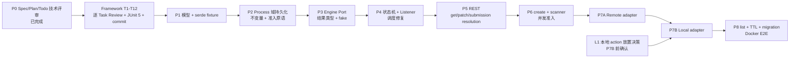

<!--
  Licensed to the Apache Software Foundation (ASF) under one
  or more contributor license agreements.  See the NOTICE file
  distributed with this work for additional information
  regarding copyright ownership.  The ASF licenses this file
  to you under the Apache License, Version 2.0 (the
  "License"); you may not use this file except in compliance
  with the License.  You may obtain a copy of the License at

      http://www.apache.org/licenses/LICENSE-2.0

  Unless required by applicable law or agreed to in writing,
  software distributed under the License is distributed on an
  "AS IS" BASIS, WITHOUT WARRANTIES OR CONDITIONS OF ANY
  KIND, either express or implied.  See the License for the
  specific language governing permissions and limitations
  under the License.
-->

# Implementation Plan: amoro-ams-v2 Process 资源

> 状态：Draft；P0 技术评审已完成，P7B 前尚待确认本地 action 的迁移放置边界；P1-P8 尚未实现。
>
> 权威规格：`tasks/amoro-ams-v2-process-spec.md`。
>
> 任务验收：`tasks/ams-v2-process-todo.md`。
> v2 Process 是全新实现；v1 代码只作为事实、差异与迁移风险基线。
> Framework T1-T12 完成后，Process 固定按 **P1 → P2 → P3 → P4 → P5 → P6 → P7A → P7B → P8** 逐 Task 执行 JUnit 5 RED→GREEN、五轴 Review、相关验证和本地原子提交；前一实施序列节点未提交不得开始下一节点。

## 1. 交付结果

在 `amoro-ams-v2` 交付一个可恢复、可审计的 Process 控制面：资源模型、Base64(YAML) 持久化、引擎端口、level-triggered 状态机、创建/查询/取消/人工消解 API、scanner、本地与远端 adapter、TTL 与迁移文档。

本计划默认不改 v1 Process 状态机/SQL/前端；已授权的固定例外只有 P8 v1 endpoint usage counter。若用户选择 P7B `AmsLocalEngineAdapter`，还必须把 v1 内部 execution endpoint 作为第二个显式兼容例外写入本计划后再实施。本计划不把历史分支代码视为当前实现，也不在首期承诺多 AMS 实例并发写。

## 2. 已定架构决策

| 决策 | 理由与验收边界 |
|---|---|
| 数据库 durable-first，内存仅为可重建读缓存 | 重启安全；create/modify/delete 只有 DB 成功后才完成 stage、更新内存和分发 listener |
| `ControllerKey(domain, resourceId)` single-flight | 避免跨域 ID 碰撞；同 key 的 delay 按最早 deadline 合并，取消不能被较慢轮询推迟 |
| 固定终态与最终谓词分离 | `FAILED` 预算内可重试，不能无条件触发 TerminalState |
| desired 仅允许 `RUN -> CANCEL` | 没有 resume，取消后不复活 |
| v2 自有 `ProcessEnginePort` | 当前 `ExecuteEngine` 没有 submit 四分类、resolve 与统一 observe；现有 HTTP adapter 不能原样复用 |
| UNKNOWN 禁止盲重投，提供人工消解 | 当前远端没有经验证的 resolve 能力；避免重复远端作业 |
| 单实例用 `(tableId,action)` keyed mutex 保障创建准入 | scanner 与 REST 仍会并发；多实例上线前另加 DB/leader 保证 |
| create 要求 `Idempotency-Key` | 同 scope/hash 重放原资源；不同 payload 409；key hash 与资源同生命周期，避免响应丢失后重复副作用 |
| REST JSON 与持久化 YAML 分离 | HTTP message conversion 不复用 Base64/at-rest serde |
| API 返回完整 `spec.parameters` | 用户已确认当前尚无权限问题；日志和错误仍必须脱敏；鉴权是未来不可信网络发布前置项 |
| TTL 条件批量删除 | 只删过期最终资源，禁止运行时 truncate |

## 3. 框架依赖

**全局实施门禁：Framework T1-T12 必须先全部完成，并逐 Task 通过 Review、JUnit 5 和本地提交；随后才开始 Process P1。** 下表只说明 Process 各阶段实际消费的框架能力，不能用作穿插提前实现 Process 的授权。

| Process 阶段 | 最小 Framework 前置 |
|---|---|
| P1 模型/fixture | T4 `ControlledResource`/domain 契约，T7 serde 契约 |
| P2 持久化/domain | T9 真 DB 与 `amoro_process` 域表，T10 Spring 装配 |
| P4 状态机/listener | T2 scheduler 的 ControllerKey/最早 deadline/unschedule，以及 T6 listener dispatcher/repair |
| P8 E2E | T11 框架重启重放和 T12 文档/回归门禁 |

实施不采用分段解锁或“先做一半 P1→回来补 Framework”的循环顺序；Framework 完整基线先于全部 Process 代码。

## 4. 依赖图

图表示唯一实施序列，不授权并行或跨节点提前开发；技术依赖较少的 Task 也必须等待前一节点 Review、JUnit 5 与本地提交完成。

## 5. 阶段计划

### P0：规格技术评审（完成）

- [x] 核实当前 HEAD、v1 事实、历史提交和 SSP 参考语义；
- [x] 修正架构图、持久化时序、状态图、接口图与代码引用；
- [x] 定稿 v1/v2 差异、迁移路径、兼容边界和参数返回决策；
- [x] 定稿 create 幂等键、PATCH/submission/execution-resolutions 与 v1 未废弃门禁；
- [x] 重排 P1-P8 依赖和验收。

### L1：P7B 本地执行放置决策（P7B 前门禁，不阻塞 Framework/P1-P7A）

- [ ] 用户确认 P7B 采用 v2 native local action，还是迁移期 `AmsLocalEngineAdapter` 代理 v1 内部执行；

### P1：对象模型与 serde

- [ ] `ProcessResource/Spec/Status/Attempt/ManualResolution/Condition/Failure`；
- [ ] spec 冻结、desired 单调、action retry 与 dispatchGeneration 双层预算、最终谓词；
- [ ] `process/v1` Base64(YAML) fixture 与 string ID 验证。
- [ ] max-legal-shape（4 attempts × 3 generations、8 conditions、全部字段 cap、最终 failure/finishedAt）的 persistence YAML 与 REST JSON 都小于 65536B；否则在 P1 下调 cap。

Checkpoint：模型不依赖真实引擎即可完成往返与不变量测试。

### P2：Process 域持久化与准入原语

- [ ] `amoro_process` 域、Repository、durable-first DB 测试；
- [ ] `ProcessActiveIndex` 同时提供 `(tableId,action)→name` 准入 map 与 `(createdAt,name)` 非最终资源 rank tree，配合 keyed mutex；rescheduler 只扫 active tree，不从全历史过滤；
- [ ] retained-resource idempotency index、request hash 与 in-flight/重放语义；
- [ ] read index 为 ALL/action/phase/action+phase 四种有界 view，各自使用带 subtree-size 的 immutable persistent rank tree 按 `(createdAt,name)` 排序；`resourcesByName` 与 `viewKey→root` 顶层同样采用结构共享 persistent map，单资源最多四个 view 的 prepare 总访问/节点分配为 `O(log R+log V+log n)`，避免复制整表数组或全部 view map；postStart 构造完整新 snapshot 后单次发布；
- [ ] `(finishedAt,name)` expiry index，durable publish/delete 维护并 postStart 重建，TTL 不扫全 cache；
- [ ] execution handle release index 以 byHandle 去重 map + 按 `(nextReleaseAt,engine,externalId)` 排序的 due skip-list 构成，striped lock 原子更新两者；任一 local attempt 的执行终态结果 durable publish 后加入、release 成功移除、postStart 从当前/历史 attempt 安全重建，exclusive cursor/batch 扫描不遍历全 index/cache；
- [ ] `ProcessIndexProjection` 聚合 `resourcesByName` canonical read map 与 active、idempotency、read、expiry 四类 correctness-sensitive 索引为单个 immutable snapshot：Process get/list/准入/rescheduler/TTL 每次只读一次 aggregate 引用，不再跨读 Framework cache；严格复用 Framework 的 DB 前 `prepare` 与 DB 后 same-lane 单次原子 `commit`；release index 使用独立、最多 `maxRetries+1` 个 handle 的 prepared delta，在同一 HandleKey striped lock 内同步维护 dedup/due-order 两个结构，竞态只允许幂等重复 release；listener 仅作修复信号，不能承担索引正确性；
- [ ] DB 失败内存不变、重启重放和跨域隔离。

Checkpoint：资源可可靠创建/修改/读取；并发 create 恰一成功。

### P3：引擎端口与 fake

- [ ] 无 I/O immutable capabilities snapshot（两项 boolean + 跨相同配置重启稳定的 capabilityVersion）+ submit/resolve/observe/cancel/release 异步端口；dispatcher 以默认 30s 可配置 timeout 保证所有 future 有界完成，submit 外层 timeout 保守归 UNKNOWN、其余归 UNAVAILABLE；submit 明确区分可证明未发送的 UNAVAILABLE 与副作用不确定的 UNKNOWN，resolution/observation 区分 authoritative NOT_FOUND、UNAVAILABLE 与 LOST；release 只做 execution-result-durable-confirmed cleanup；
- [ ] command single-flight dispatcher，scheduler worker 禁止等待 future；SubmissionIdentity、ExecutionIdentity 约束业务 I/O，ReleaseIdentity 合并幂等 cleanup；
- [ ] submission identity 跨 submit/resolve、execution identity 跨 observe/cancel 单飞行；慢 submit 未完成时 resolve=0；
- [ ] adapter 能力和 NOT_FOUND 权威性契约；
- [ ] 可脚本化 fake 覆盖全部结果分类。

Checkpoint：状态机可在无远端依赖下做完整确定性测试。

### P4：状态机、Listener 与调度修复

- [ ] ToRun/ToCancel、resourceVersion CAS、十态 × desired；
- [ ] 每个 action attempt 结束时写 attempt.finishedAt；只有资源最终时写 status.finishedAt，release hard retention 以持久化 attempt 时间重建；
- [ ] `nextReconcileAt` 跨重启业务门控；提前唤醒零副作用，取消命令可抢占旧 deadline；
- [ ] `ProcessResultApplier` 按 attempt/generation key/hash 合并迟到异步结果，保留并发 desired；
- [ ] UNKNOWN/CONFLICT、条件维护、retryNumber 0..maxRetries、dispatchGeneration 0..maxSubmissionRetries；
- [ ] 权威 EngineObservation.FAILED 的 retryable=false/true 在同一 CAS 映射 retryDisposition=FINAL/ALLOW，覆盖 observe 与 cancel ALREADY_TERMINAL，迟到结果不覆盖人工 FINAL；
- [ ] `DataRepaired` 只标记导入/历史终态字段修补，正常迁移路径不产生；
- [ ] 权威 submission NOT_FOUND 归档旧 generation 并生成有界新 key；不得复用旧 key；
- [ ] 本地派发后 ACK 落库前崩溃或 ACK 后 handle 丢失均进入 `ExecutionUnresolved`，禁止自动重投；
- [ ] ACK 后 observe 的权威 NOT_FOUND/LOST 或 cancel 的权威 NOT_FOUND 均进入 `ExecutionUnresolved`；只有 submission resolution NOT_FOUND 可证明未接受并轮换 generation；
- [ ] `ExecutionUnresolved` 对当前 unresolved identity 的 submit/resolve/observe/cancel 是零 I/O 等待态，仅按 5min reminder 刷新告警；不阻断 reaper 清理旧 durable-terminal attempt；submission/cancel UNSUPPORTED 在 future 完成前下调 capability snapshot，并持久化当时 capabilityVersion；初始 supportsCancellation=false 也在首次取消前本地置 condition、零 cancel I/O；相同 version 即使 cancel deadline 到期或跨重启也只 observe，不重复 cancel，新 version+true 才恢复；
- [ ] 四 operation 的 engine backoff counter 独立持久化并在重启后续接，非 UNAVAILABLE 只归零自身；
- [ ] 每次执行的终态结果（含可重试 FAILED）CAS 成功后由 projection 加入 release index；`ExecutionHandleReaper` 是唯一 release caller，覆盖异步结果和人工消解，CAS 失败不得产生 cleanup entry；
- [ ] listener 失败重试与周期性 active rescheduler；
- [ ] ControllerKey 与 earliest-deadline single-flight。

Checkpoint：取消竞态、提交不确定和重启调和均不违反不变量。

### P5：REST 查询、取消和 attempt-bound 人工消解

- [ ] GET resource、PATCH desiredState、POST submission/execution-resolutions；
- [ ] cancel 命令复用 ToCancelTransition 的纯 requestCancel 规则，FAILED 因 desired=CANCEL 变最终时同 CAS 写 failure/finishedAt；
- [ ] 两类人工命令强制 Idempotency-Key + submissionKey/requestHash，并与对应 generation/attempt 审计同一次 CAS；
- [ ] `ManualResolutionTransition` 独占人工迁移规则；generation 轮换、条件、终态 failure/finishedAt 不在 REST/CommandService/ResultApplier 重复实现；
- [ ] JSON API model 与 persistence serde 分离；
- [ ] 统一错误码、完整 parameters、审计 reason。

Checkpoint：接口层只发命令，不直接执行业务状态迁移或引擎调用。

### P6：创建与触发

- [ ] v2 自有 `ManagedTablePort` + `ProcessActionPlugin`；首个 adapter 只读 `table_identifier/table_metadata`，不导入 `org.apache.amoro.server.*`、不写 v1 表；
- [ ] 手工 create 和 scanner 共用参数冻结链；
- [ ] REST Idempotency-Key 与 scanner stable window intent key；
- [ ] canonical action registry 与格式映射；P6 用 fake action plugin 证明编排，P7A/P7B 才交付真实 remote/local action plugin；
- [ ] 服务端冻结 action retry/submission generation 策略，手工与 scanner 使用同一配置快照；
- [ ] REST/scanner 并发准入测试。

Checkpoint：两个入口生成等价冻结执行语义；triggerSource、createdAt、name 与请求幂等元数据按入口规则不同；同一 table/action 最多一个非最终资源。

### P7：引擎适配

- [ ] P7A 远端 Spark adapter：只复用经验证的 endpoint/字段映射；
- [ ] P7A 同时交付 Paimon `expire-snapshots/clean-orphans` 两个 remote-spark `ProcessActionPlugin`；未完成的 pair 不得注册为 supported；
- [ ] 远端 trackUri 在 adapter 边界只接受无 user-info/控制字符的绝对 http/https URI；非法值丢弃并告警；
- [ ] P7B 本地 adapter：专用有界线程池，派发与观测分离，禁止阻塞 scheduler worker；
- [ ] P7B 同时交付 Iceberg `expire-snapshots/clean-orphans` 与 Paimon `sync-table-meta` 三个 local pair；registry advertised pair 必须都有 contract/E2E 证据；
- [ ] 本地 terminal result 保留到该次执行终态结果 durable CAS 后的幂等 release；重复 release no-op，hard retention 超时清理告警；
- [ ] 本地 durable DISPATCHING 后派发、ACK 落库前崩溃必须由 resolve LOST 收敛，不能伪造 NOT_FOUND；
- [ ] 两个 adapter 均只消费冻结 parameters。

Checkpoint：每个 adapter 独立通过 contract tests；不以一个 adapter 成功代替另一个。

### P8：列表、TTL、迁移与端到端

- [ ] list 的 page/pageSize（默认 20/最大 50）、稳定排序、404 和 string ID；
- [ ] 基于 ProcessExpiryIndex、只删除过期最终资源的 cursor/batch cleaner；任一 local handle 的 release entry 尚 pending/in-flight/failed 时阻止删行，release success 后才允许 delete，删除阶段不靠 volatile cleanup delta；
- [ ] Process 域 DurableDeletionHook 在 mutation lane 内完成直接 unschedule，delete 失败不撤销调度、同名重建不被旧 delete 终止；
- [ ] v1/v2 灰度互斥、回退和历史查询边界；
- [ ] v1/v2 usage/active/result/UNKNOWN/cancel-latency 指标；v1 仅在生产证明和零使用量后另行进入 advisory deprecation；
- [ ] v1 endpoint usage 通过 Javalin route after-handler 只读 counter 采集，label 不含表名/parameters；当前不存在可复用指标，不能虚称 access log 已覆盖；
- [ ] MySQL 5.7 Docker E2E：创建→运行→取消竞态→终态→重启重放→清理。

Checkpoint：只有离线单测、adapter contract tests 和 Docker E2E 均通过后，才能把实现状态从 Draft 改为 Implemented。

## 6. 主要风险与控制

| 风险 | 等级 | 控制 |
|---|---|---|
| 持久化先更新内存导致重启丢状态 | Critical | Framework durable-first 测试作为 P2 前置门禁 |
| UNKNOWN 自动重投造成重复 Spark 作业 | Critical | 当前 generation 同 key/hash resolve；未获权威 NOT_FOUND 时禁止换 key；权威 NOT_FOUND 后才按有界 dispatchGeneration 生成新 key；UNSUPPORTED/LOST 时人工消解 |
| `FAILED` 误判终态导致预算内不重试 | High | 最终谓词独立单测，maxRetries=0/3 边界 |
| 固定终态或最终 FAILED 缺失 finishedAt | High | 所有自动/人工迁移同 CAS 写终态时间；TTL 只消费不修补 |
| 取消 delay 被普通轮询覆盖 | High | scheduler 取最早 deadline，不用 last-writer-wins |
| listener 失败后资源永久不调度 | High | listener retry + active-resource repair sweep |
| REST/scanner 并发创建重复 Process | High | keyed mutex 包含检查与 durable create；并发测试 |
| create 响应丢失后客户端盲重试 | High | required Idempotency-Key；同 key/hash replay，不同 hash 冲突；retention ≥ 最长重试窗口 |
| 当前远端接口不支持幂等消解 | High | adapter 返回 UNSUPPORTED；人工消解和告警为正式路径 |
| v1/v2 同时为同表/action 调度 | High | 灰度范围开关互斥；禁止双写/双触发 |
| Snowflake ID 在前端精度丢失 | Medium | string end-to-end contract test |
| 完整 parameters 暴露 | 当前接受 | 当前网络信任边界；日志脱敏；外部/多租户发布前引入鉴权与分级 |
| 运行时清理误删活跃资源 | High | 最终谓词 + finishedAt cutoff + batch limit；禁止 truncate |
| TTL/repair 每轮遍历全缓存，资源增长后形成周期性停顿 | High | ProcessExpiryIndex/ExecutionHandleReleaseIndex 稳定 cursor + batch；单轮 load 有硬上限 |
| 本地 terminal result 在执行结果 CAS 前被释放或 CAS 后永久泄漏 | Critical | 该 externalId 的终态结果 CAS 成功后才 release；ExecutionHandleReaper 补偿崩溃窗口；重复 release 幂等 + hard retention 告警兜底 |
| 不可信 trackUri 通过 API 传播危险 scheme | High | adapter 边界只接受绝对 http/https 且拒绝 user-info/控制字符；非法值丢弃告警 |

## 7. 发布判定

以下任一项未满足时，不得宣称完整成功：

- 仅编译通过但未跑状态机矩阵；
- Docker 测试被默认排除或未执行；
- remote/local 只有一个 adapter 被验证；
- 当前远端 UNKNOWN 仍无人工消解；
- 未验证 v1/v2 灰度互斥；
- API/前端仍把 Process ID 当 JavaScript Number；
- 文档仍把历史提交或计划类型称为当前实现。

## 8. 尚未决定但不阻塞 P1 的事项

- JIRA issue 号和提交标题；
- docker-it 是否进入 CI；
- 远端服务是否增加 submission ledger/resolve；未增加时保留人工消解；
- 各 action 的 parameters schema 与 summary.result 内部字段 cap，由 P6/P7 基于格式代码定稿，但不得突破 Spec 已定的 16 KiB/8 KiB 全局上限。
