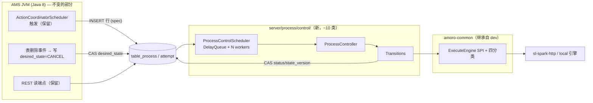
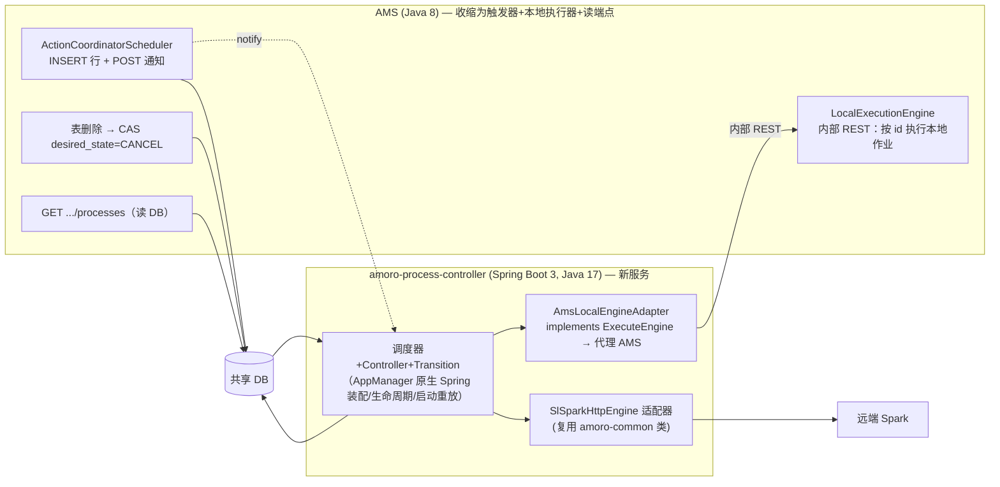

<!--
  Licensed to the Apache Software Foundation (ASF) under one
  or more contributor license agreements.  See the NOTICE file
  distributed with this work for additional information
  regarding copyright ownership.  The ASF licenses this file
  to you under the Apache License, Version 2.0 (the
  "License"); you may not use this file except in compliance
  with the License.  You may obtain a copy of the License at

      http://www.apache.org/licenses/LICENSE-2.0

  Unless required by applicable law or agreed to in writing,
  software distributed under the License is distributed on an
  "AS IS" BASIS, WITHOUT WARRANTIES OR CONDITIONS OF ANY
  KIND, either express or implied.  See the License for the
  specific language governing permissions and limitations
  under the License.
-->

# Process 控制面重写 — 方案变体对比（头脑风暴）

> **历史决策记录，非当前 v2 契约。** 本文保留方案比较与采访上下文，但后续审核已经
> 将 v2 定义为 Spring Boot 3 / Java 17 下的全新实现，并补齐独立事实表、异步引擎端口、
> 新 REST 契约和 v1 迁移边界。实施时以 `amoro-ams-v2-process-spec.md` 及其 Plan/Todo
> 为准，不得从本文恢复被替代的默认假设。
>
> 2026-08-22。基于采访确认的意图 + 双路代码探索（当前分支旧实现 / dev 分支 reconciler 版）+ AppManager 参考架构（control-plane 技能家族）。
> 状态：**已决策——用户选定方案 C，并确认资产默认假设**。Spec 见 `process-control-plane-spec.md`。

---

## 0. 已确认意图（采访结论，用户已确认）

| 维度 | 结论 |
|---|---|
| 不满原因 | reconciler 版**架构形态不对 + 太复杂太重 + 边界场景淹没主线**（功能本身达标） |
| 范围 | 仅 External Process 域（table_process 维护作业）；不含 OptimizingQueue 'AMORO' 域、不含 Optimizer 生命周期 |
| 部署假设 | **单节点**——ownership fencing / epoch / admission lock 全部简化掉 |
| 目标形态 | AppManager 式声明式控制面：spec/status 双状态 + DelayQueue 调度器 + 每资源一个 Controller + 幂等 Transition 单步状态机 + TerminalState + resourceVersion CAS |
| Success | 主线顺着 Transition 链可读；调度层类数远少于 20+；新增 action 只写 SPI + Transition；UNKNOWN/取消收敛为状态机内普通迁移 |
| 硬约束 | Java 8 基线（`java.source.version=8`）；全仓库零 Spring；MyBatis 注解 mapper；REST/前端行为兼容 |
| 补充思路 | 从 Process 调度起步迁移 Spring Boot 3，后续整个 Amoro 逐步迁移（方案 B 已认真探索） |
| 默认假设（待确认） | 保留 attempt 幂等底座 + ExecuteEngine SPI；resolve 独立通道不保留（折叠进 Transition）；取消不变量保留但测试重写 |

---

## 1. 探索结论摘要

### 1.1 当前分支（jira/process-dev）旧实现的病灶

- **thread-per-process**：`TableProcessExecutor.run()` 提交后 `while + Thread.sleep(5000)` 轮询到终态，一个远端作业全程占用一根 AMS 线程。
- **池实际固定 10 线程 + 无界队列**：`ThreadPoolExecutor(10, 100, 60s, LinkedBlockingQueue)`——无界队列导致永远只有 10 线程，第 11 个作业起无限静默排队（无背压信号）。
- **重启恢复只认 SUBMITTED/RUNNING**；本地引擎状态在内存（4h TTL），重启即丢。
- **优化行与维护行共表**（`execution_engine='AMORO'`），写者与状态词汇不同，恢复歧义——JSPT-2662 卡死正是这类行永久阻塞恢复。
- 提交细节（session SQL、qid 归档）硬编码在引擎里，靠 hotfix 反复修补（887c5dc09）。

### 1.2 dev 分支 reconciler 版的资产盘点

**形态无关、重写时直接继承**（与"谁来驱动调度"正交）：

1. **amoro-common SPI 9 文件**（纯值类型 + default 方法，旧引擎零改动加载）：`SubmissionPayload/SubmissionContext/SubmissionOutcome(四分类)/SubmissionResolution/ProcessObservation` + `ExecuteEngine` 4 个 default 扩展 + `HttpRemoteSparkStandAloneSubmit` 的 prepare/submit 分类实现。
2. **SQL schema**：`table_process_attempt`（submission_key 唯一 + payload 冻结 + submit_state）、`state_version`（CAS）、`desired_state`（RUN/CANCEL）、生成列唯一索引（单表单活跃行）。
3. **状态机语义**：`SubmitState` 枚举、`validTransition` PR2c 决策表（CANCELING 中间态 + `CANCEL_CONFIRMED` + desired_state 拒绝复活）、取消八场景不变量。
4. **`ProcessStateRepository` + 3 个 Mapper + Meta 值类**（简化后保留，见 §2.3）。

**形态强耦合、丢弃**：五池骨架（timer/control/action/resolve/poll-lane）、`ControlSlot`/generation/commandId 完成栅栏、`ProcessDecisionEngine` 决策表组织、`ProcessReconcileController`（1419 行胶水）、`ReconcilerConfig` 预算推导、指标/告警挂点接线。

### 1.3 硬约束核查

- `java.source.version=8` → **Spring Boot 3（需 Java 17）不能进 AMS JVM**，只能独立服务或独立模块（Maven 支持 per-module release，maven-compiler 3.13）。
- 全仓库无任何 Spring 依赖；AmoroServiceContainer 是手工装配 + Javalin REST。
- 仓库已有 JDK 17 先例（trino profile），构建工具链可行。

---

## 2. 三个变体共享的设计核心

无论选哪个变体，以下 AppManager 语义与简化决策相同——变体之间的差异只在**宿主环境与模块边界**。

### 2.1 spec/status 映射（不需要新表）

| AppManager 概念 | Amoro 对应物（已存在） |
|---|---|
| spec（用户期望态） | `desired_state`（RUN/CANCEL）+ 插入时冻结的 `process_parameters` |
| status（实际态） | `status`（十态）+ `table_process_attempt.submit_state` |
| resourceVersion | `state_version`（CAS 列） |
| 写 spec 的入口 | REST/表事件只写 `desired_state`/INSERT 行，**永不直接写 status** |
| TerminalState | 行删除或到达终态 → Controller 抛 TerminalState → 永久停止排期 |

### 2.2 调度核心（复刻 AppManager 骨架，约 6-8 个类）

```
ProcessControlScheduler        // DelayQueue<ScheduledController> + N 个 SchedulerWorker
ScheduledController            // (processId, nextDelay) 包装
ProcessController implements Controller   // invoke(): 读快照 → 缺失/终态抛 TerminalState
                               //          → Transitions.forState(desired_state, status) → 单步执行
ProcessTransition              // 幂等单步接口（四值结果：继续等下一轮/本步完成/资源终态/需退避）
ToSubmitted / Observe / ToCanceling / ToTerminal...   // 每个 Transition 只做一次引擎调用 + 一次 CAS 写回
TransitionRegistry             // (desired_state, status) → Transition 的纯映射
```

- **level-triggered**：每轮全量读快照重新判断，丢任意轮次后仍收敛。
- **等待 = 下次排期时间**：poll 间隔/重试退避/UNAVAILABLE 退避全部表现为 `nextDelay`（退避序列 {3,3,5,8,13,21,34,55}s + ≤250ms 抖动，上限可配）。
- **UNKNOWN≠失败、CONFLICT 停推** 等四分类语义不变，但表达为 Transition 返回值，不再是独立子系统。
- 引擎调用在 worker 内同步执行（AppManager 方式），引擎 HTTP 超时必须小于排期节奏预算；慢/降级引擎用更长 nextDelay 表达（UnhappyCluster 模式）。

### 2.3 单节点简化清单（相对 dev 版删除项）

| 删除 | 理由 |
|---|---|
| `process_controller_ownership` 表 + `ProcessOwnershipManager` + owner 三列 + 所有 EXISTS 谓词 | 单节点无跨实例写竞争，`state_version` CAS 足够 |
| `process_admission_lock` 表 | 准入互斥退化为 JVM 内计数 + DB 唯一活跃索引兜底 |
| `AmsAssignService` fence-before-publish（+161 行） | 无多节点归属转移 |
| `TableRemovalReason` 的 ownership-revoke 语义 | 只保留表 drop 取消路径 |
| 五池 / RecoveryRateLimiter / DueLagSampler | 恢复错峰 = 启动时按 processId 均匀展开 nextDelay；指标保留核心四项 |

### 2.4 保留资产清单（从 dev 分支搬运）

amoro-common SPI 9 文件原样；attempt 表 DDL + `state_version`/`desired_state`/唯一索引 DDL；`ProcessStateRepository` 去 fencing 化（保留 casProcess/createAttempt/snapshot/insertWithinCap）；`validTransition` PR2c 决策表；`TestCancelRace` 等测试的**不变量**（测试体按新骨架重写）。

---

## 3. 方案 A — Amoro 内嵌薄复刻（Java 8，无 Spring）

### 架构



### 形态要点

- 新包 `org.apache.amoro.server.process.control`，预计 **10±2 个类**（对比 reconciler 版 20+）；`ProcessService` 收缩为门面（register = INSERT + schedule，cancel = CAS desired_state + schedule）。
- 旧 `TableProcessExecutor`（thread-per-process）与 `executor/` 包删除（与 dev 版相同处置）。
- 装配沿用 AmoroServiceContainer 手工 wiring，停机顺序并入现有 dispose 链。

### 评估

| 优势 | 劣势/风险 |
|---|---|
| 零部署变化、零新依赖，一个 release 完成 | 不启动 SB3 战略；后续 SB3 化时控制面要再搬一次家 |
| review 面最小，主线 = Controller.invoke → Transition 链 | Java 8 语法（无 record/var/虚拟线程） |
| 与 RuntimeHandlerChain 表事件天然同进程 | — |
| 回滚简单（DB 改动全部 additive，旧版本可直接回退） | — |

---

## 4. 方案 B — Spring Boot 3 独立控制面服务（绞杀者迁移起点）

> 用户补充思路的完整展开：以 Process 为第一个被"绞杀"的子系统，新服务逐步吸收 AMS，最终整个 Amoro 迁到 Spring Boot。

### 架构（Phase 1）



### 关键设计决策（本方案成立的前提）

1. **DB 共享 + spec-write 集成模式**：AMS 侧一切触发/取消都只是写 `desired_state`/INSERT 行（纯 spec 写），控制面 level-triggered 收敛——通知 REST 只是加速器，失败不影响正确性（兜底周期扫描）。跨进程一致性由 DB 唯一约束 + CAS 保证，无需分布式协议。
2. **本地作业代理执行**：Iceberg 维护/Paimon sync 等 `LocalProcess` 依赖 AMS 内的 TableRuntime/元数据，无法搬到 SB3。Phase 1 中 SB3 的 `AmsLocalEngineAdapter` 把 AMS 当作又一个"执行基础设施"（恰是 AppManager 的 Cluster SPI 观点），AMS 暴露"按已持久化的 process id 构造并执行本地作业"的内部端点（复用现有 recover 重建逻辑）。
3. **引擎代码复用**：`HttpRemoteSparkStandAloneSubmit` 等在 amoro-common（Java 8 字节码），SB3/JDK17 直接依赖运行。
4. **模块与构建**：新 Maven 模块 `amoro-process-controller`，per-module `<release>17</release>` + spring-boot-dependencies BOM；dist 打包为同 tarball 内第二个启动脚本（或独立 rpm/deb）。CI 用 JDK 17 跑全仓（trino profile 已有先例）。
5. **职责切割**：清理任务（deleteExpired）随状态机归 SB3；REST 读端点 Phase 1 留在 AMS（读 DB，零状态），Phase 2 迁移。

### 迁移路线（绞杀者）

- **Phase 1**（本次）：SB3 服务拥有 Process 状态机；AMS 保留触发、本地执行、读端点。两服务共存，DB additive。
- **Phase 2**：触发协调（ActionCoordinator）与 REST 读端点迁入 SB3；AMS 的 process 包只剩本地执行端点。
- **Phase 3+**（"整个 Amoro"）：按模块逐个吸收（表元数据服务、catalog、optimizer 管理……），AmoroServiceContainer 逐步瘦身直至退役。每阶段共享 DB + REST 契约。

### 评估

| 优势 | 劣势/风险 |
|---|---|
| **直接服务战略目标**：SB3 迁移从最自包含的子系统起步 | 运维 +1 个服务（部署/监控/日志/故障域拆两个） |
| AppManager 本身就是 Spring 装配——**复刻还原度最高**（生命周期/启动重放/事件监听原生） | 集成链变长：本地作业跨进程代理、触发通知跨进程 |
| Java 17+ 生态（后续可上虚拟线程）、独立演进/测试节奏 | 交付面最大：新服务 + AMS 收缩 + 部署story + 联调 |
| 为后续模块迁移提供模板与基础设施 | fork 与 upstream（无 Spring 方向）差异拉大，merge 成本上升 |
| AMS 老代码可逐模块退役，无一次性重写风险 | 双工具链（JDK8 AMS + JDK17 SB3）共存期的构建复杂度 |

---

## 5. 方案 C — 混合：A 的形态 + B 的边界（可移植契约层）

### 架构

方案 A 原样落地，但把**契约层与 Transition 层切到零依赖边界**：

```
amoro-common (或新微模块 amoro-control-api, Java 8, 零依赖)
├── Controller / Scheduler / TerminalState / ProcessTransition 接口（~200 行）
├── Transition 实现只依赖: ExecuteEngine SPI + TransitionContext(仓储端口接口)
└── ProcessControlScheduler 实现（纯 JDK，无 AMS 类型泄漏）

amoro-ams
└── MyBatis 仓储适配器实现 TransitionContext 端口 + 装配 + 触发/取消入口
```

未来 SB3 启动时：把 amoro-control-api + Transition + 仓储适配器（换成 SB3 MyBatis）整体搬进 Spring 宿主，**接口与状态机代码零改动**——即"先 A 后 B"的搬家成本被压到最低。

### 评估

| 优势 | 劣势/风险 |
|---|---|
| 立刻解决确认的痛点（薄/直观/主线清晰），无部署变化 | 比方案 A 多一层端口抽象的纪律成本（很小：接口本来就该这么切） |
| SB3 战略不被堵死，搬家路径明确且便宜 | SB3 启动时间推迟到 Phase 2 决策 |
| 契约层零依赖本身提升可测试性（Transition 单测无需 DB） | "为未来设计"若猜错边界（如本地引擎代理需求），搬运时仍要改 |

---

## 6. 对比矩阵与推荐

| 维度 | A 内嵌薄复刻 | B SB3 独立服务 | C 混合可移植 |
|---|---|---|---|
| 解决确认痛点（形态/重量/主线） | ✅ 完全 | ✅ 完全 | ✅ 完全 |
| 部署复杂度 | 不变 | **+1 服务** | 不变 |
| 交付速度 | 最快 | 最慢（新服务+集成+联调） | ≈A（+端口切分） |
| AppManager 复刻还原度 | 高（语义同构，装配手工） | **最高**（Spring 原生） | 高 |
| SB3 战略启动 | ❌ | ✅ 立即 | ⏸ 预留（搬家便宜） |
| 集成风险 | 低 | 中（本地作业代理、通知链） | 低 |
| fork-upstream merge | 中 | 差异最大 | 中 |
| 类数（调度层） | ~10 | ~10 + 服务骨架 | ~10 + 接口层 |

**推荐：方案 C。** 理由：

1. 三个变体对"确认的痛点"解决程度相同——痛点本身不构成选 B 的理由。
2. B 的额外成本（双服务运维、本地作业跨进程代理、交付面翻倍）买到的是"战略提前量"；而 Process 控制面代码量小（~10 类），未来搬家的绝对成本本来就低——C 用极小的端口切分纪律把这个成本进一步压低，**保留选择权而不预付全价**。
3. 若 SB3 迁移已是被批准的明确路线图（有排期、有运维预算），B 是对的起点——这也是本方案对比为 B 做完整探索的原因：Phase 1 的集成模式（spec-write + 引擎代理）已经设计好，随时可以启用。

---

## 7. 下一步（变体确定后）

1. 出 spec：状态机全迁移表（desired_state × status × submit_state → Transition 与 nextDelay）、Transition 四值精确定义、配置键（建议 2-3 个：poll-interval / worker-count / tracked-max）、停机序、恢复错峰策略。
2. 分支与资产搬运清单：新分支基于 `jira/process-dev`；从 dev 分支按目录搬运 SPI/SQL/Repository/测试不变量（主体是单个 91 文件 commit，需手工拆取）。
3. JIRA issue 立项（当前 `[JSPT-XXXX]` 占位）。
4. 实施顺序建议：契约层+调度器骨架 → 状态机 Transition → 接线替换 ProcessService 内部 → 恢复/清理迁移 → 测试不变量重写。
