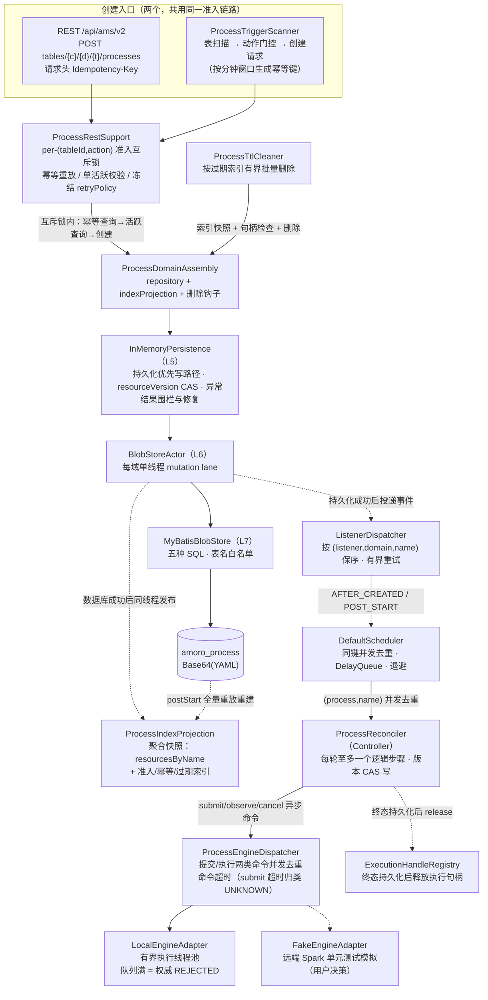
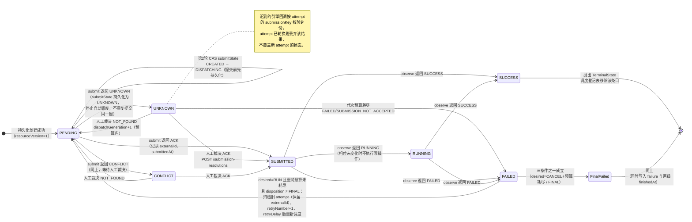
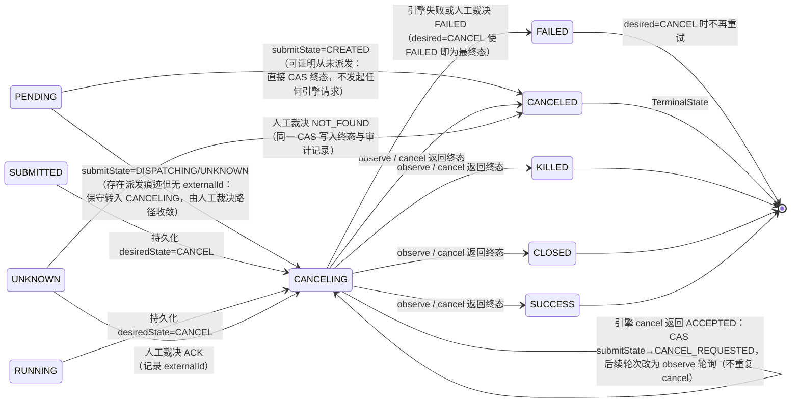
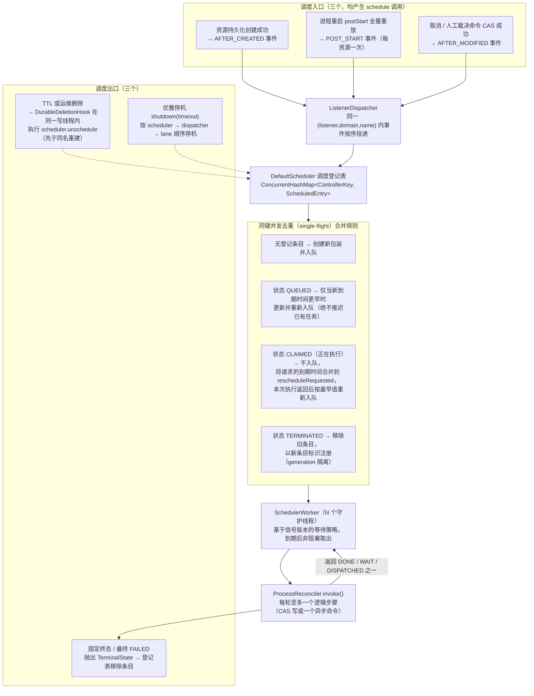
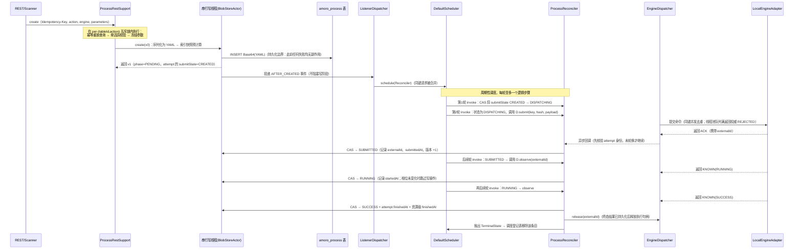
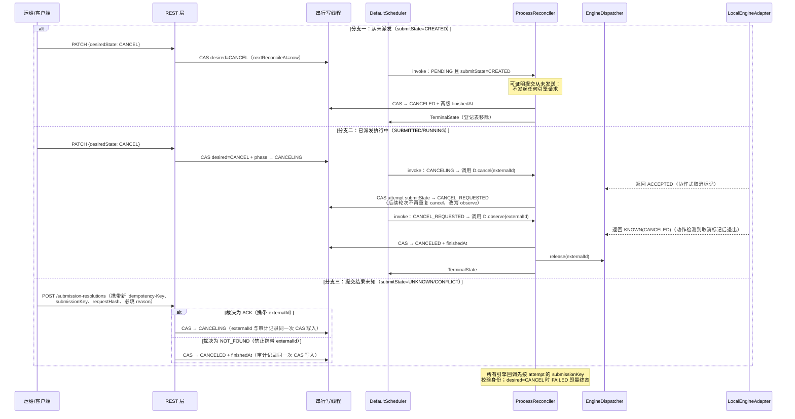

# amoro-ams-v2 Process 实际调度生命流程（Runbook）

> 基于 `jira/process-dev` 分支实际实现（Framework T1–T12 + Process P1–P8 全部交付，
> 提交 `724ed7be4`…`e63a8bd4f`）整理。权威设计见 `amoro-ams-v2-process-spec.md`；本文描述
> **代码里真实发生的事**，并标注与 spec 的当前差异。离线 183 + docker-it（真 MySQL 5.7）
> 192 测试全绿。

## 0. 组件地图（已实现）

| 层 | 组件 | 职责 |
|---|---|---|
| 调度 | `DefaultScheduler`（control） | DelayQueue 排序 + single-flight（同 key 至多一个 Controller 在飞）、退避 {3,3,5,8,13,21,34,55}s、优雅停机 |
| 持久化 | `InMemoryPersistence` + `BlobStoreActor`（persistence/blob） | 每域单线程 mutation lane：read→detached→CAS→apply→版本→serde→projection prepare→DB→发布→hook→listener |
| 事件 | `ListenerDispatcher`（persistence） | 有界队列 + 按 (listener,domain,name) pair 保序 + 有界重试 |
| serde | `VersionAwareJacksonSerde`（serde） | Base64(YAML/JSON) 文档、版本链、64KiB 上界 |
| Process 域 | `ProcessDomainAssembly`（process） | `amoro_process` 表、聚合索引快照（准入/幂等/过期）、删除 hook=同 lane unschedule |
| 状态机 | `ProcessReconciler`（process） | level-triggered Controller：RUN/CANCEL 全路径 |
| 引擎 | `ProcessEngineDispatcher` + `LocalEngineAdapter`/`FakeEngineAdapter`（process/engine） | 引擎命令同键并发去重 + 强制超时（submit 超时归类 UNKNOWN）；本地引擎为真实线程池实现，远端 Spark 用可编程模拟适配器（用户决策） |


## 0.5 图集（架构 / RUN 状态机 / CANCEL 状态机 / Controller 入口 / RUN·CANCEL 时序）

> 六张图均描述**当前代码的实际行为**（含评审修复 190fda699：准入互斥锁、提交前先
> 持久化 DISPATCHING、未知提交不盲目重复提交、未派发取消不调用引擎、终态后释放执行
> 句柄、TTL 删除前检查句柄释放状态）。
>
> 术语约定：**single-flight（同键并发去重）** 指同一 ControllerKey 的并发调度请求合并
> 为至多一次执行；**mutation lane（串行写线程）** 指每个持久化域唯一的单线程写入队
> 列，所有读写-计算-写入在该线程内串行执行；**CAS** 指基于 resourceVersion 的乐观
> 并发控制写入。

### 图 1：总体架构



### 图 2：状态机 —— desired=RUN 路径



### 图 3：状态机 —— desired=CANCEL 路径



### 图 4：Controller 的调度入口与出口



### 图 5：RUN 完整调用时序（本地引擎）



### 图 6：CANCEL 完整调用时序（三种分支）



## 1. 一次 Process 的完整生命

### 1.1 创建（durable create）

```
REST/Scanner → ProcessDomainAssembly.repository.create(resource v0)
  ├─ 调用线程: serde.detach(resource)          # alias 隔离从入队开始
  └─ mutation lane（单线程）:
       canonical.containsKey? → ResourceAlreadyExists（准入第一道）
       candidate = resource.withVersion(1)
       bytes = serde.serialize(candidate)        # 超过 65536B 直接失败
       projection.prepare(created(detached))     # 纯计算，DB 前失败零副作用
       blobStore.insert(amoro_process, name, Base64(YAML))   # ← 持久化边界：此后失败进入结果未知处理
       canonical.put + projection.commit         # O(1) 原子切换
       listener handoff(AFTER_CREATED)           # 异步，绝不阻塞/反转 stage
返回 v1，phase=PENDING, desired=RUN
```

数据库行落库后，即使进程当场崩溃，新进程 `postStart` 会从 DB 全量重放并重建一切。

### 1.2 事件 → 调度接入

```
ListenerDispatcher 收 AFTER_CREATED envelope
  → ProcessListener.afterCreated（异步 worker）
  → scheduler.schedule(ProcessReconciler(name))
     single-flight：同 key ("process", name) 至多一个在飞；重复 schedule 合并最早 deadline
```

### 1.3 每轮调和（invoke，50ms~周期由 amoro.control.scheduler.delay-ms 决定）

Reconciler 在 scheduler worker 上执行，**每轮至多一个逻辑步骤**：

```
invoke():
  resource = repository.get(name)        # 读内存快照（detached），零 DB 调用
  if final: throw TerminalState          # 登记表回收，永久停调度
  desired=RUN:
    PENDING/UNKNOWN:
      attempt 为空 → 先 CAS 持久化 attempt（submissionKey=name:retry:0, submitState=CREATED）
                    → 本轮结束，下轮才派发（spec §7.3：durable DISPATCHING 先于 dispatch）
      attempt 已存在且 submitState=CREATED → 先 CAS submitState→DISPATCHING（提交前先持久化：崩溃重启后进入裁决路径而非重复提交）
      attempt=DISPATCHING → dispatcher.submit(key, requestHash, payload)   # 异步派发，同键并发请求去重为一次
                      └ ACCEPTED 回调: CAS→SUBMITTED（记 externalId, submittedAt）
                        REJECTED 回调: CAS→FAILED(终态判定)+failure
                        UNKNOWN/CONFLICT 回调: CAS submitState→UNKNOWN/CONFLICT 并停止自动派发——
                          不盲目重复提交同一 submissionKey，等待人工裁决（POST /submission-resolutions）
                        UNAVAILABLE 回调: 可证未发送，下轮同 key 重投
    SUBMITTED/RUNNING:
      dispatcher.observe(externalId)
        KNOWN(SUBMITTED) → 保持（仅刷新 lastObserved）
        KNOWN(RUNNING)   → CAS→RUNNING（startedAt）
        KNOWN(SUCCESS/CANCELED/KILLED/CLOSED) → CAS→终态 + attempt.finishedAt + 顶层 finishedAt
        KNOWN(FAILED)    → CAS→FAILED + lastError; retryable=false ⇒ disposition=FINAL
            NOT_FOUND/LOST   → 首版：日志+下轮继续；人工执行消解（POST /execution-resolutions）收敛
        回调统一带 submissionKey 身份守卫：attempt 已轮换则丢弃，绝不覆盖新 attempt
        终态写 durable 成功 → engine.release(externalId) + ExecutionHandleRegistry 释放（TTL gate 依赖）
    FAILED（预算内）:
      CAS 归档旧 attempt（含 externalId → attemptHistory，供幂等 release）
      retryNumber+1, 新 attempt=null, phase=PENDING
      → Step.WAIT：scheduler.schedule(this, retryDelay)   # 业务门控，非框架退避
    FAILED（desired=CANCEL / 预算尽 / FINAL）:
      throw TerminalState
  desired=CANCEL 路径:
    PENDING/UNKNOWN → 先 submit/resolve 确认是否已派发；确认从未派发 → CAS→CANCELED（终态）
    SUBMITTED/RUNNING → CAS→CANCELING
    CANCELING:
      submitState != CANCEL_REQUESTED → dispatcher.cancel(externalId)
          ACCEPTED          → CAS 标记 CANCEL_REQUESTED（后续轮次不再重复 cancel）
          ALREADY_TERMINAL  → CAS→实际终态 + finishedAt
      submitState == CANCEL_REQUESTED → observe 轮次收敛终态
    FAILED → TerminalState（desired=CANCEL 使 FAILED 即终）
```

### 1.4 CAS 纪律

所有状态写走 `modify(name, expectedVersion, fn)`：
- 版本不匹配 → `PreconditionFailedException` → **本轮直接放弃**（不重试），下一轮重读最新值；
- 迟到的引擎回调按 `attempt.submissionKey` 身份比对，attempt 已轮换则丢弃；
- 因此并发 cancel / observe / 重试永远不会互相覆盖。

### 1.5 删除（TTL 或运维）

```
delete(name, version):
  lane: DB DELETE → cache/index 摘除 → DurableDeletionHook:
        scheduler.unschedule(ControllerKey("process", name))   # 同 lane、delete stage 完成前
  → 之后同名 create 才可能出队；旧 delete 永不误杀新 entry
```

## 2. 重启重放（"DB 是事实源"的运行时证明）

新进程启动：

```
postStart():
  blobStore.forEach(amoro_process)            # 全量游标
    → serde.deserialize（旧版本经 Converter 链懒升级并回写）
    → canonical 重建 + ProcessIndexProjection 逐资源 prepare/commit 重建索引
  → 逐资源 handoff POST_START → listener → scheduler.schedule
调度恢复后 PENDING/SUBMITTED/RUNNING/CANCELING 全部继续调和：
  - submitState=DISPATCHING/UNKNOWN 的，重启后先 resolveSubmission 消解
  - 已 ACK 的直接 observe 续跑
  - 终态资源抛 TerminalState 自动退场
（T11 E2E 对真 MySQL 完整验证了该链路）
```

## 3. 失败与恢复语义速查

| 故障 | 行为 |
|---|---|
| Controller 抛任意异常 | 框架退避 {3,3,5,8,...}s 无限重试，**控制器不丢弃** |
| 引擎命令超时 | dispatcher 强制完成：submit→UNKNOWN（不盲目重复提交），其余→UNAVAILABLE |
| DB 提交结果未知 | 新连接点读三分支：candidate=成功 / previous=失败 / 不可判=fence+repair |
| listener 失败 | 不影响 durable 写；同 pair 有界重试 3 次后告警丢弃，修复扫描补偿 |
| mailbox 满 | 写方快速失败（stage exceptional），绝不先确认后补写 |
| 进程崩溃 | 重启 postStart 全量重放，level-triggered 自然收敛 |

## 4. P5–P8 已交付内容（本轮更新）

- **P5 REST `/api/ams/v2`**：create（幂等键/服务端冻结 retryPolicy/单活跃准入/终态后重放 200+原资源）、GET 点查、列表（createdAt DESC、单快照 items+total、page≥1/pageSize 1..50）、PATCH 取消（FAILED 归并同 CAS 防 TTL 死角）、submission/execution 人工消解（双身份校验+DISPATCHING 门控+审计同 CAS）；统一错误体 {code,message,timestamp,traceId}，PersistenceException→503、未知字段→400。
- **P6 触发扫描**：`ManagedTablePort`（只读表快照）+ `ProcessActionPlugin`（interval 门控+冻结参数）+ `ProcessTriggerScanner`（复用 REST 准入、per-(tableId,action) mutex、分钟窗口幂等键、表级隔离）。
- **P7 本地引擎**：`LocalEngineAdapter` 有界 action 池（submit 立即 ACK、observe 收敛、容量满=权威 REJECTED、释放后 observe=LOST、协作式 cancel）——真实 adapter 非 fake；远端 Spark 按用户决策以 `FakeEngineAdapter` 单测模拟。
- **P8 TTL**：`ProcessTtlCleaner` 从 expiryOrder 顺序读到 cutoff、有界批次、逐条 CAS delete；真 MySQL E2E 覆盖 REST→本地引擎→终态→TTL→重启重放全链路。

## 5. 当前与 spec 的差异（如实）

1. **读索引**：首版用不可变 Map 快照（语义等价），spec 的 persistent rank tree O(log) 渐进上界延后（`ProcessIndexSnapshot` 可替换）。
2. **EngineBackoff 持久化计数、conditions、nextReconcileAt 精确门控**：模型字段齐全，Reconciler 首版以周期轮询替代精确门控（语义收敛等价、效率差异）。
3. **远端 Spark adapter**：按用户决策单测模拟（FakeEngineAdapter），真实 HTTP 提交未实现。
4. **L2/L3 业务边界待用户确认**：首版 action scope（5 pair 候选）、scheduled trigger 兼容承诺、真实格式维护动作（Iceberg/Paimon 调用）接入。
5. **CI workflow**：现有 core workflow 不含 JDK17 toolchain/path filter，本地验证为当前门禁（README 声明）。

## 6. 验证现状

- 离线全量 **183 tests** 绿（`JAVA_HOME=jdk11 ./mvnw -pl amoro-ams-v2 test`）
- docker-it（真 MySQL 5.7.44 @3306/amoro_v2）**192 tests** 全绿（`AMORO_V2_MYSQL_PASSWORD=... ./mvnw -pl amoro-ams-v2 test -Pdocker-it`）
- 双 JDK 构建（JDK11 reactor / JDK17 boot jar）与 spotless/checkstyle/rat 全过
- 每个任务均经独立 code review（框架+P5 共 4 次 Request-changes 全部修复）后本地原子提交
