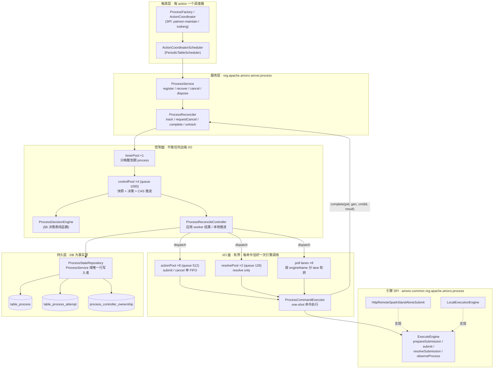
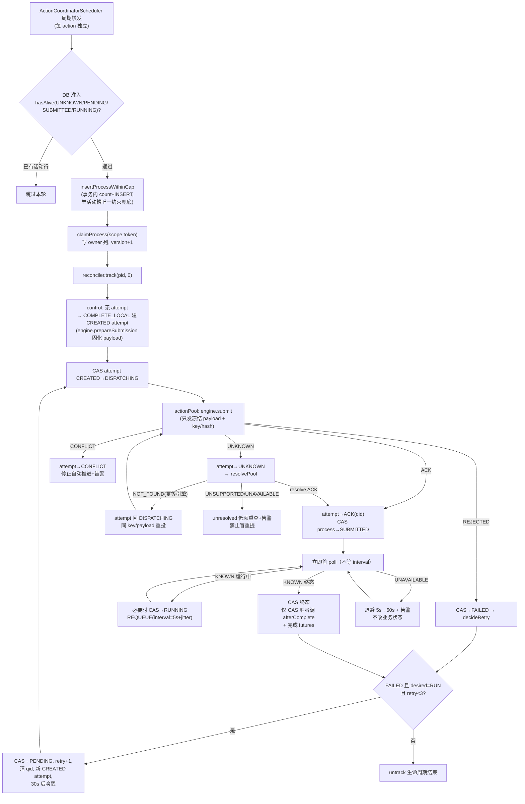
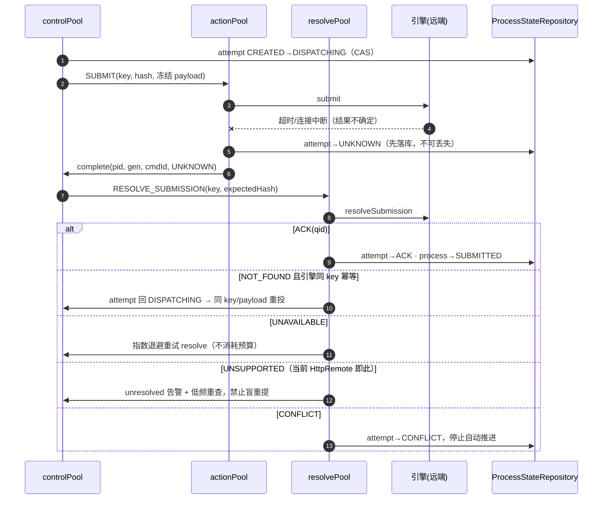
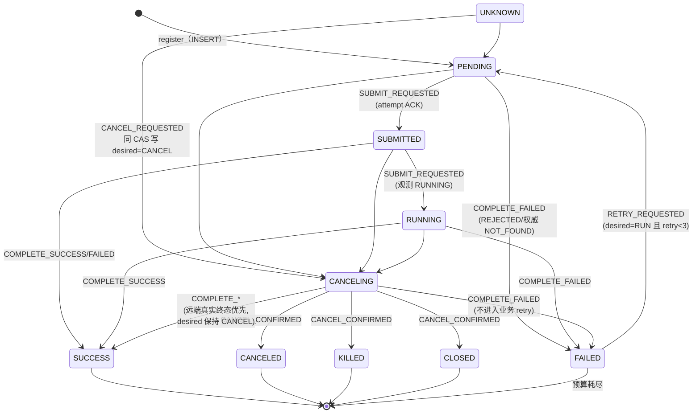
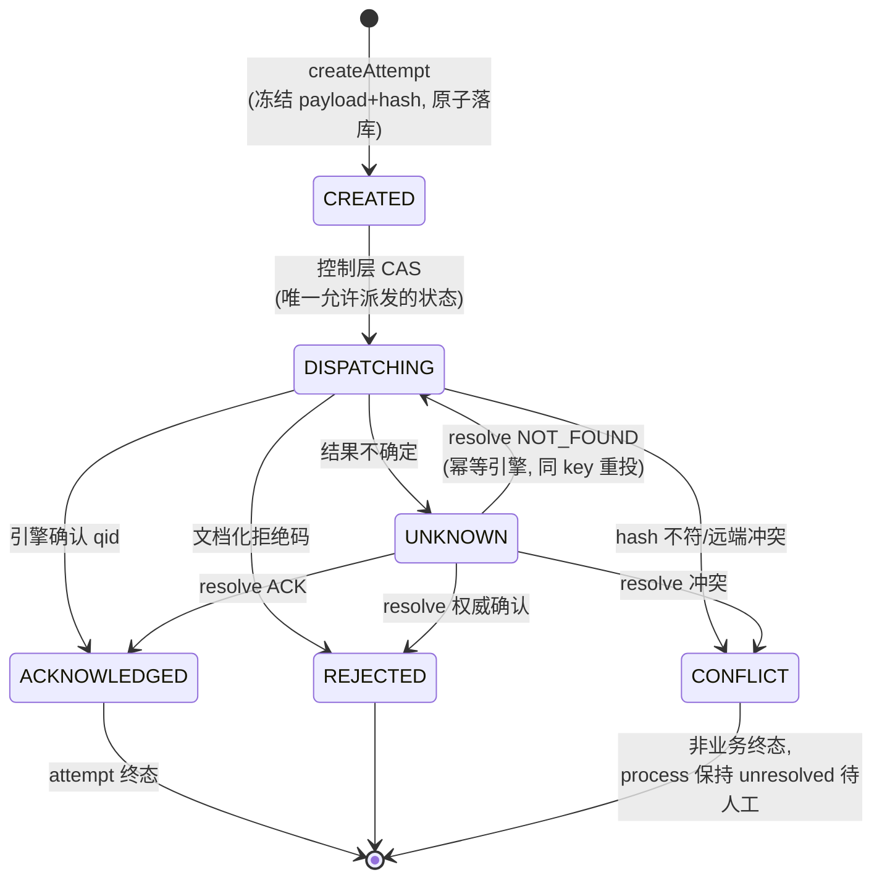
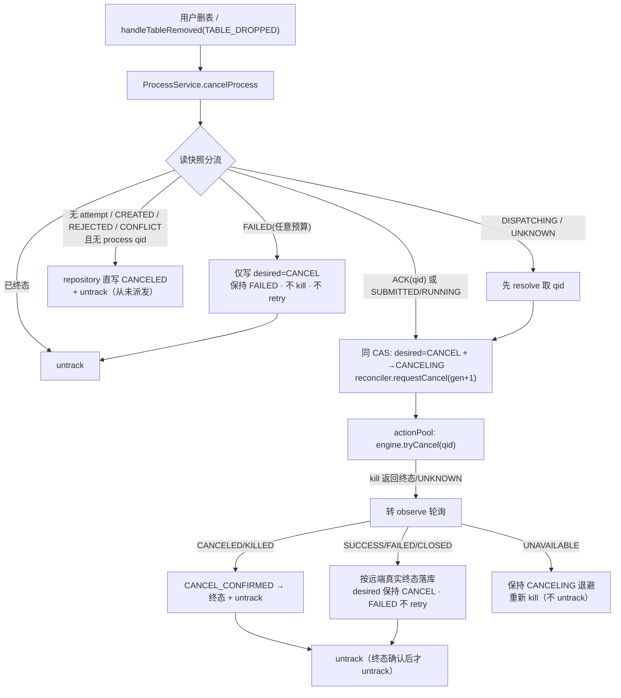
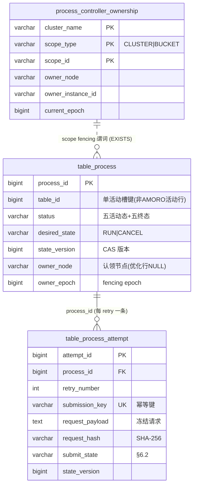
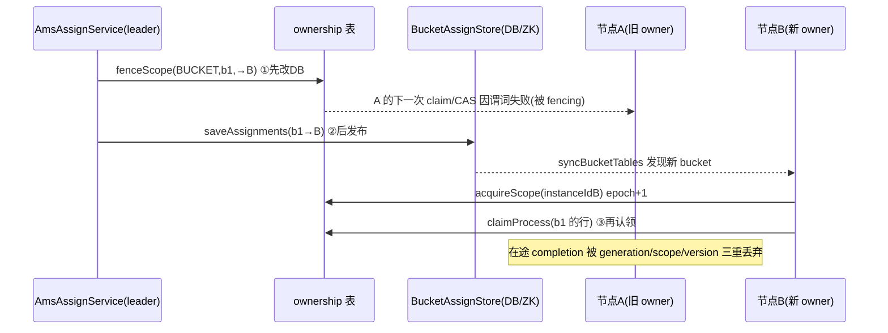
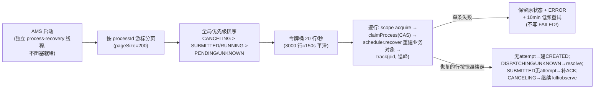

<!--
  Licensed to the Apache Software Foundation (ASF) under one
  or more contributor license agreements.  See the NOTICE file
  distributed with this work for additional information
  regarding copyright ownership.  The ASF licenses this file
  to you under the Apache License, Version 2.0 (the
  "License"); you may not use this file except in compliance
  with the License.  You may obtain a copy of the License at

      http://www.apache.org/licenses/LICENSE-2.0

  Unless required by applicable law or agreed to in writing,
  software distributed under the License is distributed on an
  "AS IS" BASIS, WITHOUT WARRANTIES OR CONDITIONS OF ANY
  KIND, either express or implied.  See the License for the
  specific language governing permissions and limitations
  under the License.
-->

# External Process Reconciler — 架构与流程全解析

> **历史分支实现说明，非当前 HEAD，也非 v2 契约。** 本文只用于追溯 dev 分支
> reconciler 方案及其竞态场景；当前 `jira/process-dev` 不包含这里描述的实现，
> `amoro-ams-v2-process-spec.md` 才是新 Process 实现的权威规格。本文中的类型、路径、
> 数据表和 `CANCEL_CONFIRMED` 不能被视为当前代码事实或 v2 实施承诺。
>
> 对应实现：dev 分支 `7a60c87db`（主体）+ `ffe464af3` / `f4067d42a` / `4bee915ed`（修复）。
> Spec：仓库根 `External-Process异步状态机追踪Spec.md`。本文面向需要读懂/维护此功能的工程师。

---

## 1. 功能定位与要解决的问题

External Process 是 AMS 周期性触发的**表维护作业**（当前主要是 Paimon 的 `expire_snapshots`、`remove_orphan_files`、`sync_table_meta`，经 `sl-spark-http` 引擎提交到远端 Spark；Iceberg 的维护作业走 `local` 引擎）。

旧实现的根因缺陷（重构动机）：

| 旧问题 | 新设计 |
|---|---|
| thread-per-process：每个作业独占一个 worker，`while + sleep(5s)` 轮询 | **level-triggered Reconciler**：等待只表现为下次排期时间，worker 只执行单次命令 |
| 线程池无界排队，第 11 个作业起永远排队 | 五池分离（timer/control/action/resolve/poll），全部有界 |
| 重启只恢复 SUBMITTED/RUNNING，PENDING/CANCELING 泄漏 | DB 为事实源，五状态全恢复 + 令牌桶限速 |
| 提交结果不确定（超时）会被当成失败重试 → **重复远端作业** | 稳定幂等键 + UNKNOWN/REJECTED/CONFLICT 四分类 + resolve |
| 取消是「先写 CANCELED 再 best-effort kill」 | 异步取消状态机：desired_state=CANCEL → kill → observe → 终态确认 |
| 多节点可交叉写同一行 | DB ownership fencing（scope/epoch）+ 所有状态推进 CAS |

三个核心设计词：

- **DB 是事实源**：`table_process` + `table_process_attempt` 是唯一持久化真相，内存 ControlSlot 只是排期视图，重启即重建。
- **level-triggered**：每个控制步从 DB 读最新快照推导「下一步一条命令」，不做 while 循环；任何中间状态崩溃后重启都能续上。
- **fail-closed**：观测不到 ≠ 失败。UNAVAILABLE 只退避告警；拿不到 ownership token 就不 claim；升级遇重复活动行就中止。

---

## 2. 总体架构（分层）



**一次命令的完整旅程**（核心约束逐条落实）：

1. timer 只投递，不碰 DB/引擎；
2. control 每次从 repository 取最新快照（owner/version/desired_state/status/attempt），经 ownership authority 谓词校验后，**推导出至多一条命令**；
3. worker 只执行命令规定的那一次引擎调用（SUBMIT 前先持久化 attempt DISPATCHING，结果先落 attempt 再返回）；
4. 全部完成统一进入 `ProcessReconciler.complete(processId, generation, commandId, result)`；
5. completion 由 generation + commandId fencing：旧 generation/重复 commandId 直接丢弃。

---

## 3. 代码地图（关键类与职责）

| 类 | 文件（amoro-ams 下 `src/main/java/org/apache/amoro/`） | 职责 |
|---|---|---|
| `ProcessService` | `server/process/ProcessService.java` | 对外门面：register（DB 准入+claim+track）、异步限速恢复、cancelProcess 入口、dispose（§12 停机序）、指标/告警接线 |
| `ProcessReconciler` | `server/process/reconciler/ProcessReconciler.java` | 线程模型 owner：五池、ControlSlot 生命周期、generation/commandId fencing、优雅停机 30s |
| `ControlSlot` | `reconciler/ControlSlot.java` | 每 process 一个：generation、在途 commandId、slotState(IDLE/SCHEDULED/RUNNING/STOPPED)、pendingWake、拒绝计数 |
| `ReconcileCommand` / `Decision` / `ReconcileResult` / `WorkerResult` | `reconciler/` | 命令与决策值类型（Kind: SUBMIT/RESOLVE_SUBMISSION/POLL/CANCEL/COMPLETE_LOCAL/WAIT） |
| `ProcessDecisionEngine` | `reconciler/ProcessDecisionEngine.java` | **纯函数决策表**：snapshot → Decision；含 decideRetry、UNAVAILABLE 退避公式 |
| `ProcessReconcileController` | `reconciler/ProcessReconcileController.java` | 控制环实现：onWake/onComplete、apply* 结果应用、本地推进（建 attempt/转 SUBMITTED/终态+afterComplete） |
| `ProcessCommandExecutor` | `reconciler/ProcessCommandExecutor.java` | one-shot 引擎调用 + hash 守卫 + attempt 结果先落库（§7.1） |
| `Dispatcher` | `reconciler/Dispatcher.java` | action/resolve 池 + poll lane 轮转 + 拒绝计数 + shutdown |
| `ReconcilerDefaults` / `ReconcilerConfig` | `reconciler/` | §11.2 全部内部常量 / 三键配置值对象（>0 校验） |
| `ReconcilerMetrics` / `ProcessAlertEvaluator` / `DueLagSampler` / `RecoveryRateLimiter` | `reconciler/` | 10 项指标、6 条告警（30s 周期）、due-lag p95 环形采样、恢复令牌桶 |
| `ProcessStateRepository` | `server/process/ProcessStateRepository.java` | **table_process/attempt 唯一行写入者**：claim/casProcess/desired_state 谓词/attempt 生命周期/insertProcessWithinCap/snapshot/scopeAuthorizes |
| `ProcessOwnershipManager` | `server/process/ProcessOwnershipManager.java` | scope fence/acquire（fail-closed）、holdsToken（控制环 authority 预检） |
| `DefaultTableProcessStore` | `server/process/DefaultTableProcessStore.java` | 转移规则权威（validTransition/isTerminal）+ amoro-common 门面；claimed 行持久化委托 repository |
| `PersistedTableProcess` | `server/process/PersistedTableProcess.java` | 由 TableProcessMeta 构造的只读视图，传给引擎（禁止重拼请求） |
| amoro-common SPI 值类型 | `amoro-common/.../process/Submission*.java`、`ProcessObservation.java` | 见 §4.2 |
| `HttpRemoteSparkStandAloneSubmit` | `amoro-common/.../HttpRemoteSparkStandAloneSubmit.java` | 远端 Spark：prepare 固化最终请求体；submit 带 key/hash、分类 REJECTED(仅 rejectable-codes)/UNKNOWN；resolve=UNSUPPORTED |

---

## 4. 引擎 SPI 与提交分类

### 4.1 additive 扩展（旧引擎零改动加载）

```java
interface ExecuteEngine {
  // 旧方法不动：submitTableProcess / getStatusInfo / tryCancelTableProcess ...
  default SubmissionPayload prepareSubmission(TableProcess p);          // 纯函数：固化最终请求
  default SubmissionOutcome submit(TableProcess p, SubmissionPayload payload, SubmissionContext ctx);
  default SubmissionResolution resolveSubmission(SubmissionContext ctx); // 默认 UNSUPPORTED
  default ProcessObservation observeProcess(String externalId);          // UNKNOWN→UNAVAILABLE
}
```

`SubmissionContext` = 稳定键 `table-process:v1:{processId}:{retryNumber}` + payload 的 SHA-256。**同一 key 永远绑定同一份持久化 payload**——引擎配置重启后变化也不会改变已存在 attempt 的请求。

### 4.2 结果分类（安全核心）

| 类型 | 值 | 语义 → 系统行为 |
|---|---|---|
| `SubmissionOutcome` | ACKNOWLEDGED(qid) | 引擎确认建作业 → attempt ACK → process SUBMITTED |
| | REJECTED | **仅**远端契约文档化为「未建作业」的码（`rejectable-codes` 配置）→ FAILED → 消耗业务重试 |
| | UNKNOWN | 超时/响应丢失/非文档化非零码 → attempt UNKNOWN → 只 resolve/退避，**不消耗重试** |
| | CONFLICT | 同 key 不同 hash（一致性错误）→ 停止自动推进 + 告警，人工处理 |
| `SubmissionResolution` | ACK(qid) / NOT_FOUND / UNAVAILABLE / UNSUPPORTED / CONFLICT | NOT_FOUND 仅幂等引擎可返回 → **同 key 同 payload 重投**；UNSUPPORTED → unresolved 低频重查 |
| `ProcessObservation` | KNOWN / NOT_FOUND / UNAVAILABLE | UNAVAILABLE ≠ 失败：只退避（5s→12×interval）+ 告警，**永不转 FAILED** |

---

## 5. 端到端调度流程

### 5.1 主生命周期（正常路径）



要点：

- **重试预算唯一来源** `PROCESS_MAX_RETRY_NUMBER=3`：只有「明确 REJECTED」与「远端明确终态 FAILED / 权威 NOT_FOUND」消耗；UNAVAILABLE/队列拒绝/resolve 不可用不消耗。
- **trackUri**：观测到新非空值即 CAS 合并进 summary，跨 step 与重启保留。
- **单活动槽**：同表跨 Action 同时至多一条活动行（DB 生成列唯一索引保证，见 §8.1）。

### 5.2 提交不确定时的 resolve 时序



---

## 6. 状态机

### 6.1 ProcessStatus（业务状态，`DefaultTableProcessStore.validTransition` 为规则权威）



取消的关键规则（PR2c，§5.6/§8.3）：

- `CANCEL_REQUESTED` 的目标是 **CANCELING**（不再是 CANCELED），且**同一个 CAS** 写入 `desired_state='CANCEL'`；
- `desired_state=CANCEL` 拒绝一切 SUBMIT_REQUESTED/RETRY_REQUESTED（store 层 validTransition + retry CAS 的 SQL 谓词双重防线）；
- FAILED 行上取消：只写 intent、保持 FAILED、不 kill、不 retry（retry race 由 desired_state 谓词挡住）；
- `CANCEL_CONFIRMED`（优先级 100）只在 CANCELING → CANCELED/KILLED/CLOSED。

### 6.2 SubmitState（attempt 提交状态机，`table_process_attempt.submit_state`）



### 6.3 控制环 slot 状态（内存，`ControlSlot`）

```
IDLE ──wake──> SCHEDULED ──dispatch──> RUNNING ──complete──> IDLE（或链式 beginCommand）
  │                                        │
  └────── untrack / cancel / shutdown ─────┴──> STOPPED（generation+1，旧 completion 全丢弃）
```

---

## 7. 取消流程（异步状态机，§8.3）



并发保证（TestCancelRace 8 场景锁定的不变量）：**不会出现** CANCELED 后重新 SUBMITTED、取消后 FAILED 被业务重试、旧回调复活排期、无 qid 的远端孤儿。

---

## 8. 持久化模型（三张表的作用）

### 8.1 `table_process`（业务事实行）

| 列组 | 作用 |
|---|---|
| 原有列（process_id/status/process_type/external_process_identifier/retry_number/summary/…） | 业务状态与展示；`execution_engine='AMORO'` 的行属 **OptimizingQueue 域**（owner 恒空、不参与本框架 fencing） |
| `state_version` | 行级 CAS 版本，每次状态推进 +1；完成回调按 expectedVersion CAS |
| `owner_scope_type/owner_scope_id` | 认领该行的 scope（CLUSTER=clusterName / BUCKET=bucketId）；优化行恒 NULL |
| `owner_node / owner_epoch` | fencing token 两要素（与 scope 共同构成写权限凭证） |
| `desired_state` | RUN/CANCEL：**持久化用户取消意图**（跨重启存活），拒绝取消后复活 |
| `process_service_active_table_id`（生成列） | **单活动槽**：非 AMORO 五状态行取正 `table_id`，其余取负 `process_id`；其唯一索引实现「同表跨 Action 同时至多一条活动行」（DB 层兜底，跨实例原子） |

**写入归属（§5.5）**：ProcessService 域一切行级写经 `ProcessStateRepository`（claim/CAS 带 ownership EXISTS 谓词）；例外仅三类——OptimizingQueue 的无条件写（永久设计）、未 claim 行的 legacy 写（测试/极早期）、新建 INSERT（`insertProcessWithinCap`，也在 repository 内）。

### 8.2 `table_process_attempt`（提交幂等事实）

| 列 | 作用 |
|---|---|
| attempt_id / process_id / retry_number | 主键（snowflake）；`UNIQUE(process_id, retry_number)` |
| submission_key | `table-process:v1:{processId}:{retryNumber}`，`UNIQUE`——远端幂等契约的 AMS 侧锚点 |
| request_payload / request_hash | `prepareSubmission` 首次固化的**最终请求体**及其 SHA-256；此后 submit/resolve/恢复只读，禁止重算 |
| submit_state | §6.2 状态机 |
| external_process_identifier | ACK 后的 qid |
| last_error | 脱敏（剔除 payload/hql）+ 截断 2000 |
| state_version | attempt 自身 CAS 版本 |

### 8.3 `process_controller_ownership`（写权限权威）

联合主键 `(cluster_name, scope_type, scope_id)`；`owner_node`（当前授权节点）、`owner_instance_id`（ProcessService 实例 UUID，同节点新实例 acquire 时递增 epoch 以 fencing 旧实例）、`current_epoch`。**先改本表 fencing 旧 owner，再发布 assignment / 启动服务**；所有 claim/CAS 的 SQL 都带 `EXISTS(本表四元组匹配)` 谓词。

### 8.4 表关系



---

## 9. Ownership 与 fencing（多节点安全）



规则要点：非主从用 CLUSTER scope（leader transition 先 fence→acquire）；**acquire 失败 fail-closed**（返回 -1 不 claim，PersistenceException 同样 fail-closed——这也是启动线程泄漏修复的一部分）；控制环每步经 `holdsToken` 重读 scope 行做 authority 预检（fence 后旧实例下一步即 retire，不再远端提交）；**ownership revoke ≠ 业务取消**（OWNERSHIP_REVOKED 只本地 untrack，绝不 kill/写 desired_state）。

---

## 10. 重启恢复（§9.3）



---

## 11. 线程模型与资源上限

| 池 | 线程 | 队列 | 职责 / 禁止 |
|---|---:|---:|---|
| timerPool | 1 | — | 只唤醒到期 process；**禁止 DB/HTTP** |
| controlPool | 4 | 1000 | 快照+决策+CAS；禁止远端 I/O |
| actionPool | 8（=io-thread-count） | 512(=线程×64) | submit/cancel 单 FIFO |
| resolvePool | 2 | 128 | 只做 resolve（物理隔离，UNKNOWN 洪峰不占提交/取消容量） |
| poll lanes | 8（总） | 512 | 按 engineName 分 lane 轮转（远端 30s 超时不吞 local lane） |
| process-recovery | 1 | — | 启动恢复（异步） |
| alert evaluator | 1 | — | 30s 周期告警评估 |
| **合计** | **默认 23+2 辅助** | 全有界 | 拒绝 → 基础设施退避(full-jitter 1s→30s)，不消耗业务重试 |

退避公式：`delay(n) = min(base × 2^(n-1), max)`，UNAVAILABLE 的 max=12×interval(默认60s)、告警阈值 10 次（只告警，永不判失败）。

---

## 12. 配置 / 指标 / 告警

**对外仅三键**（`AmoroManagementConf`，启动校验 >0）：

| key | 默认 | 含义 |
|---|---|---|
| `process.reconcile.interval` | 5s | 常规 poll 间隔（UNAVAILABLE 上限=12×interval） |
| `process.reconcile.io-thread-count` | 8 | action 与 poll 的线程预算（两池物理隔离共享旋钮） |
| `process.reconcile.tracked-max` | 10000 | 新建准入上限（恢复不受限） |

**指标**（MetricManager 全局 registry，label 全有界）：`tracked`(status)、`queue_depth`(lane)、`command_latency_ms`+`command_total`(command/outcome)、`unavailable_total`(engine)、`due_lag_ms`(p95)、`inflight`(command)、`rejected_total`(lane)、`submission_unresolved`(submit_state)、`owner_cas_conflict_total`、`recovery_backlog`(status)。

**六条告警**（`ProcessAlertEvaluator`，WARN 日志）：unresolved>0 持续 5min；due-lag p95>2×interval 持续 10min；任一队列>80%；CAS 冲突连续 3 窗口递增；CANCELING 超 600s；恢复 backlog 3 窗口不降。

---

## 13. 启动与停机顺序

**启动**（非主从）：fence→acquire CLUSTER scope（**fail-closed**，拿不到 token 不 claim 但服务可起）→ 构建五池/reconciler → 异步限速恢复。`startOptimizingService` 任何失败都会 dispose 本次已构造服务后再抛（防线程泄漏），main 循环失败按 1s→60s 指数退避（保留无限重试）。

**停机**（`ProcessService.dispose`，固定顺序）：停 register → 停告警评估 → 停恢复线程(5s) → `reconciler.shutdown()`（STOPPING 拒新 track → 停 timer/control 分发 → 最多 30s 等 in-flight 持久化 → shutdownNow → 清 slot **不删 DB 行**）→ 注销指标 → **引擎最后 close**。

---

## 14. 设计不变量（快速自检清单）

1. DB 是事实源：一切内存状态可由 DB 重建；恢复覆盖五活动状态。
2. 同表跨 Action 至多一条活动行（DB 唯一槽，跨实例原子）。
3. 同一 process 同时至多一条在途命令；completion 必须 generation+commandId 双匹配。
4. attempt 先落库（CREATED→DISPATCHING）才允许调引擎；submit 结果先持久化再进 complete。
5. 同 submissionKey 永远同 hash 同 payload；不符即 CONFLICT 停推。
6. UNKNOWN≠失败：UNAVAILABLE/队列拒绝/resolve 不可用永不消耗 3 次业务重试预算。
7. `desired_state=CANCEL` 后不可能复活（submit/retry 双层拒绝 + retry CAS SQL 谓词）。
8. 只有终态 CAS 胜者调用 afterComplete/完成 futures；stale completion 零副作用。
9. 优化域（execution_engine='AMORO'）与本域互不干扰：不走 CAS、不占活动槽、恢复时被 findScheduler 跳过。
10. 一切 fencing 以 `process_controller_ownership` 为权威；acquire 失败 fail-closed。
